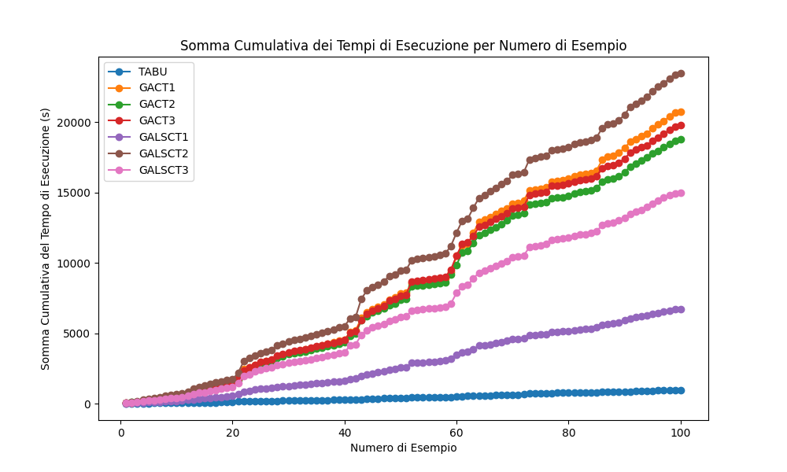
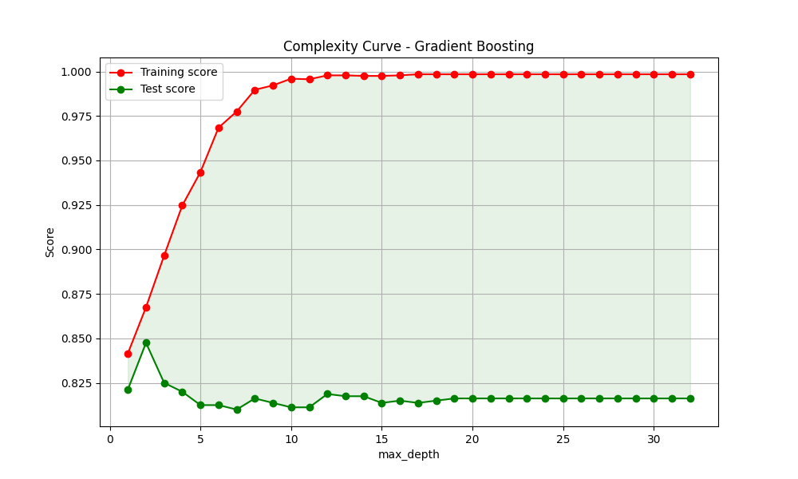
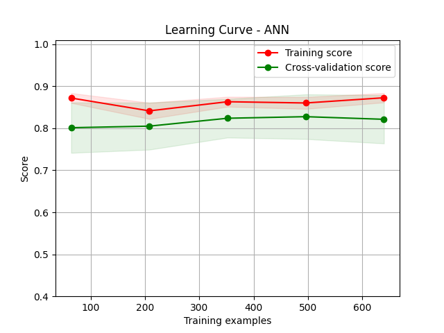

# Documentazione - HDM

**Gruppo di lavoro**:

- Manuel Roberto Matera

- Matricola: 758386

- Mail: m.matera51@studenti.uniba.it

**Link per la repo**: [GitHub - matera02/HDM: Hospital Decision Maker](https://github.com/matera02/HDM.git)

**AA**: 2023-24

# Indice

- [Introduzione](#introduzione) 

- [Primo capitolo](#primo-capitolo) 
  
  - [Knowledge Base](#knowledge-base)
    
    - [Fatti](#fatti)
    
    - [Regole](#regole)
    
    - [Query](#query)
  
  - [Grafo dell'ospedale](#grafo-dellospedale)
  
  - [Algoritmi](#algoritmi)
    
    - [Problema di ricerca generico](#problema-di-ricerca-generico)
    
    - [Strategie di ricerca non informata](#strategie-di-ricerca-non-informata)
      
      - [DFS](#dfs---depth-first-search)
      
      - [BFS](#bfs---breadth-first-search)
      
      - [ID](#id---iterative-deepening)
      
      - [LCFS](#lcfs---lowest-cost-first-search)
    
    - [Strategie di ricerca informata](#strategie-di-ricerca-informata)
      
      - [A* Search](#a-search)
      
      - [DFBB](#dfbb---depth-first-branch-and-bound)
    
    - [Strategie di ricerca avanzate](#strategie-di-ricerca-avanzate)
      
      - [Programmazione dinamica](#programmazione-dinamica)
      
      - [Ricerca basata su isole](#ricerca-basata-su-isole)
  
  - [Valutazioni](#valutazioni)

- [Secondo capitolo](#secondo-capitolo)
  
  - [Nurse Scheduling Problem](#nurse-scheduling-problem)
  
  - [Notazione](#notazione)
    
    - [Vincoli rigidi](#vincoli-rigidi)
    
    - [Funzione obiettivo](#funzione-obiettivo)
    
    - [Vincoli soft](#vincoli-soft)
  
  - [Algoritmi](#algoritmi-nsp)
    
    - [Tabu Search](#tabu-search)
    
    - [Algoritmo Genetico](#algoritmo-genetico)
    
    - [Algoritmo Genetico con Local Search](#algoritmo-genetico-con-local-search)
    
    - [Scelta degli iperparametri](#scelta-degli-iperparametri)
  
  - [Statistiche](#statistiche)
  
  - [Conclusioni](#conclusioni)

- [Terzo capitolo](#terzo-capitolo)
  
  - [Heart Disease](#heart-disease---dataset)
  
  - [Descrizione delle feature del dataset](#descrizione-delle-feature-del-dataset)
  
  - [Preprocess del Dataset](#preprocess-del-dataset)
  
  - [Modelli](#modelli)
    
    - [Pipeline](#pipeline)
    
    - [Decision Tree](#decision-tree)
    
    - [Logistic Regression](#logistic-regression)
    
    - [Random Forest](#random-forest)
    
    - [Gradient Boosting](#gradient-boosting)
    
    - [ANN](#artificial-neural-network---ann)
    
    - [Risultati complessivi](#risultati-complessivi)

- [Conclusione](#conclusione)

- [Riferimenti bibliografici](#riferimenti-bibliografici)

## Introduzione

Il progetto **Hospital Decision Maker - (HDM)** si propone come un sistema di supporto decisionale per le strutture ospedaliere. L'obiettivo principale del progetto è ottimizzare vari aspetti della gestione ospedaliera. 

Il primo capitolo affronta un **problema di ricerca** su un **grafo** che rappresenta la struttura dell'ospedale. Il grafo viene costruito a partire da una **KB**.

Nel secondo capitolo viene affrontato il problema di pianificazione dei turni degli infermieri come **problema di ottimizzazione**, utilizzando come algoritmi la **Tabu Search** e gli **Algoritmi Genetici** con varianti ibride che sfruttano la **Local Search** dopo la fase di mutazione.

Il terzo capitolo si concentra su un task di **classificazione binaria**, il cui obiettivo è prevedere la presenza di malattie cardiache nei pazienti.

# Primo Capitolo

## Knowledge Base

Una **Knowledge Base (KB)**, o base di conoscenza, è un insieme strutturato di informazioni, regole e fatti che rappresentano la conoscenza in un determinato dominio. Una KB viene comunemente implementata sfruttando liguaggi di programmazione logica come **Prolog**, che permette di definire **fatti** e **regole**, e formulare **query**. 

Nel nostro contesto, il file `src/graph/data/hospital.pl` rappresenta la KB contenente le informazioni, che descrivono l'architettura dell'ospedale e le relazioni spaziali al suo interno. Queste informazioni verranno sfruttate per fornire una rappresentazione dell'ospedale con un **grafo**, dove i nodi sono le stanze e gli archi sono pesati dalla distanza fra ciascuna stanza in cui è definita una connessione.

Vediamo nel dettaglio le informazioni incluse all'interno della KB.

### Fatti

I fatti sono informazioni atomiche o proposizioni che descrivono il mondo o il dominio. Nel nostro contesto vengono utilizzati per definire le **proprietà** di una classe **Stanza**, e la **relazione** che definisce la connessione fra due stanze.

- **Stanza -`room/1`**:
  
  Definisce una stanza dell'ospedale. Ogni stanza è rappresentata da un numero identificativo.
  
  Esempio: `room(101).` 
  
  Questo significa che esiste una stanza che identificheremo con 101.

- **Nome della Stanza  - `name/2`**:
  
  Associa un nome descrittivo a ciascuna stanza, in maniera tale da definirne la sua funzione.
  
  Esempio: `name(101, 'Entry').` 
  
  Alla stanza 101 è associato il nome "Entry".

- **Coordinate X - (`x/2`) e Y - (`y/2`)**:
  
  Definisce la posizione di una stanza in termini di coordinate $x$ e $y$ su una mappa bidimensionale.
  
  Esempio: `x(101, 13.11).` e `y(101, 17.50).` 
  
  La stanza 101 si trova in coordinata $(13.11, 17.50)$.

- **Piano - `floor/2`**:
  
  Specifica il piano su cui si trova una stanza.
  
  Esempio: `floor(101, 1).`
  
  La stanza 101 è al primo piano.

- **Connessioni Definite - `defined_connection/2`**:
  
  Indica quali stanze sono direttamente collegate tra loro.
  
  Esempio: `defined_connection(101, 102).`
  
  Esiste una connessione fra la stanza 101 e la stanza 102.

- **Inserimento Dinamico di Connessioni** con `assertz/1`:
  
  Aggiunge dinamicamente connessioni tra stanze durante l'esecuzione del programma.
  
  Esempio: `:- assertz(defined_connection(229, 237)).`

Un altro fatto è presente nei file Prolog `src/graph/data/diGraph/heuristics.pl` e in `src/graph/data/biGraph/heuristics.pl`. Ciascun file ritornerà utile nelle **strategie di ricerca informata**, in un caso per il grafo diretto, nell'altro per il grafo bidirezionale.

Quindi avremo come fatto:

- **Costo per Raggiungere l'Obiettivo -`cost_to_goal/3`**:
  
  Definisce il costo minimo (calcolato con la programmazione dinamica) per raggiungere una stanza specifica da un'altra stanza. (Questo valore verrà utilizzato per l'euristica degli algoritmi A* e DFBB).
  
  Esempio: `cost_to_goal(101, 106, 11.0).`

### Regole

Possiamo vedere le regole come insiemi di condizioni e conclusioni che definiscono come i fatti possono essere combinati o interpretati. Le regole permettono di derivare nuova conoscenza dai fatti esistenti. Nel nostro caso le regole sono servite nel stabilire fra due nodi una connessione unidirezionale pesata con la loro distanza euclidea. 

- **Calcolo della Distanza Euclidea -`euclidean_distance/3`**:
  
  Questa regola è usata per calcolare la distanza euclidea tra due stanze, basandosi sulle loro coordinate. La distanza euclidea è definita come la lunghezza del segmento di retta che unisce due punti in uno spazio euclideo. Dove la distanza euclidea $d$ è data dalla seguente formula:
  
  $$
  d = \sqrt{(x_2-x_1)^2 +(y_2 - y_1)^2}
  $$
  
  ```prolog
  euclidean_distance(Room1, Room2, Distance) :-
      room(Room1),
      room(Room2),
      x(Room1, X1),
      y(Room1, Y1),
      x(Room2, X2),
      y(Room2, Y2),
      DiffX is X2 - X1,
      DiffY is Y2 - Y1,
      Distance is sqrt(DiffX*DiffX + DiffY*DiffY).
  ```

- **Connessione con Peso Basato sulla Distanza Euclidea - `connection_with_weight/3`**:
  
  Definisce una connessione tra due stanze, con un peso che corrisponde alla distanza euclidea calcolata tra di esse.
  
  ```prolog
  connection_with_weight(Room1, Room2, Weight) :-
      euclidean_distance(Room1, Room2, Weight).
  ```

- **Connessione Unidirezionale - `connection/3`**:
  
  Definisce una connessione unidirezionale tra due stanze, utilizzando la connessione con peso basato sulla distanza euclidea e verificando che la connessione sia definita tra le stanze.
  
  ```prolog
  connection(Room1, Room2, Weight) :-
      connection_with_weight(Room1, Room2, Weight),
      defined_connection(Room1, Room2).
  ```

### Query

Le query sono richieste di informazione che possono essere poste alla KB per ottenere risposte basate sulle informazioni presenti nella base di conoscenza.

Le query principalmente formulate sono presenti all'interno del file `src/graph/hospital.py`, dove la KB viene utilizzata in combinazione con il codice Python tramite la libreria `pyswip`, che consente di eseguire query Prolog direttamente dal codice Python. Questo tipo di approccio permette di costruire dinamicamente il grafo che rappresenta l'ospedale.

Vediamo in maniera dettagliata come queste query vengono formulate, considerando il metodo `__build_graph_from_prolog` all'interno della classe `Hospital`:

- **Estrazione delle Stanze**
  
  Si esegue una query in Prolog per ottenere tutte le stanze definite all'interno della KB. La query `room(X)` restituisce un elenco di stanze, dove `X` rappresenta il numero identificativo di ciascuna stanza.
  
  ```python
  rooms = list(prolog.query("room(X)"))
  ```

- **Recupero degli attributi delle Stanze**
  
  Per ciascuna stanza identificata nella query precedente, il codice esegue una query aggiuntiva per ottenere gli attributi della stanza: nome (`name`), coordinate spaziali (`x`, `y`), e piano (`floor`). Questi dettagli vengono usati per creare un'istanza della classe `Room`, che incapsula tutte le informazioni rilevanti per la stanza. La stanza viene poi aggiunta al grafo come un nodo, con `number` come identificatore del nodo e `room_obj` come attributo associato.
  
  ```python
  for room in rooms:
      number = room['X']
      details = next(prolog.query(f"name({number}, T), x({number}, X), y({number}, Y), floor({number}, P)"))
      room_obj = self.Room(number, details['T'], float(details['X']), float(details['Y']), int(details['P']))
      G.add_node(number, room=room_obj)
  ```

- **Estrazione delle connessioni**
  
  Si esegue un'altra query in Prolog per ottenere tutte le connessioni tra le stanze, dove `A` e `B` sono i numeri identificativi delle stanze connesse e `Weight` rappresenta il peso dell'arco (che potrebbe indicare distanza, tempo di percorrenza, ecc.).
  
  ```python
  connections = list(prolog.query("connection(A, B, Weight)"))
  for conn in connections:
      G.add_edge(conn['A'], conn['B'], weight=float(conn['Weight']))
  ```
  
  Per ciascuna connessione trovata, viene aggiunto un arco diretto nel grafo dal nodo `A` al nodo `B` con un attributo `weight` che rappresenta il peso dell'arco. Quest'ultimo passaggio permette di fornire una struttura completa del grafo.

L'ultima query formulata è presente in `src/graph/pathFinder.py`, dove con il metodo `__get_heuristic` si ottiene il valore dell'euristica per un nodo specifico rispetto a un  nodo obiettivo, attraverso la seguente query:

```python
list(prolog.query(f"cost_to_goal({node}, {goal}, Cost)"))
```

## Grafo dell'ospedale

### Grafo diretto

Di seguito mostriamo il plot del grafo diretto progettato per l'ospedale.

**Note**:

- La suddivisione in piani (per ora) è per comodità grafica.

- Ciascun nodo che rappresenta le scale di un piano è collegato direttamente al nodo di entrata del piano successivo e viceversa.

**Primo piano**


**Secondo piano**


**Terzo piano**


### Grafo bidirezionale

Abbiamo voluto sperimentare anche con un grafo bidirezionale, per diversi motivi come la valutazione degli algoritmi di **path finding**, che verranno discussi nella sezione successiva, l'applicazione di strategie di ricerca sofisticate come la **ricerca basata su isole**, in cui la direzione di ricerca può andare dall'alto in basso e viceversa, o l'uso della **programmazione dinamica**, che, nel caso di un grafo **NON** **fortemente connesso**, come quello fornito precedentemente, produrrebbe molti costi pari a **inf** (cioè nodo non raggiungibile), comportando uno spreco di memoria.

Un **grafo fortemente connesso** e **bidirezionale**, ottenuto unendo il grafo che abbiamo fornito prima e il suo inverso, ci permette di poter applicare gli algoritmi di **path finding** in un contesto d'uso reale, dove vogliamo che ciascun nodo possa essere raggiungibile da qualsiasi altro.

## Algoritmi

Riferimento: `src/graph/pathFinder.py` 

## Problema di ricerca generico

Per risolvere un problema di ricerca, è necessario prima definire lo spazio di ricerca e poi applicare un algoritmo di ricerca appropriato. Esistono problemi che possono essere visti come la ricerca di un percorso all'interno di un grafo, come ad esempio nel nostro caso trovare un percorso da una stanza di partenza ad una stanza obiettivo all'interno dell'ospedale. Dato un grafo, l'algoritmo di ricerca generico funziona esplorando in maniera incrementale i percorsi, che vanno dai nodi di partenza ai nodi obiettivo, memorizzandoli all'interno di una **frontiera**. Inizialmente la frontiera contiene il solo nodo di partenza, poi l'algoritmo procede espandendo i percorsi verso nodi inesploarati, fino a trovare il nodo obiettivo. Il processo di ricerca generico si articola in 3 fasi:

1. Si seleziona un percorso dalla frontiera e lo si rimuove.

2. Si estende quel percorso utilizzando ogni connessione uscente dall'ultimo nodo.

3. Si aggiungono alla frontiera i nuovi percorsi ottenuti.

Questo processo avviene in maniera iterativa fintantoché non si raggiunge il nodo obiettivo oppure si esauriscono i percorsi da esplorare.

## Strategie di ricerca non informata

Quando abbiamo a che fare con un algoritmo in cui la strategia di ricerca non è informata, è come se dovessimo effettuare una ricerca senza sapere dove si trovi l'obiettivo.

Un paziente mai entrato in ospedale ha una conoscenza diversa da quella del suo dottore, che sa come orientarsi; ad esempio se il paziente deve effettuare degli esami, non sa che la sua stanza obiettivo si trova al terzo piano, mentre il medico ne è a conoscenza: quindi il paziente andrebbe in giro per l'ospedale fintantoché non trova la sua stanza obiettivo, esplorando percorsi e stanze diverse all'interno dell'edificio, mentre il medico seguirebbe percorsi più promettenti, che gli consentono di arrivare senza fatica.

Quando gli archi di un grafo hanno costo unitario si applicano algoritmi di ricerca come DFS, BFS e Iterative Deepening; in senso figurato, potremmo pensare che l'agente in questo caso non prenda in considerazione quanto distino tra di loro le stanze all'interno dell'ospedale.

Alternativamente, disponendo e sfruttando come conoscenza quella della distanza (che non è a costo unitario) fra ciascuna stanza, si applica come algoritmo la LCFS.

### DFS - Depth First Search

Tenendo conto dell'algoritmo di ricerca generico presentato in precedenza, l'algoritmo **DFS** utilizza una **pila** (**LIFO**) come frontiera, `frontier`, per gestire l'esplorazione dei percorsi. Questo implica che l'algoritmo esplora il grafo andando in profondità lungo ciascun percorso possibile, tornando indietro solo quando raggiunge un vicolo cieco, cioè quando il nodo corrente non ha ulteriori nodi adiacenti non visitati: questo metodo è conosciuto come **backtracking**. 

Tuttavia l'algoritmo allo stato dell'arte risulta essere sensibile ai cicli quando presenti, perciò può divergere. Inoltre può capitare che un nodo possa essere esplorato più volte attraverso percorsi diversi. Queste due problematiche inficiano sull'efficienza e sull'uso reale dell'algoritmo, infatti vedere un agente che "gira in tondo" non sembra essere un comportamento così tanto "intelligente". Pertanto sono state implementate due tecniche di **pruning**:

- **Multiple path pruning**: sfruttiamo un *set* di nodi visitati, `visited`, in maniera tale da considerare solamente i nodi non visitati, così da prevenerire percorsi multipli e da ridurre il numero totale di percorsi esplorati.

- **Cycle pruning**: prima di esplorare un nodo adiacente, verifichiamo che non sia già presente nel percorso corrente. In questo modo evitiamo di esplorarlo nuovamente così da prevenire i cicli e migliorare l'efficienza.

```python
def dfs(graph, start, goal):
        #print('DFS: ')
        start_time = time.time()
        frontier = [(start, [start])]
        visited = set()  # Per il multiple path pruning
        paths_explored = 0  # Numero di percorsi esplorati
        nodes_visited = 0  # Numero di nodi visitati

        while frontier:
            current, path = frontier.pop()
            nodes_visited += 1

            if current == goal:
                t = time.time() - start_time
                return path, paths_explored, nodes_visited, t

            if current not in visited: # Multiple path pruning
                visited.add(current)

                for adj in graph.neighbors(current):
                    if adj not in path:  # Cycle pruning
                        new_path = path + [adj]
                        paths_explored += 1
                        frontier.append((adj, new_path))

        return None
```

### BFS - Breadth First Search

Nell'algoritmo **BFS** la frontiera viene implementata mediante una **coda** (**FIFO**), così il grafo viene esplorato per **livelli**, garantendo che tutti i nodi a una certa distanza dal punto di partenza vengano visitati prima di passare al livello successivo. 

A differenza della DFS, la BFS permette di trovare il percorso più corto in termini di numero di archi verso il nodo obiettivo, tuttavia può risultare lento se la soluzione è lontana dal punto di partenza. Come per la DFS, abbiamo implementato meccanismi per evitare cicli e percorsi ripetuti, non per le problematiche discusse per la DFS ma per ridurre il numero di nodi visitati e percorsi esplorati.

```python
# cambia l'uso della frontiera, il resto rimane invariato
def bfs(graph, start, goal):
        # ...
        frontier = Queue()
        # ...
        frontier.put((start, [start]))
        # ...
        while not frontier.empty():
            current, path = frontier.get()
            # ...
            # ...
                for adj in graph.neighbors(current):
                    if adj not in path: #cp
                        # ...
                        frontier.put((adj, path + [adj]))
        return None
```

### ID - Iterative Deepening

Questo algoritmo combina i vantaggi di DFS e BFS. Funziona come una serie di DFS con **profondità limitata**, aumentando gradualmente il **limite**. Inizia con una ricerca poco profonda e, se non trova la soluzione, incrementa la profondità e ricomincia fintantoché non si raggiunge la profondità massima. Questo approccio garantisce di trovare la soluzione più vicina al punto di partenza (come BFS) ma con un consumo di memoria simile a DFS. Inoltre, abbiamo scelto di impostare di default come limite di profondità massimo raggiungibile il numero di nodi presenti nel grafo che l'algoritmo prende in input, anche perché aspettare che l'algoritmo fallisca naturalmente potrebbe richiedere molto tempo. Anche in questo caso applichiamo cycle pruning e multiple path pruning per gli stessi motivi discussi in precedenza.

```python
def IterativeDeepening(graph, start, goal, max_bound = None):
        # ...
        def DepthLimitedSearch(graph, node, goal, bound, path, paths_explored, nodes_visited, visited):
            nodes_visited += 1

            if node == goal:
                return path, paths_explored, nodes_visited

            if bound > 0:
                visited.add(node)  #mpp

                for adj in graph.neighbors(node):
                    if adj not in path and adj not in visited:  # Multiple path pruning e cycle pruning
                        new_path = path + [adj]
                        paths_explored += 1
                        result, pe, nv = DepthLimitedSearch(graph, adj, goal, bound - 1, new_path, paths_explored, nodes_visited, visited)
                        if result is not None:
                            return result, pe, nv

                visited.remove(node)  #mpp

            return None, paths_explored, nodes_visited
        # ...

        if max_bound is None:
            max_bound = len(graph.nodes())  # Limite massimo della profondità basato sul numero di nodi del grafo

        while bound <= max_bound:
            visited = set()  # insieme dei nodi visitati per ogni livello di profondità
            result, pe, nv = DepthLimitedSearch(graph, start, goal, bound, [start], paths_explored, nodes_visited, visited)
            paths_explored = pe
            nodes_visited = nv

            if result is not None:
                t = time.time() - start_time
                return result, paths_explored, nodes_visited, t

            bound += 1
        # ...
```

### LCFS - Lowest Cost First Search

LCFS è un algoritmo che cerca di trovare il percorso a costo minimo in termini di somma dei pesi degli archi verso il nodo obiettivo. Nell'esplorazione del grafo, per dare priorità ai percorsi meno costosi, utilizza come frontiera una coda con priorità, in maniera tale da selezionare sempre il nodo con il costo cumulativo più basso. Quindi tiene traccia del miglior costo per raggiungere ogni nodo, aggiornandolo se trova un percorso migliore. 

Questo approccio è ottimo quando i costi dei percorsi sono variabili e importanti come nel nostro contesto: se, ad esempio, un paziente in ricovero dovesse essere operato d'urgenza, sarebbe il massimo conoscere il percorso a costo minimo dalla stanza in cui viene ricoverato alla sala operatoria.

Inoltre, dati due nodi, abbiamo deciso come scelta progettuale che il peso di ciascun arco sia pari alla **distanza euclidea** fra i due.

In questo caso abbiamo implementato il solo meccanismo di multiple path pruning per gli stessi motivi discussi per la BFS: attraverso un dizionario `best_costs` teniamo traccia del miglior costo trovato finora per ogni nodo, evitando di esplorare percorsi sub-ottimali e sfruttandola nel meccanismo di multiple path pruning. 

```python
def lowestCostSearch(graph, start, goal):
        # ...
        frontier = PriorityQueue()
        visited = set()
        best_costs = {}
        # ...
        while not frontier.empty():
            priority, (current, path) = frontier.get()
            nodes_visited += 1

            if current == goal:
                t = time.time() - start_time
                return path, paths_explored, nodes_visited, t

            if current not in visited: #mpp
                visited.add(current)
                if current in graph:
                    for adj in graph.neighbors(current):
                        weight = graph.get_edge_data(current, adj)['weight']
                        new_cost = priority + weight
                        if adj not in best_costs or new_cost < best_costs[adj]:  # mpp
                            best_costs[adj] = new_cost
                            frontier.put((new_cost, (adj, path + [adj])))
                            paths_explored += 1
                # ...
        return None
```

## Strategie di ricerca informata

Nella strategia di ricerca informata ricade l'approccio euristico, che, a differenza dell'approccio considerato precedentemente, si basa su intuizioni e conoscenze empiriche per generare nuove soluzioni. Gli algoritmi euristici sfruttano le **funzioni euristiche** per stimare il costo per raggiungere l'obiettivo, e se queste stime sono **ammissibili**, cioè non sovrastimano mai il costo effettivo, possono guidare la ricerca verso una soluzione valida, ma non necessariamente ottimale. 

Ritornando all'esempio descritto precedentemente, in questo caso è come se il paziente dovesse orientarsi tenendo conto di quanto le stanze siano distanti tra loro e chiedendo informazioni al personale per raggiungere la stanza dove svolgere le analisi, e, infatti, la differenza rispetto alla strategia non informata è sostanziale: in un caso il paziente girovaga per l'ospedale con un certo criterio fintantoché non trova la stanza desiderata, nell'altro, invece, essendosi rivolto a qualcuno del personale, sa che la stanza si trova al terzo piano, perciò adotterà un'altra strategia più "intelligente" per raggiungerla, senza dover necessariamente esplorare tutto il piano terra, ma seguendo le indicazioni che gli consentiranno di arrivare fino al terzo piano.

Perciò, nell'implementare questa tipologia di algoritmi, abbiamo l'intento di realizzare il comportamento discusso nell'esempio appena descritto e per farlo presentiamo due algoritmi: A* e DFBB.

### A* Search

L'A* è un algoritmo di ricerca informata che combina il costo del percorso (come LCFS) con una stima euristica della distanza rimanente dall'obiettivo. Usa una funzione $f(n) = g(n) + h(n)$, dove $g(n)$ è il costo effettivo da un punto di partenza $s$ al nodo $n$, e $h(n)$ è la stima euristica da $n$ all'obiettivo $x$. Anche in questa implementazione seguiamo lo schema dell'algoritmo di ricerca generico, implementando la frontiera come coda con priorità, in cui la priorità viene ordinata da $f(n)$. Per quanto riguarda il calcolo di $g(n)$, questo avviene nello stesso modo della LCFS, mentre $h(n)$ si ottiene da una tabella, precalcolata attraverso la **programmazione dinamica**, `cost_to_goal`, che viene memorizzata sia nel file Prolog `src/graph/data/diGraph/heuristics.pl` sia in `src/graph/data/biGraph/heuristics.pl` a seconda del grafo con cui abbiamo a che fare. 

```python
def AStarSearch(graph, start, goal, filename=FILENAME):
        # ...
        prolog = Prolog()
        prolog.consult(filename=filename)
        frontier = PriorityQueue()
        best_costs = {}
        start_priority = PathFinder.__get_f(prolog, graph, [start], goal)
        # ...
        while not frontier.empty():
            priority, (current, path) = frontier.get()
            current = path[-1]
            nodes_visited += 1

            if current == goal:
                t = time.time() - start_time
                return path, paths_explored, nodes_visited, t

            if current in graph:
                for adj in graph.neighbors(current):
                    new_path = path + [adj]
                    new_priority = PathFinder.__get_f(prolog, graph, new_path, goal)
                    if new_priority is not None and new_priority != float('inf'):
                        if adj not in best_costs or new_priority < best_costs[adj]:  #mpp
                            best_costs[adj] = new_priority
                            frontier.put((new_priority, (adj, new_path)))
                            paths_explored += 1
            # ...
        return None
```

### DFBB - Depth-First Branch and Bound

Questo algoritmo combina l'approccio in profondità di DFS con la tecnica di branch and bound: esplora il grafo in profondità ma mantiene un limite superiore, `bound`, sul costo della soluzione; il bound ci permette di limitare l'esplorazione, infatti, quando il costo stimato di un percorso supera questo limite, quest'ultimo viene scartato.

Quando l'algoritmo trova una soluzione, aggiorna questo limite e usa l'euristica di A* per decidere se continuare l'esplorazione di un ramo. Questo permette di tagliare rapidamente rami non promettenti del grafo, riducendo lo spazio di ricerca.

Questo algoritmo risulta particolarmente efficace in problemi di ottimizzazione dove si vuole trovare la soluzione migliore esplorando selettivamente lo spazio delle soluzioni.

```python
def DF_branch_and_bound(graph, start, goal, filename=FILENAME):
        # ...
        def cbsearch(graph, path, goal, bound, frontier, visited, paths_explored, nodes_visited):
            current = path[-1]
            nodes_visited += 1
            f_value = PathFinder.__get_f(prolog, graph, path, goal)

            if f_value < bound:
                if current == goal:
                    return PathFinder.__get_cost(graph, path), paths_explored, nodes_visited
                else:
                    for adj in graph.neighbors(current):
                        if adj not in path: # cp
                            new_path = path + [adj]
                            new_f = PathFinder.__get_f(prolog, graph, new_path, goal)
                            paths_explored += 1
                            if adj not in visited or new_f < visited[adj]: # mpp
                                visited[adj] = new_f #mpp
                                frontier.append((new_f, (adj, new_path)))
            return bound, paths_explored, nodes_visited

        # ...
        while frontier:
            cost, (current, path) = min(frontier, key=lambda x: x[0])
            frontier.remove((cost, (current, path)))
            if current == goal:
                if cost < bound:
                    bound = cost
                    best_path = path
            elif cost < bound:
                new_bound, pe, nv = cbsearch(graph, path, goal, bound, frontier, visited, paths_explored, nodes_visited)
                paths_explored = pe
                nodes_visited = nv
                if new_bound < bound:
                    bound = new_bound
        # ...
        if best_path is None:
            return None
        return best_path, paths_explored, nodes_visited, t
```

## Strategie di ricerca avanzate

### Programmazione dinamica

La programmazione dinamica è un metodo di ottimizzazione che memorizza soluzioni parziali per evitare ricalcoli. In questo contesto viene utilizzata principalmente per precomputare le euristiche di cui si serviranno gli algoritmi A* e DFBB.

L'algoritmo implementato opera eseguendo una ricerca inversa a partire da un nodo obiettivo verso tutti gli altri nodi del grafo. Durante questa ricerca, viene costruita una tabella `cost_to_goal`, che memorizza il costo minimo necessario per raggiungere l'obiettivo da ogni nodo. Questa tabella viene costruita **offline** utilizzando la LCFS con multiple path pruning, partendo dal nodo obiettivo nel grafo inverso: in sostanza, il metodo lavora a ritroso rispetto all'obiettivo, memorizzando i valori di `cost_to_goal` per ogni nodo trovato. Questo meccanismo permette di determinare una policy ottimale, ossia una regola che specifica quale arco seguire da ogni nodo, garantendo che l'agente raggiunga l'obiettivo seguendo il percorso a costo minimo. Inoltre, questo tipo di approccio permette anche di ridurre in maniera significativa il tempo di calcolo di A* e DFBB, dato che l'euristica è già disponibile e non deve essere ricalcolata durante la ricerca.

```python
def __dpSearch(graph, goal):
        frontier = PriorityQueue()
        visited = set()
        cost_to_goal = {}
        for node in graph.nodes:
            cost_to_goal[node] = {goal: float('inf')}
        cost_to_goal[goal][goal] = 0
        frontier.put((0, (goal, [goal])))
        while not frontier.empty():
            priority, (current, path) = frontier.get()
            print(priority, path)
            print(current)
            if current not in visited:
                visited.add(current)
                for adj in graph.neighbors(current):
                    peso = graph.get_edge_data(current, adj)['weight']
                    new_cost = cost_to_goal[current][goal] + peso
                    if new_cost < cost_to_goal[adj][goal]:
                        cost_to_goal[adj][goal] = new_cost
                        frontier.put((new_cost, (adj, path + [adj])))
        return cost_to_goal
```

La tabella `cost_to_goal`, che viene costruita per ciascun nodo obiettivo all'interno del grafo, viene memorizzata all'interno di un file Prolog, da cui sia l'A* sia DFBB possono leggere i valori euristici precalcolati, in maniera da servirsene per il calcolo della funzione euristica. Quest'ultimo passaggio appena descritto viene implementato nei metodi `make_graph_heuristics` e `__add_cost_to_goal_to_prolog`.

I due file in cui sono memorizzati i valori di `cost_to_goal`, a seconda del grafo sono:

- `src/graph/data/diGraph/heuristics.pl` per il **grafo diretto**

- `src/graph/data/biGraph/heuristics.pl` per il **grafo bidirezionale**

Possiamo usare i valori di `cost_to_goal` come euristica `h(n)`?

Il metodo `__dpSearch` calcola proprio il costo minimo effettivo da un nodo corrente al nodo obiettivo nel grafo invertito, che equivale al costo minimo per raggiungere il nodo obiettivo, partendo da ogni nodo nel grafo originale. Ciò implica che l'euristica basata sui valori di `cost_to_goal` è **ammissibile** e **consistente**.

---

**Ammissibilità dell'euristica**

L'euristica basata sui valori di `cost_to_goal` è **ammissibile**, ovvero non sovrastima mai il costo effettivo da un nodo $n$ al nodo obiettivo. 

In termini più formali, un'euristica $h(n)$ è **ammissibile** se:

$$
h(n) \leq h^*(n)
$$

dove:

- $h(n)$ è il valore stimato dall'euristica per raggiungere il goal dal nodo $n$

- $h^*(n)$ è il costo reale minimo per raggiungere il goal dal nodo n

L'**ammissibilità** è garantita perché i valori di `cost_to_goal` rappresentano il costo minimo per raggiungere il nodo obiettivo a partire da ciascun nodo. Essendo ciascun arco pesato con la distanza euclidea fra i due nodi, questi valori non possono mai essere inferiori al costo effettivo, anzi forniscono in realtà proprio il costo minimo esatto e non una stima. 

Ricordiamo che un'euristica ammissibile garantisce che l'algoritmo A* trovi il percorso ottimale.

---

**Consistenza dell'euristica**

L'euristica basata sui valori di `cost_to_goal` è anche **consistente**, ovvero rispetta la disuguaglianza triangolare: $h(n) <= cost(n, m) + h(m)$, dove $cost(n, m)$ è il costo dell'arco tra $n$ e $m$. Anche questa relazione è soddisfatta perché i valori di `cost_to_goal` rappresentano il costo minimo effettivo. E abbiamo anche questa proprietà: se $h(g) = 0$ per ogni goal $g$, allora $h$ consistente non sovrastimerà mai il costo dei percorsi da un nodo verso un obiettivo.

---

L'utilizzo di valori di `cost_to_goal` pre-calcolati come euristica $h(n)$, presenta quindi diversi vantaggi come assicurare il raggiungimento di una soluzione ottimale, permettere un accesso rapido all'euristica, senza doverla necessariamente ricalcolarla ogni volta, e sfruttare informazioni esatte sui costi minimi, anziché stime approssimative.

### Ricerca basata su isole

Riferimento: `src/graph/islandSearch.py`

Graficamente abbiamo mostrato il grafo dell'ospedale per piani, sia perché era difficile da visualizzare per intero, sia perché siamo abituati a ragionare sulla struttura di un edificio in termini di piani. In genere siamo fedeli a questo tipo di rappresentazione anche perché non ci sogneremmo mai di ripercorrere più volte le stesse scale. Un paziente dell'ospedale, ad esempio, se è a conoscenza del piano in cui si trova la sua stanza obiettivo, indirizzerebbe la sua ricerca verso quel piano. Se lui si trova al piano terra e la sua stanza obiettivo al terzo piano, la cosa più intelligente che può venirgli in mente, sapendolo, è proprio quella di prendere le scale o l'ascensore per arrivarci, e, una volta arrivato al terzo piano, cercare lì la stanza obiettivo, senza dover tornare indietro al primo piano per riesplorare di nuovo l'ospedale, rivedendosi stanze già visitate e percorsi già esplorati sia per il primo che per il secondo piano.

Sembra un ragionamento scontato, ma non lo è affatto: invece di affrontare un problema di ricerca complesso in un unico passaggio, sono stati risolti più problemi più semplici, riducendo in questa maniera la complessità del problema.

Perché questo comportamento sia replicato da un agente dobbiamo identificare un numero limitato di **isole**, ossia delle posizioni intermedie strategiche che devono essere attraversate lungo il cammino da un punto di partenza $s$ ad un punto di arrivo $g$. Le isole sono scelte perché si trovano necessariamente su un percorso di soluzione, e quindi suddividere la ricerca in più sotto-problemi che coinvolgono il raggiungimento di ciascuna isola rende la soluzione complessiva più semplice da trovare.

Quindi, ritornando all'esempio precedente, potremmo identificare come isole le scale o  gli ascensori dell'ospedale. Tuttavia, per comodità a livello implementativo, ci riferiamo alle isole del nostro dominio applicativo con `stairs_nodes` e ai sottografi generati dall'identificazione di queste isole con `islands`. Questo tipo di associazione è risultato conveniente nel gestire la direzione di ricerca, quindi in questo caso possiamo pensare alle isole come corrispondenti ai diversi piani del grafo, ciascuno dei quali è a sua volta un sottografo in cui la ricerca procede in una certa direzione: se il nodo di partenza si trova ad un piano inferiore rispetto al nodo obiettivo, la ricerca procede verso su, altrimenti verso giù. Questo modo di ragionare si è rivelato utile nel settare i nodi start e goal man mano che la ricerca procedeva di isola in isola. Quando il piano è lo stesso per entrambi i nodi l'ultima fase della ricerca si conclude in quella stessa isola. 

Riferendoci al grafo bidirezionale dell'ospedale e supponendo che il nodo *start* sia il 304 e il nodo *goal* 104, l'agente si rende conto che la direzione di ricerca è verso il basso e che dovrà trovare tre percorsi per passare fra ciascun piano:

- da 304 a 301 (ossia il goal di questa isola, `local_goal`), passando poi per 202

- da 202 (che diventa il nodo start di questa isola) a 201 passando per 124

- da 124 a 104 (che era il goal iniziale)

Questa strategia di ricerca ha avuto maggior senso per il grafo bidirezionale, che, rispetto al grafo diretto progettato inizialmente, ha permesso di procedere verso il basso nella ricerca.

La classe `IDGS` (Island-Driven Graph Search) in `src/graph/islandSearch.py` implementa questa strategia, vediamo ora nel dettaglio come funziona:

- Il costruttore `__init__` prende in input un grafo che rappresenta l'ospedale (`Hospital.get_hospital()`) e un dizionario `stairs_nodes` che contiene i nodi delle scale per passare da un piano all'altro.
  
  ```python
  def __init__(self, graph=Hospital.get_hospital(), stairs_nodes={1:{'up': 124, 'down': None}, 2:{'up': 202, 'down': 201}, 3:{'up': None, 'down': 301}}):
          self.graph = graph
          self.islands = self.partition_graph(self.graph)
          self.stairs_nodes = stairs_nodes
  ```

- Il metodo `partition_graph` divide il grafo in isole, ossia sottografi che rappresentano i singoli piani dell'ospedale. Questo viene fatto utilizzando una funzione di *criterio* (`__floor_criterion`) che verifica se due nodi appartengono allo stesso piano.

- Il metodo `island_driven_graph_search` è il cuore dell'algoritmo. Prende in input il nodo di partenza (`start`) e il nodo di destinazione (`goal`), nonché l'algoritmo di ricerca da utilizzare (`search_algorithm`).
  
  ```python
  def island_driven_graph_search(self, start, goal, search_algorithm='bfs', filename_heuristic=None):
          start_time = time.time()
          local_paths = []
          paths_explored = 0
          nodes_visited = 0
          current_floor = util.get_room_from_graph(self.graph, start).floor
          goal_floor = util.get_room_from_graph(self.graph, goal).floor
  
          while current_floor != goal_floor:
              island = self.islands[current_floor - 1]  
              if current_floor < goal_floor:
                  local_goal = self.stairs_nodes[current_floor]['up']
                  direction = 'up'
              else:
                  local_goal = self.stairs_nodes[current_floor]['down']
                  direction = 'down'
  
              result = self.search(island, start, local_goal, search_algorithm, filename_heuristic=filename_heuristic)
              if result is None:
                  return None
  
              local_path, _, _, local_paths_explored, local_nodes_visited = result
              local_paths.append(local_path)
              paths_explored += local_paths_explored
              nodes_visited += local_nodes_visited
  
              next_start = self.get_next_floor_start(local_goal, direction)
              if next_start is None:
                  print(f"Impossibile trovare un percorso verso il piano successivo da {local_goal}")
                  return None
  
              start = next_start
              current_floor += 1 if direction == 'up' else -1
  
          # Ricerca finale sul piano del goal
          result = self.search(self.islands[goal_floor - 1], start, goal, search_algorithm, filename_heuristic=filename_heuristic)
          if result is None:
              return None
  
          final_local_path, _, _, local_paths_explored, local_nodes_visited = result
          local_paths.append(final_local_path)
          paths_explored += local_paths_explored
          nodes_visited += local_nodes_visited
  
          final_path = self.__integrate_local_paths(local_paths)
          return final_path, paths_explored, nodes_visited, time.time() - start_time
  ```
  
  - Fintantoché il piano corrente è diverso da quello di destinazione, viene effettuata una ricerca locale nell'isola corrispondente al piano corrente, utilizzando il metodo `search`. A seconda del piano corrente e di quello di destinazione, viene scelto come obiettivo locale il nodo della scala che porta al piano successivo (`up`) o precedente (`down`).
  
  - Il risultato della ricerca locale (`local_path`) viene aggiunto a una lista di percorsi parziali (`local_paths`) e viene determinato il prossimo nodo di partenza per il piano successivo (`next_start`) utilizzando il metodo `get_next_floor_start`.
  
  - Il piano corrente viene aggiornato in base alla direzione (`up` o `down`).
  
  - Una volta raggiunto il piano di destinazione, viene effettuata la ricerca finale all'interno di quella isola, e il percorso finale (`final_path`) viene costruito integrando tutti i percorsi parziali.

- Il metodo `search` effettua la ricerca all'interno di una singola isola, utilizzando l'algoritmo di ricerca specificato (`search_algorithm`).

- Il metodo `__integrate_local_paths` combina tutti i percorsi parziali in un unico percorso finale, che verrà restituito come soluzione.

## Valutazioni

In questa sezione ci occupiamo di valutare le prestazioni dei diversi algoritmi prima in termini di nodi visitati e percorsi esplorati, e infine confrontando i diversi tempi di esecuzione.

### Grafo diretto

#### Approccio normale


Facciamo le seguenti **osservazioni**:

- BFS e DFS hanno andamenti simili inizialmente, con una crescita quasi costante nel numero di percorsi esplorati all'aumentare di nodi incontrati. Tuttavia, BFS esplora molti più percorsi con l'aumentare del numero di nodi, mentre la DFS ha un andamento leggermente inferiore verso la fine, limitandosi ad un numero minore di nodi visitati. 

- L'ID mostra una crescita più moderata rispetto a BFS e DFS, infatti notiamo che la sua curva è significativamente più bassa, indicando che esplora meno percorsi per lo stesso numero di nodi incontrati.

- Rispetto agli algoritmi precedentemente discussi la LCFS termina la sua ricerca per un numero più limitato di nodi, tuttavia a parità di numero di nodi visitati per percorso esplora molti più percorsi rispetto agli altri algoritmi.

- Le strategie di ricerca informata sono ovviamente più performanti in questi termini rispetto agli altri algoritmi. Inoltre notiamo che DFBB esplora il minor numero di percorsi rispetto agli altri algoritmi a parità di nodi visitati.

**Tempi di esecuzione**

Generalmente gli algoritmi con strategia di ricerca informata mostrano i tempi di esecuzione più lunghi. Per quanto riguarda gli altri quello che ha mostrato i tempi di esecuzione peggiori è l'ID. La DFS si è rivelato il più efficiente.


#### Approccio basato su isole


**Osservazioni**

- Rispetto agli altri algoritmi la BFS esplora un numero significativamente maggiore di percorsi man mano che incontra più nodi. Per quanto riguarda la DFS, questa mostra una mostra un comportamento simile alla BFS inizialmente, tuttavia la sua curva si interrompe decisamente prima, indicando che visita meno nodi nel complesso rispetto alla BFS. Potremmo considerare un miglioramento in termini di nodi visitati per la DFS.

- Anche in questo caso l'ID tende ad esplorare meno percorsi a parità di nodi incontrati rispetto a DFS e BFS. Anche in questo caso sembra esserci un miglioramento in termini di nodi visitati per la DFS.

- Sembra che sia un leggero peggioramento rispetto all'approccio precedente in termini di percorsi esplorati per quanto riguarda l'A*.

**Tempi di esecuzione**

In questo caso l'A* si è mostrato leggermente inefficiente rispetto a DFBB.

L'ID non mostra più lo stesso divario di prima rispetto agli algoritmi con strategia di ricerca non informata, infatti in questa categoria di algoritmi quello posizionato peggio è la BFS. 


#### Osservazioni

In generale l'approccio basato su isole è riuscito a ridurre il numero di nodi visitati per ciascun algoritmo, senza mostrare significativi miglioramenti per quanto riguarda il numero di percorsi esplorati. Inoltre ci sono chiari peggioramenti in termini di tempi di esecuzione per tutti gli algoritmi tranne per l'ID, che è riuscito a posizionarsi decisamente bene. Questo comportamento per l'ID può essere giustificato con il fatto che lo spazio di ricerca sia ridotto, dato che le isole, prese singolarmente, si prestano ad essere di dimensioni inferiori rispetto all'intero grafo. 

Nella cartella `src/graph/data/diGraph/cmp` è possibile vedere in maniera approfondita le differenze sottolineate fra i due approcci in questo grafo per ciascun algoritmo.

Come abbiamo già discusso, l'approccio basato su isole non era adatto per questo tipo di grafo, sia per la relativa semplicità del problema che per il motivo per cui è stato pensato, ossia quello di poter procedere in due direzioni nella ricerca.

### Grafo bidirezionale

In questo caso mostriamo le differenze che abbiamo nei risultati prodotti da entrambi gli approcci, considerando ciascun algoritmo singolarmente. 

#### Strategie di ricerca non informata

#### BFS


BFS mostra una crescita leggermente più rapida nei percorsi esplorati rispetto alla versione con l'approccio basato su isole, che sembra essere più efficiente. Infatti ISL-BFS esplora meno percorsi per lo stesso numero di nodi incontrati, e questo è molto più evidente nella parte finale del grafico. Possiamo già contare un miglioramento.

#### DFS


ISL-DFS mostra una migliore efficienza, esplorando generalmente meno percorsi per lo stesso numero di nodi incontrati. La differenza diventa più evidente dopo circa 125 nodi incontrati, dove ISL-DFS mantiene un numero inferiore di percorsi esplorati. Anche in questo caso possiamo vedere un miglioramento. 

#### ID


ISL-ID mostra una crescita più rapida inizialmente, esplorando più percorsi per un minor numero di nodi incontrati. Tuttavia, ISL-ID termina prima, suggerendo che potrebbe trovare soluzioni più rapidamente. Sebbene non ci sia un evidente miglioramento, l'approccio basato su isole sembra modificare in maniera significativa il comportamento dell'ID, rendendolo più aggressivo nell'esplorazione iniziale ma potenzialmente più efficiente nel trovare soluzioni. Abbiamo una maggiore conferma andando a considerare le statistiche dei tempi di esecuzione:


Possiamo appunto notare che il tempo medio di esecuzione dell'ISL-ID è di due ordini di grandezza inferiore rispetto ad ID. 

#### LCFS


L'andamento fra entrambe le curve è molto simile, le differenze sono minime ma chiare: ISL-LCFS sembra essere più efficiente nelle fasi intermedie, esplorando meno percorsi per lo stesso numero di nodi. La convergenza verso la fine di entrambe le curve suggerisce che l'approccio basato su isole, a parità di nodi incontrati, abbia un impatto limitato su LCFS.

#### Strategie di ricerca informata

L'approccio basato su isole ha mostrato benefici significativi per gli algoritmi con strategia di ricerca non informata. Tuttavia ciò non vale per gli algoritmi A* e DFBB che, essendo algoritmi basati su una strategia di ricerca informata, sono già di per sé progettati per essere efficienti nell'indirizzare la ricerca verso soluzioni ottimali. Quando l'A* utilizza un'euristica ammissibile, trova un percorso ottimale, e chiaramente utilizzare l'approccio basato su isole non può migliorare ulteriormente questa caratteristica. Dall'altra parte il DFBB utilizza tecniche di branch and bound per potare efficacemente parti dell'albero di ricerca che non porterebbero a soluzioni migliori: questa capacità di pruning combinata con l'uso dell'euristica limita già l'esplorazione non necessaria, suggerendoci che una suddivisione per isole sia un ulteriore costo computazionale che per questi algoritmi non è richiesto.

#### A*


Dopo i primi 10 nodi, ISL-A* inizia a esplorare leggermente più percorsi rispetto ad A* per lo stesso numero di nodi incontrati. Questa divergenza aumenta gradualmente man mano che il numero di nodi cresce.

#### DFBB


Entrambi gli algoritmi mostrano un comportamento molto simile fino a 30-40 nodi incontrati. Dopo questo intervallo, ISL-DFBB mostra una leggera riduzione nei percorsi esplorati rispetto a DFBB. Tuttavia la differenza è minima, suggerendo che l'approccio basato su isole ha un impatto limitato su DFBB.

#### Tempi di esecuzione

**Approccio normale**

ID risulta essere il peggiore fra tutti gli algoritmi in termini di tempo di esecuzione, questo ce lo potevamo aspettare tenendo in considerazione la natura del grafo. 


**Approccio basato su isole**

A* e DFBB ritornano a mostrare le peggiori prestazioni. ID risulta decisamente migliorato con questo tipo di approccio.


In generale, l'approccio basato su isole comporta un maggiore overhead, andando ad inficiare sui tempi di esecuzione degli algoritmi: questa osservazione è stata valida per tutti gli algoritmi tranne che per l'ID per le ragioni già discusse in precedenza.

# Secondo Capitolo

## Nurse Scheduling Problem

Il problema della pianificazione dei turni degli infermieri è un problema di ottimizzazione combinatoria che si presenta negli ospedali e in altri contesti sanitari. L'obiettivo è quello di creare un programma di turni per gli infermieri che soddisfi le esigenze dell'ospedale, come la copertura minima del personale, e che, allo stesso tempo, tenga conto delle preferenze degli infermieri, come i giorni liberi richiesti o il limite di ore lavorative consecutive. Trovare una soluzione ottimale a questo problema può essere molto complesso, in quanto coinvolge un gran numero di variabili e vincoli interdipendenti. Questo problema rientra nella categoria dei problemi NP-hard, il che significa che la sua complessità aumenta esponenzialmente con la dimensione dell'istanza, quindi il numero di soluzioni cresce esponenzialmente rispetto al numero di infermieri, ai giorni e al numero di turni disponibili per ogni giorno.

Il documento da cui traiamo spunto per la soluzione proposta al problema di schedulazione degli infermieri (**NSP**) è "ORProject_Final_Copy.pdf".

Come discusso nella fonte, anche un ospedale relativamente piccolo come il *UPMC Shadyside* ha incontrato difficoltà nell'affrontare questo problema, scegliendo di demandare la pianificazione ai singoli infermieri piuttosto che cercare una soluzione centralizzata. 

Le fonti si concentrano in particolare sull'utilizzo di **algoritmi genetici**, che sfruttano la **programmazione lineare intera** per risolvere il problema della pianificazione degli infermieri. Gli algoritmi genetici sono ispirati al processo di evoluzione naturale e funzionano generando una popolazione di soluzioni candidate, valutandone l'idoneità in base a una funzione obiettivo e utilizzando operatori genetici come la selezione, il crossover e la mutazione per creare nuove soluzioni.

Analizziamo lo pseudocodice proposto:

```pseudo
Genetic Algorithm (NSP)
Initialize a Population of Individuals
While Stop Criterion not met
   Selection of Individuals to Combine
   Application of Crossover Operator
   Application of Mutation Operator
   Application of Local Search Heuristics
   Evaluation of Fitness of the Newly Created Individuals
   Update Population
Endwhile
```

Notiamo che, oltre agli operatori genetici sopracitati, dopo la fase di mutazione è presente una fase in cui viene applicata la **ricerca locale** nel tentativo di minimizzare ulteriormente la funzione obiettivo, proponendo una configurazione migliore che si ottiene attraverso la modifica casuale dei turni assegnati.

A questo punto possiamo chiederci:

- "Cosa accadrebbe se non ci fosse un meccanismo di ricerca locale dopo la fase di mutazione?"

- "Possiamo considerare di applicare, in alternativa all'algoritmo genetico proposto, una variante di ricerca locale per trovare una soluzione?"

Consci del fatto che la ricerca locale sia direttamente applicabile a problemi di ottimizzazione come questo e che quest'ultima di per sé non ha memoria, cioè non ricorda nulla su come procede la ricerca, abbiamo pensato di proporre come soluzione alternativa la **Tabu Search** da confrontare sia con l'algoritmo genetico proposto dal paper sia con l'algoritmo genetico in cui vi è assenza di ricerca locale dopo la fase di mutazione. 

Infatti un algoritmo di ricerca locale tradizionale, senza memoria, esplora lo spazio delle soluzioni modificando iterativamente una soluzione esistente per cercare miglioramenti. Tuttavia, questo algoritmo può facilmente rimanere intrappolato in un minimo locale o ciclare tra le stesse soluzioni senza fare progressi significativi.

La ricerca tabù introduce un elemento di memoria nella ricerca locale per superare questi ostacoli. Questa memoria, conosciuta come "lista tabù", tiene traccia delle modifiche recenti apportate alle variabili della soluzione. L'idea chiave è quella di prevenire la ripetizione immediata di certe mosse, dando alla ricerca la possibilità di esplorare altre aree dello spazio delle soluzioni senza ritornare subito a configurazioni precedentemente esaminate.

Per poter comprendere al meglio come viene formulato questo problema di ottimizzazione e come interviene la programmazione lineare intera, sarà necessario introdurre qualche notazione e qualche convenzione per semplificare l'enunciato del problema.

## Notazione

Faremo riferimento, almeno per questa parte, al file `HDM/src/csp/NSP/src/main/java/com/mycompany/nsp/NSP.java`

Siano:

- $I$: numero di infermieri (*numNurses* in Java)

- $K$: numero di giorni nel periodo di programmazione (*numDays* in Java)

- $S$: insieme dei turni $\{s_1, s_2, s_3, s_4\}$ (*numShifts* in Java)

- $D_{i, k, s}\in\{0, 1\}$: variabile decisionale binaria per l'infermiere $i$, giorno $k$, turno $s$. (*schedule[i][k][s]* in Java).

### Vincoli rigidi

I **vincoli rigidi** sono condizioni essenziali che devono essere soddisfatte per garantire la fattibilità di un programma di turni per gli infermieri. In altre parole, un programma di schedulazione che viola anche solo uno di questi vincoli è considerato inaccettabile.

Definiamo i **vincoli rigidi** implementati nel metodo `protected boolean isFeasible(int[][][] schedule)`:

- **Vincolo di copertura minima ospedaliera**:
  
  Per tutti i giorni $k$ e turni $s$ dove $k=1, \dots, K$ e $s\in S$:
  
  $$
  \sum_{i=1}^I D_{i,k,s} \geq H_{k,s}
  $$
  
  dove $H_{k,s}$ rappresenta il requisito di copertura minima dell'ospedale per il giorno $k$, turno $s$. ($H_{k,s}$ è *this.getHospitalCoverage()[k][s]* in Java).
  
  In altre parole, per ogni giorno $k$ e per ogni turno $s$, il numero di infermieri assegnati a quel turno deve essere maggiore o uguale al fabbisogno minimo dell'ospedale per quel giorno e turno (indicato con $H_{k,s}$).
  
  ---
  
  **Implementazione**
  
  ```java
  for(int k = 0; k < this.getNumDays(); k++){
      for(int s = 0; s < this.getNumShifts(); s++){
          int sum = 0;
          for(int i = 0; i < this.getNumNurses(); i++)
          {sum += schedule[i][k][s];}
          if(sum < this.getHospitalCoverage()[k][s]){
              return false;
  }}}
  ```
  
  ---

- **Nessun turno notturno deve essere seguito da un turno mattutino**:
  
  Per tutti gli $i=1, \dots, I$ e $k=1, \dots, K-1$:
  
  $$
  D_{i,k,s_3} + D_{i, k+1, s_1} \leq 1
  $$
  
  Quindi nessun infermiere può essere assegnato a un turno di notte (indicato con $s_3$) seguito immediatamente da un turno di mattina (indicato con $s_1$) nel giorno successivo.
  
  ---
  
  **Implementazione**
  
  ```java
  for(int i = 0; i < this.getNumNurses(); i++){
      for(int k = 0; k < this.getNumDays() - 1; k++){
          if(schedule[i][k][2] == 1 && schedule[i][k + 1][0] == 1)
                  {return false;}}}
  ```
  
  ---

- **Esattamente un turno al giorno**:
  
  Per tutti gli infermieri $i$ e giorni $k$:
  
  $$
  \sum_{s\in S} D_{i,k,s}=1
  $$
  
  Ogni infermiere può essere assegnato a un solo turno per ogni giorno. Questo significa che la somma degli assegnamenti di turno per un infermiere in un giorno deve essere uguale a 1.
  
  ---
  
  **Implementazione**
  
  ```java
  for(int i = 0; i < this.getNumNurses(); i++){
      for(int k = 0; k < this.getNumDays(); k++){
          int sum = 0;
          for(int s = 0; s < this.getNumShifts(); s++)
              {sum += schedule[i][k][s];}
          if (sum != 1) {return false;}}}
  ```
  
  ---

### Funzione obiettivo

La funzione obiettivo nel problema di pianificazione degli infermieri, ha lo scopo di **quantificare la "bontà" di un determinato programma di turni**. Poiché questo problema coinvolge obiettivi spesso in conflitto tra loro (esigenze dell'ospedale vs. preferenze degli infermieri), la funzione obiettivo deve combinare questi aspetti in un'unica metrica da **minimizzare**.

La funzione obiettivo svolge un ruolo di guida nella ricerca della soluzione negli algoritmi che andremo a definire, in quanto questi la utilizzeranno per valutare e confrontare le diverse soluzioni durante il processo di ottimizzazione.

A livello implementativo facciamo riferimento alla funzione obiettivo nel metodo `protected double fitness(int[][][] schedule)`.

**Componenti della Funzione Obiettivo:**

Denotiamo le due componenti principali che contribuiscono alla funzione obiettivo:

1. **Avversione Complessiva degli Infermieri ($F$):** Misura quanto il programma di turni sia sgradito agli infermieri in base alle loro preferenze individuali. Questa funzione ($F$) prende in input la matrice del programma e restituisce un valore di fitness. Un valore più basso indica una maggiore soddisfazione degli infermieri.
2. **Costo per l'Ospedale ($G$):** Rappresenta il costo sostenuto dall'ospedale a causa di sovraffollamento o carenza di personale in determinati turni. Anche questa funzione ($G$) prende in input la matrice del programma e restituisce un valore, che quando è inferiore indica un costo minore per l'ospedale.

**Bilanciamento degli Obiettivi con Lambda ($\lambda$):**

Per combinare le due componenti in un'unica funzione obiettivo, si introduce un peso **lambda ($\lambda$)**, un valore compreso tra 0 e 1 che determina l'importanza relativa data a ciascun obiettivo:

- $\lambda > 0.5$: Priorità alle preferenze degli infermieri.
- $λ < 0.5$: Priorità alle esigenze dell'ospedale.
- $\lambda = 0.5$: Importanza uguale a entrambi.

Come scelta progettuale si è scelto di impostare $\lambda=0.46$ proprio come nel documento di riferimento. In questa maniera si riflettono le priorità dell'ospedale, in quanto il valore $\lambda$ (*lambdaWeight* in Java) ci permette di specificare l'importanza relativa data alla soddisfazione degli infermieri rispetto al contenimento dei costi.

**Formulazione completa**

La funzione obiettivo completa, da **minimizzare**, è formulata come segue:

$$
\lambda \cdot F(D) + (1-\lambda) \cdot G(D)
$$

Dove:

- **$D$** rappresenta la matrice del programma di turni.
- **$F(D)$** è l'avversione complessiva degli infermieri al programma D (*nurseAversion* in Java).
- **$G(D)$** è il costo per l'ospedale associato al programma D (*hospitalCost* in Java).

Nello specifico:

- $$
  F(D) = \sum_{i=1}^I \sum_{k=1}^K \sum_{s \in S} D_{i,k,s} \cdot P_{i,k,s}
  $$
  
  dove:
  
  - $P_{i,k,s}$ è un valore che rappresenta l'avversione dell'infermiere $i$ per il turno $s$ nel giorno $k$. (Nell'implementazione Java: *this.getNursePreferences()[i][k][s]* è l'elemento corrispondente in una matrice tridimensionale che memorizza queste preferenze); I valori possibili che possono essere assunti da $P_{i,k,s}$ sono scelti da un insieme $A=\{1,2,3,4\}$, dove:
    
    - 1 rappresenta una forte preferenza per il turno;
    
    - 4 indica una forte avversione al turno;
    
    - 2 e 3 sono dei valori intermedi.
  
  ---
  
  **Implementazione**
  
  ```java
  double nurseAversion = 0;
  for(int i = 0; i < this.getNumNurses(); i++){
      for(int k = 0; k < this.getNumDays(); k++){
          for(int s = 0; s < this.getNumShifts(); s++){
              nurseAversion += 
              schedule[i][k][s] * this.getNursePreferences()[i][k][s];
  }}}
  ```
  
  ---

- $$
  G(D) = \sum_{k=1}^K \sum_{s \in S} \sum_{i=1}^I D_{i,k,s} - H_{k,s}
  $$
  
  ---
  
  **Implementazione**
  
  ```java
  double hospitalCost = 0;
  for(int k = 0; k < this.getNumDays(); k++){
      for(int s = 0; s < this.getNumShifts(); s++){
          int coverage = 0;
          for(int i = 0; i < this.getNumNurses(); i++)
          {coverage += schedule[i][k][s];}
          int diff = coverage - this.getHospitalCoverage()[k][s];
          hospitalCost += diff;
  }}
  ```

---

#### Convessità della funzione obiettivo

Nei problemi di **minimizzazione**, avere una funzione obiettivo **convessa** è altamente desiderabile per la garanzia di ottimo globale: in una funzione convessa, ogni minimo locale è anche un minimo globale, ciò significa che se troviamo un punto di minimo, possiamo essere certi che sia la migliore soluzione possibile per l'intero dominio della funzione. Quindi nel nostro contesto ci semplifica notevolmente il processo di ottimizzazione, tuttavia è importante notare che mentre la funzione obiettivo è convessa, il problema complessivo del NSP rimane comunque NP-hard a causa dei vincoli definiti. La convessità della funzione obiettivo nel nostro caso fornisce comunque dei vantaggi, come una maggiore stabilità nelle soluzioni trovate e una maggiore affidabilità nel confronto tra le diverse soluzioni candidate.

---

 **Definizione di funzione convessa**

Una funzione $f(x)$ si dice convessa se, per ogni coppia di punti $x_1$ e $x_2$ nel suo dominio e se per ogni $t$ nell'intervallo $[0,1]$, vale la seguente disuguaglianza:

$$
f(t \cdot x_1 + (1-t)\cdot x_2) \leq t \cdot f(x_1) + (1-t) \cdot f(x_2)  
$$

Geometricamente, questo significa che il segmento che unisce due punti qualsiasi sulla curva della funzione giace sempre sopra o sulla curva stessa.

---

Riprendendo la funzione obiettivo definita in precedenza notiamo che sia $F(D)$ sia $G(D)$ sono due funzioni lineari in $D$, quindi sono entrambe sia convessse che concave. Inoltre, dal momento che la combinazione lineare di funzioni convesse è convessa e sia $\lambda$ che $1-\lambda$ sono entrambi non negativi, la funzione obiettivo complessiva $\lambda \cdot F(D) + (1-\lambda) \cdot G(D)$ è convessa.

In sintesi, la funzione obiettivo nel NSP è una misura che combina l'avversione degli infermieri e il costo per l'ospedale, bilanciandoli tramite un peso lambda. L'obiettivo dell'algoritmo è trovare il programma di turni che minimizza questa funzione, trovando un compromesso ottimale tra le esigenze contrastanti.

### Vincoli soft

L'NSP come presentato nel documento di riferimento include due vincoli soft:

1. Non più di tre giorni liberi consecutivi per ciascun infermiere.

2. Non più di sette giorni lavorativi consecutivi per ciascun infermiere.

Nella nostra implementazione attuale, abbiamo scelto di non includere questi vincoli soft per diverse ragioni. L'aggiunta di questi vincoli aumenterebbe significativamente la complessità computazionale dell'algoritmo, potenzialmente rallentando l'esecuzione su grandi istanze del problema. La nostra implementazione si concentra sui vincoli hard e sulla funzione obiettivo principale, che riteniamo siano gli elementi più critici per una soluzione di base al NSP.

Riconosciamo l'importanza di questi vincoli soft per molte applicazioni pratiche del NSP, infatti in uno sviluppo futuro prevediamo di implementarli come parte della funzione di fitness, assegnando delle penalità quando vengono violati, e di effettuare degli studi comparativi per valutare l'impatto dell'inclusione di questi vincoli sulla qualità delle soluzioni e sulle prestazioni dell'algoritmo.

## Algoritmi NSP

### Tabu Search

Riferimento: `HDM/src/csp/NSP/src/main/java/com/mycompany/nsp/NSPTabuSearch.java`

La classe NSPTabuSearch implementa l'algoritmo di Ricerca Tabu per risolvere il problema di schedulazione degli infermieri. Questo approccio si basa sull'idea di esplorare lo spazio delle soluzioni in modo intelligente, evitando di rimanere intrappolati in minimi locali. 

Iniziamo con il costruttore della classe. Quando creiamo un'istanza di NSPTabuSearch, forniamo tre parametri: il nome del file contenente i dati del problema, il numero di iterazioni che l'algoritmo eseguirà, e la *tabuTenure* (durata tabu). Quest'ultimo parametro determina per quanto tempo una soluzione rimarrà nella lista tabu, impedendo all'algoritmo di rivisitarla. Il costruttore inizializza anche una lista tabu vuota, che sarà fondamentale per il funzionamento dell'algoritmo.

Il cuore dell'algoritmo è il metodo `run()`. Questo metodo inizia generando una soluzione iniziale casuale utilizzando il metodo `randomSchedule()` ereditato dalla classe genitore `NSP`. Assicura che questa soluzione iniziale sia fattibile, cioè che rispetti tutti i vincoli del problema, utilizzando il metodo `isFeasible()`. Se la soluzione non è fattibile, ne genera una nuova finché non ne trova una valida. 

Una volta ottenuta una soluzione iniziale valida, l'algoritmo entra nel suo ciclo principale. In ogni iterazione, esplora il "**vicinato**" della soluzione corrente. Qui entra in gioco il metodo `getNeighbors()`. Questo metodo genera tutte le possibili modifiche alla soluzione corrente, cambiando un turno alla volta per ogni infermiere e ogni giorno. Ogni nuova soluzione generata viene controllata per assicurarsi che sia fattibile e che non sia già nella lista tabu. Solo le soluzioni che passano questi controlli vengono aggiunte alla lista dei vicini.

Il metodo `getNeighbors()` fa uso di altri due metodi di supporto: `copySchedule()` e `isTabu()`. Il primo crea una copia profonda dello schedule, necessaria per generare nuove soluzioni senza modificare quella originale. Il secondo controlla se una soluzione è già presente nella lista tabu, confrontandola con tutte le soluzioni nella lista.

Tornando al ciclo principale in `run()`, una volta generati tutti i vicini validi, l'algoritmo li ordina in base alla loro **fitness**. Sceglie quindi il miglior vicino come nuova soluzione corrente.

Qui c'è un passaggio interessante: anche se la nuova soluzione non è migliore della migliore trovata finora, l'algoritmo la accetta comunque. Questo è un aspetto chiave della Tabu Search, che permette all'algoritmo di uscire da minimi locali. Tuttavia, l'algoritmo tiene sempre traccia della migliore soluzione globale trovata finora.

L'algoritmo continua questo processo per il numero specificato di iterazioni, o fino a quando non può più generare nuovi vicini validi. 

Infine, il metodo `main()` fornisce un esempio di come utilizzare la classe. Crea un'istanza di `NSPTabuSearch`, la esegue, e misura il tempo di esecuzione. Questo è utile per valutare le prestazioni dell'algoritmo su diverse istanze del problema.

In sintesi, `NSPTabuSearch` implementa una strategia sofisticata per esplorare lo spazio delle soluzioni del problema di schedulazione degli infermieri. Combina l'esplorazione di nuove soluzioni con un meccanismo di memoria per evitare cicli, permettendo all'algoritmo di trovare soluzioni di alta qualità anche in problemi complessi e con molti minimi locali.

### Algoritmo Genetico

Riferimento: `HDM/src/csp/NSP/src/main/java/com/mycompany/nsp/NSPGeneticAlgorithm.java`

La classe NSPGeneticAlgorithm implementa un algoritmo genetico per risolvere il problema di schedulazione degli infermieri. Questo approccio si ispira al processo di evoluzione naturale per trovare soluzioni ottimali o quasi ottimali.

Il costruttore della classe prende diversi parametri: il nome del file contenente i dati del problema, la dimensione della popolazione (`populationSize`), il numero di generazioni (`generations`), il tasso di mutazione (`mutationRate`) e il tipo di crossover (`crossoverType`). Questi parametri definiscono come l'algoritmo genetico opererà.

Il metodo `initializePopulation()` è responsabile della creazione della popolazione iniziale. Genera schedule casuali usando il metodo `randomSchedule()` ereditato dalla classe genitore `NSP`, assicurandosi che ogni schedule sia fattibile (cioè rispetti tutti i vincoli del problema) tramite il metodo `isFeasible()`. Questo processo continua fino a quando non viene creata una popolazione completa di soluzioni fattibili. (La popolazione è completa quando raggiunge la dimensione di `populationSize`).

Il metodo `run()` esegue l'algoritmo genetico per il numero specificato di generazioni (`generations`). Per ogni generazione, l'algoritmo crea una nuova popolazione attraverso i seguenti passaggi:

1. **Selezione dei genitori**: Il metodo `selectParents()` implementa la selezione tramite torneo. Seleziona casualmente coppie di individui e sceglie il migliore di ogni coppia come genitore. Questo processo favorisce gli individui più adatti ma mantiene anche una certa diversità nella popolazione.

2. **Crossover**: Il metodo `crossover()` combina le informazioni genetiche di due genitori per creare un nuovo "**figlio**". L'implementazione supporta diversi tipi di crossover (`crossoverType`), come lo scambio di metà delle colonne tra i genitori o lo scambio di informazioni a partire da un punto casuale.
   
   **Tipologie di crossover**
   
   1. Questo metodo di crossover è il più semplice dei tre implementati: divide le soluzioni dei due genitori, $P_1$ e $P_2$, a metà, prendendo la prima metà da $P_1$ e la seconda metà da $P_2$. Questo metodo crea un figlio $C_{p_1\_p_2}$ che eredita metà del programma di $P_1$ e metà del programma di $P_2$.
   
   2. Questo metodo introduce un punto di crossover casuale, $x$, all'interno dell'orizzonte di pianificazione ($K$ giorni). Il figlio, $C_{P_1\_P_2}$, eredita i primi $x$ giorni del programma da $P_1$ e i restanti $(K-x)$ giorni da $P_2$. Questo metodo permette una maggiore flessibilità rispetto al tipo di Crossover 1, consentendo al figlio di ereditare blocchi di giorni consecutivi da entrambi i genitori.
   
   3. Questo metodo, simile al Crossover 2, utilizza un punto di crossover casuale, $i$, ma questa volta considera gli infermieri. Il figlio, $C_{P_1\_P_2}$, eredita il programma dei primi i infermieri da $P_1$ e il programma dei restanti $(I-i)$ infermieri da $P_2$. Questo metodo permette di combinare le assegnazioni di interi gruppi di infermieri dai due genitori.

3. **Mutazione**: Il metodo `mutate()`, con una probabilità pari a `mutationRate`, sceglie casualmente un infermiere, un giorno e un turno, e assegna quel turno all'infermiere per quel giorno; in sintesi introduce piccole modifiche casuali negli schedule. Questo aiuta a mantenere la diversità nella popolazione e a esplorare nuove aree dello spazio delle soluzioni. 

Dopo aver creato un nuovo individuo attraverso questi processi, l'algoritmo verifica che sia fattibile prima di aggiungerlo alla nuova popolazione. Questo assicura che tutte le soluzioni nella popolazione rispettino i vincoli del problema.

Alla fine di ogni generazione, la nuova popolazione viene ordinata in base alla **fitness** (calcolata dal metodo `fitness()` ereditato da NSP) e viene mantenuta solo la parte migliore, pari alla dimensione della popolazione originale.

La classe include anche una classe interna `Individual` che rappresenta un singolo schedule con il suo valore di fitness. Questa classe implementa l'interfaccia `Comparable`, permettendo di ordinare facilmente gli individui in base alla loro fitness.

### Algoritmo Genetico con Local Search

Riferimento:

`HDM/src/csp/NSP/src/main/java/com/mycompany/nsp/NSPGeneticAlgorithmLocalSearch.java`

La classe `NSPGeneticAlgorithmLocalSearch` estende `NSPGeneticAlgorithm`, aggiungendo una fase di ricerca locale dopo la mutazione. Questo approccio ibrido combina la capacità dell'algoritmo genetico di esplorare ampiamente lo spazio delle soluzioni con l'abilità della ricerca locale di ottimizzare soluzioni promettenti.

Il costruttore di questa classe aggiunge un nuovo parametro: il numero di iterazioni per la ricerca locale (`localSearchIterations`). Questo determina quanto intensivamente verrà applicata la ricerca locale a ciascun individuo dopo la mutazione.

Il metodo `mutate()` sovrascrive il metodo della classe genitore. Dopo aver applicato la mutazione già descritta precedentemente, questo metodo chiama `localSearch()` per cercare di migliorare ulteriormente la soluzione.

Il metodo `localSearch()` permette di realizzare l'approccio ibrido proposto dalla fonte di riferimento. Per un numero specificato di iterazioni, tenta di migliorare lo schedule corrente facendo piccole modifiche. 

Per ogni iterazione:

1. Sceglie casualmente un infermiere e un giorno.
2. Cambia il turno dell'infermiere in quel giorno a un turno diverso, casuale.
3. Se il nuovo schedule è fattibile e migliore di quello corrente, lo adotta come nuovo migliore schedule.

Questo processo di ricerca locale permette all'algoritmo di "scalare" i picchi locali di fitness, potenzialmente trovando soluzioni migliori che la sola mutazione potrebbe non raggiungere.

Il metodo `run()` di questa classe è simile a quello della classe genitore, ma applica la versione sovrascritta di `mutate()` che include la ricerca locale.

In sintesi, `NSPGeneticAlgorithm` implementa un approccio evolutivo al problema di schedulazione degli infermieri, mentre `NSPGeneticAlgorithmLocalSearch` potenzia questo approccio con una fase di ottimizzazione locale. Queste strategie permettono di esplorare efficacemente lo spazio delle soluzioni, combinando l'esplorazione globale dell'algoritmo genetico con l'ottimizzazione locale per trovare soluzioni di alta qualità.

### Scelta degli iperparametri

Il tuning degli iperparametri è un passaggio fondamentale nel migliorare le performance dei modelli che andremo a definire, e farlo in modo efficiente può fare la differenza.

Per affrontare questa sfida, esiste un metodo avanzato chiamato **ottimizzazione bayesiana**, che può essere implementato in Python usando la libreria  [Optuna](https://optuna.org).

Il processo inizia con la **definizione dello spazio di ricerca**, dove si scelgono gli iperparametri che si desidera ottimizzare. Per ciascuno di questi iperparametri, si specificano i valori possibili o gli intervalli entro cui devono essere esplorati. Questo passaggio stabilisce i limiti entro cui Optuna cercherà la configurazione ottimale. Vediamo ad esempio  nel caso della Tabu Search come i parametri vengono definiti: 

```python
iterations = trial.suggest_int('iterations', 50, 200)
tabu_tenure = trial.suggest_int('tabu_tenure', 3, 10)
```

Successivamente, si passa alla **definizione della funzione obiettivo**: prende in input un set di iperparametri e restituisce una metrica di performance che desideriamo ottimizzare (nel nostro caso la fitness definita in precedenza). In pratica, ogni volta che la funzione viene eseguita, addestra un modello con gli iperparametri specificati e valuta la sua performance. L’obiettivo è ottimizzare questa metrica, cercando di minimizzare il valore della fitness nel nostro contesto. 

Vediamo un esempio nel caso della Tabu Search facendo riferimento a `src/csp/nsp.py`:

```python
def objective_tabu(trial):
        iterations = trial.suggest_int('iterations', 50, 200)
        tabu_tenure = trial.suggest_int('tabu_tenure', 3, 10)
        _, best_fitness = NSP.tabu_search(iterations, tabu_tenure)
        return best_fitness
```

A questo punto inizia il **processo di ottimizzazione**: Optuna inizia con un campionamento iniziale, selezionando casualmente alcuni set di iperparametri da esplorare. Successivamente, utilizza i risultati ottenuti per costruire un modello surrogato, ossia una rappresentazione probabilistica che stima come gli iperparametri influenzano le performance.

Il processo di ottimizzazione è iterativo, quindi Optuna testa nuovi set di iperparametri, aggiorna il modello surrogato e continua la ricerca fino a raggiungere il numero predefinito di iterazioni o una condizione di arresto.

```python
study = optuna.create_study(direction='minimize')
study.optimize(NSP.objective_tabu, n_trials=100)
```

**Note implementative**: 

- `src/csp/nsp.py` è stato pensato per consentire il bridging da Java a Python, pertanto è in questo file che vengono definite le funzioni obiettivo per il tuning, tuttavia il tuning viene fatto in `src/csp/optimizeParams.py`.

- Il numero di trials per ciascun algoritmo è di 100.

- È stato considerato un solo file .nsp per effettuare il tuning.

|             | iterations | tabu tenure | population size | generations | mutation rate | local search iterations |
| ----------- | ---------- | ----------- | --------------- | ----------- | ------------- | ----------------------- |
| **Tabu**    | 121        | 6           | /               | /           | /             | /                       |
| **GACT1**   | /          | /           | 44              | 485         | 0.837         | /                       |
| **GACT2**   | /          | /           | 39              | 487         | 0.826         | /                       |
| **GACT3**   | /          | /           | 41              | 500         | 0.899         | /                       |
| **GALSCT1** | /          | /           | 11              | 351         | 0.291         | 143                     |
| **GALSCT2** | /          | /           | 48              | 144         | 0.554         | 54                      |
| **GALSCT3** | /          | /           | 29              | 457         | 0.762         | 17                      |

## Statistiche

Una volta ottenuti i parametri ottimizzati per i nostri modelli, ciascuno di questi è stato testato su un insieme di 100 esempi che rappresentano istanze del problema NSP con 25 infermieri ([NSPLib](https://www.projectmanagement.ugent.be/research/personnel_scheduling/nsp)).

In questo studio, abbiamo condotto un'analisi comparativa dei sette algoritmi appena presentati. L'obiettivo è valutare l'efficacia di ciascun algoritmo in termini di qualità della soluzione, consistenza e capacità di esplorazione dello spazio delle soluzioni. Dalla fonte di riferimento si osserva che la scelta del crossover può influenzare la variabilità delle soluzioni generate, con alcuni crossover che tendono a produrre soluzioni più simili tra loro. Inoltre, la scelta del tipo di crossover può influenzare le prestazioni dell'algoritmo genetico, ma non esiste un metodo universalmente migliore. 

**Metodologia**

Per ogni algoritmo, abbiamo analizzato le seguenti metriche statistiche: minimo, massimo, mediana, media, primo quartile (Q1), terzo quartile (Q3) e range interquartile (IQR). Queste metriche ci permettono di valutare non solo la performance in termini di miglior soluzione trovata, ma anche la distribuzione complessiva dei risultati e la consistenza dell'algoritmo. In seguito valutiamo anche i tempi di esecuzione per trarre delle conclusioni.

---

**Definizione di Intervallo Interquantile (IQR)**

L'**intervallo interquantile (IQR)** è una misura di dispersione che descrive l'ampiezza del range tra il primo quartile (Q1) e il terzo quartile (Q3) di un insieme di dati. Formalmente:

$$
IQR = Q_3 - Q_1
$$

dove:

- $Q_1$​ è il primo quartile, cioè il valore sotto il quale cade il 25% dei dati ordinati.

- $Q_3$ ​è il terzo quartile, cioè il valore sotto il quale cade il 75% dei dati ordinati.

In quanto indice di dispersione, è appunto una misura di quanto i valori si allontanino da un valore centrale.

---


**Analisi**

|             | **MIN** | **MAX** | **MEDIANA** | **MEDIA** | Q1     | Q3     | IQR  |
| ----------- | ------- | ------- | ----------- | --------- | ------ | ------ | ---- |
| **TABU**    | 199.56  | 226.02  | 211.41      | 211.48    | 207.16 | 215.44 | 8.28 |
| **GACT1**   | 197.72  | 226.48  | 211.99      | 211.78    | 207.50 | 215.56 | 8.06 |
| **GACT2**   | 195.42  | 227.40  | 210.84      | 211.42    | 207.50 | 214.98 | 7.48 |
| **GACT3**   | 193.12  | 224.18  | 208.54      | 208.54    | 204.86 | 211.76 | 6.90 |
| **GALSCT1** | 193.12  | 224.18  | 209.23      | 209.13    | 204.86 | 212.80 | 7.94 |
| **GALSCT2** | 193.58  | 224.18  | 208.08      | 208.19    | 203.94 | 211.42 | 7.48 |
| **GALSCT3** | 196.80  | 225.56  | 209.46      | 210.05    | 206.18 | 213.14 | 6.96 |

**Tabu Search**:

La Tabu Search mostra la performance peggiore in termini di valore minimo, che è il più alto fra tutti gli algoritmi, indicando una limitata capacità di trovare soluzioni ottimali globali.

L'IQR è il più alto (8.28), questo indica una maggiore variabilità nei risultati tra tutti gli algoritmi testati, suggerendo una minore consistenza nelle soluzioni generate.

La mediana (211.41) e la media (211.48) sono molto vicine, indicando una distribuzione quasi simmetrica dei risultati. Questo suggerisce che, nonostante l'alta variabilità, la Tabu Search tende a produrre soluzioni distribuite uniformemente intorno al valore centrale.

Il valore massimo (226.02), pur non essendo il più alto tra gli algoritmi, è significativamente distante dal minimo, confermando l'ampia dispersione dei risultati.

**GACT1 (Algoritmo Genetico con Crossover di Tipo 1)**:

GACT1 presenta le performance peggiori tra gli algoritmi genetici, con la mediana e la media più alte.

Il valore minimo (197.72), sebbene migliore della Tabu Search, è ancora significativamente più alto rispetto agli altri algoritmi genetici, indicando una limitata capacità di trovare soluzioni di alta qualità.

L'IQR di 8.06, il secondo più alto dopo la Tabu Search, suggerisce una variabilità relativamente alta nelle soluzioni generate.

La differenza tra media (211.78) e mediana (211.99) è minima, suggerendo una distribuzione quasi simmetrica, ma leggermente sbilanciata verso valori più bassi, il che è  desiderabile in un problema di minimizzazione. 

Il valore massimo (226.48) è il secondo più alto, indicando che GACT1 può occasionalmente produrre soluzioni di qualità molto bassa.

**GACT2 (Algoritmo Genetico con Crossover di Tipo 2)**:

GACT2 mostra un miglioramento rispetto a GACT1 in termini di valore minimo (195.42) e mediana (210.84). Tuttavia, GACT2 presenta il valore massimo più alto (227.40) tra tutti gli algoritmi, questo potrebbe suggerire una certa instabilità nelle soluzioni prodotte. L'IQR di 7.48 è significativamente più basso rispetto a GACT1 e la Tabu Search, indicando una maggiore consistenza nelle soluzioni centrali. La differenza tra media (211.42) e mediana (210.84) è più evidente rispetto a GACT1, con la mediana più bassa della media. Questo indica una distribuzione leggermente asimmetrica, tendente a valori più alti, che è meno desiderabile in un problema di minimizzazione.

**GACT3 (Algoritmo Genetico con Crossover di Tipo 3)**

GACT3 rappresenta un significativo miglioramento rispetto agli altri algoritmi genetici e mostra performance paragonabili agli algoritmi genetici con local search. 

Il valore minimo di 193.12, il più basso tra tutti gli algoritmi (pari a GALSCT1), indica un'eccellente capacità di trovare soluzioni di alta qualità. L'IQR più basso (6.90) tra tutti gli algoritmi suggerisce la massima consistenza nelle soluzioni generate. La perfetta coincidenza tra mediana e media (208.54) suggerisce una distribuzione simmetrica dei risultati, indicando un comportamento molto stabile dell'algoritmo. 

Il valore massimo (224.18) è significativamente più basso rispetto a GACT1 e GACT2, confermando la maggiore robustezza di questo approccio nel prevenire soluzioni di bassa qualità. La combinazione di minimo basso, IQR basso e simmetria nella distribuzione fa di GACT3 un algoritmo molto promettente, suggerendo un ottimo bilanciamento tra esplorazione e sfruttamento dello spazio delle soluzioni.

**GALSCT1 (Algoritmo Genetico con Local Search e Crossover di Tipo 1)** 

GALSCT1 condivide il valore minimo più basso (193.12) con GACT3, dimostrando un'eccellente capacità di trovare soluzioni ottimali. L'IQR di 7.94, più alto rispetto a GACT3 ma più basso della Tabu Search e GACT1, indica una buona consistenza nelle soluzioni, anche se non al livello di GACT3. Questo potrebbe suggerire che la ricerca locale, mentre migliora la qualità delle soluzioni, potrebbe introdurre una certa variabilità nei risultati. La leggera differenza tra media (209.13) e mediana (209.23) indica una distribuzione leggermente asimmetrica, con una tendenza verso valori più bassi, il che è desiderabile in un problema di minimizzazione. Il valore massimo (224.18), identico a GACT3, suggerisce che GALSCT1 è ugualmente efficace nel prevenire soluzioni di bassa qualità. La performance complessiva di GALSCT1 suggerisce che la combinazione di crossover di tipo 1 con ricerca locale è particolarmente efficace nel migliorare la qualità delle soluzioni rispetto al solo GACT1.

**GALSCT2 (Algoritmo Genetico con Local Search e Crossover di Tipo 2)**

GALSCT2 emerge come l'algoritmo più performante in termini di mediana e media, suggerendo la migliore performance complessiva tra tutti gli algoritmi testati. La mediana più bassa (208.08) indica che almeno il 50% delle soluzioni generate da GALSCT2 sono migliori rispetto agli altri algoritmi. Il Q1 più basso (203.94) tra tutti gli algoritmi indica che il 25% delle soluzioni di GALSCT2 sono di qualità superiore rispetto a tutti gli altri metodi, evidenziando una consistente capacità di generare soluzioni di alta qualità. Il valore minimo (193.58), sebbene leggermente superiore a GACT3 e GALSCT1, rimane molto competitivo, suggerendo che GALSCT2 potrebbe privilegiare una performance più consistente rispetto alla ricerca di soluzioni estreme. L'IQR di 7.48, identico a GACT2, indica una buona consistenza nelle soluzioni centrali, bilanciando efficacemente l'esplorazione di nuove soluzioni con lo sfruttamento di quelle promettenti. La piccola differenza tra media (208.19) e mediana (208.08) suggerisce una distribuzione quasi simmetrica, con una leggera tendenza verso valori più alti. Questo potrebbe indicare che GALSCT2 è meno soggetto a produrre outlier estremi rispetto ad altri algoritmi. Il valore massimo (224.18), in linea con GACT3 e GALSCT1, conferma la robustezza dell'algoritmo nel prevenire soluzioni di bassa qualità.

**Osservazioni**

- Mediana: 208.08 (la più bassa)

- Media: 208.19 (la più bassa)

- Q1: 203.94 (il più basso)

**GALSCT3 (Algoritmo Genetico con Local Search e Crossover di Tipo 3)**

GALSCT3 mostra performance solide ma leggermente inferiori rispetto a GALSCT1 e GALSCT2 in termini di valore minimo e mediana/media. Il valore minimo di 196.80, sebbene competitivo, è il più alto tra i GALSCT, suggerendo una minore capacità di trovare soluzioni estremamente ottimali. L'IQR di 6.96, il secondo più basso dopo GACT3, indica un'alta consistenza nelle soluzioni generate. Questo suggerisce che GALSCT3 potrebbe privilegiare la stabilità e la prevedibilità dei risultati rispetto all'esplorazione di soluzioni estreme. La differenza relativamente piccola tra mediana (209.46) e media (210.05) indica una distribuzione leggermente asimmetrica, con una tendenza verso valori più alti (meno desiderabile in un problema di minimizzazione). Il valore massimo (225.56), leggermente superiore agli altri GALSCT, suggerisce che questo algoritmo potrebbe occasionalmente produrre soluzioni di qualità inferiore rispetto ai suoi omologhi. Complessivamente, GALSCT3 sembra offrire un buon compromesso tra consistenza e qualità delle soluzioni, anche se non raggiunge i picchi di performance di GALSCT1 o GALSCT2.

## Conclusioni

Per quanto riguarda gli algoritmi genetici senza ricerca locale, abbiamo notato un chiaro miglioramento nelle performance passando da GACT1 a GACT3, che raggiunge prestazioni paragonabili agli algoritmi genetici con ricerca locale. Ciò evidenza l'importanza nella scelta del tipo di crossover. 

Gli algoritmi genetici con ricerca locale dimostrano complessivamente le migliori performance, in particolare quello con il secondo tipo di crossover emerge come il più efficace in termini di mediana e media. Aver intergrato la ricerca locale negli algoritmi genetici sembra aver migliorato significativamente la qualità delle soluzioni prodotte e la consistenza dei risultati. 

Inoltre, GACT3 e GALSCT1 mostrano la migliore capacità di trovare soluzioni ottimali (minimo più basso), suggerendo un'efficace esplorazione dello spazio delle soluzioni. GALSCT2, d'altra parte, offre il miglior equilibrio tra qualità della soluzione e consistenza, indicando un ottimo compromesso tra esplorazione e sfruttamento. GACT3 mostra la maggiore consistenza (IQR più basso), seguito da vicino da GALSCT3.

Quindi l'introduzione della ricerca locale negli algoritmi genetici generalmente migliora le performance, specialmente in termini di qualità media delle soluzioni. Tuttavia, l'effetto varia tra i diversi tipi di crossover, suggerendo un'interazione complessa tra ricerca locale e operatori genetici.

Sebbene la Tabu Search non abbia mostrato performance in termini di fitness degne di nota, un'analisi dei tempi di esecuzione di ciascun algoritmo la fa emergere come la più prestante. Fra gli algoritmi genetici quello con le migliori performance è GALSCT1.




# Terzo Capitolo

## Heart Disease - Dataset

Il dataset **Heart Disease** disponibile presso l'**UCI** Machine Learning Repository riguarda la diagnosi di malattie cardiache e contiene dati raccolti da quattro diverse istituzioni:

1. Cleveland Clinic Foundation - `src/hd/data/notProcessedDataset/cleveland.data`

2. Hungarian Institute of Cardiology, Budapest - `src/hd/data/notProcessedDataset/hungarian.data`

3. V.A. Medical Center, Long Beach, CA - `src/hd/data/notProcessedDataset/va.data`

4. University Hospital, Zurich, Switzerland - `src/hd/data/notProcessedDataset/switzerland.data`

Ogni database ha lo stesso formato per quanto riguarda le istanze. Sebbene i database contengano 76 attributi grezzi, solo 14 di essi sono effettivamente utilizzati in esperimenti passati. Per questo motivo, sono stati creati due copie di ogni database: una contenente tutti gli attributi e un'altra con solo i 14 attributi utilizzati.

Anche nel nostro caso abbiamo sfruttato le copie con 14 attributi di ciascun dataset, combinandole in un unico dataset che è stato utilizzato per i nostri esperimenti.

## Descrizione delle feature del dataset

**Feature di input**

Questi sono gli attributi che rappresentano le variabili indipendenti. Sono usati come input per i modelli che sfrutteremo. Nel dataset delle malattie cardiache, le feature di input includono:

- **Age (età)**: L'età del paziente in anni - Variabile numerica continua.

- **Sex (sesso)**: Sesso del paziente (1 = maschio, 0 = femmina) - Variabile categorica binaria.

- **CP (tipologia di dolore toracico)**:
  
  - Valore 1: Angina tipica
  
  - Valore 2: Angina atipica
  
  - Valore 3: Dolore non-anginoso
  
  - Valore 4: Asintomatico
  
  Si tratta di una variabile categorica nominale.

- **Trestbps (pressione arteriosa a riposo)**: Pressione arteriosa a riposo in mm Hg all'ammissione in ospedale - Variabile numerica continua

- **Chol (colesterolo)**: Livello di colesterolo sierico in mg/dl - Variabile numerica continua.

- **FBS (glicemia a digiuno)**: Glicemia a digiuno > 120 mg/dl (1 = vero; 0 = falso) - Variabile categorica binaria.

- **Restecg (risultati dell'elettrocardiogramma a riposo)**:
  
  - Valore 0: Normale
  
  - Valore 1: Anomalia delle onde ST-T (inversione dell'onda T e/o sopraslivellamento o sottoslivellamento > 0.05 mV)
  
  - Valore 2: Ipertrofia ventricolare sinistra probabile o definitiva
  
  Si tratta di una variabile categorica nominale.

- **Thalach (frequenza cardiaca massima raggiunta)**: Frequenza cardiaca massima raggiunta dal paziente - Variabile numerica continua.

- **Exang (angina indotta dall'esercizio)**: Angina indotta dall'esercizio (1 = sì; 0 = no) - Variabile categorica binaria

- **Oldpeak (depressione del tratto ST)**: Depressione del tratto ST indotta dall'esercizio rispetto al riposo - Variabile numerica continua.

- **Slope (pendenza del tratto ST durante l'esercizio massimo)**:
  
  - Valore 1: Pendenza ascendente
  
  - Valore 2: Pendenza piatta
  
  - Valore 3: Pendenza discendente
  
  Si tratta di una variabile categorica ordinale.

- **CA (numero di vasi principali colorati)**: Numero di vasi principali (da 0 a 3) colorati dalla fluoroscopia - Variabile categorica discreta

- **Thal (talassemia)**:
  
  - Valore 3: Normale
  
  - Valore 6: Difetto fisso
  
  - Valore 7: Difetto reversibile
  
  Si tratta di una variabile categorica nominale.

**Feature di output**

Questo è l'attributo che il modello tenta di prevedere. Nel dataset, la feature di output è **Num** che appresenta la presenza o assenza di malattia cardiaca. Si tratta di una variabile categorica che può assumere valori da 0 a 4, dove 0 indica l'assenza di malattia e i valori da 1 a 4 indicano la presenza e la gravità della malattia.

Supponiamo di voler utilizzare i nostri modelli in un contesto clinico dove è fondamentale decidere rapidamente se un paziente necessita di ulteriori esami o trattamenti, in questo caso ci basta sapere solamente se il paziente sia sano o malato, piuttosto che quantificare lo stato della malattia se presente. Pertanto ci occuperemo di un task di **classificazione binaria**, dove la variabile **Num** è pari a 0, se assente la malattia cardiaca, altrimenti è pari a 1 (tutti i valori strettamente maggiori di 1 nel dataset di partenza saranno riassegnati a 1).

## Preprocess del Dataset

Riferimento: `src/hd/heartDisease.py`

Nel processo di preparazione del dataset, abbiamo seguito una serie di fasi per garantire che i dati fossero combinati e utilizzati correttamente. L'obiettivo era quello di ottenere un dataset pronto per essere sfruttato dai modelli, che abbiamo utilizzato, e che i dati fossero coerenti e privi di errori, che potessero compromettere la validità delle analisi successive.

Abbiamo caricato i dati provenienti dalle quattro fonti sopracitate in singoli DataFrame, che sono stati uniti in uno solo, e, successivamente, abbiamo sviluppato due pipeline di preprocessing per gestire le feature numeriche e categoriche separatamente.

Per le feature numeriche, abbiamo deciso di sostituire i valori mancanti con la mediana perché non è influenzata dai valori anomali. Sapendo che la media è influenzata dagli outlier, aver preferito l'uso della mediana ci garantisce che i valori mancanti vengano sostituiti con un valore che rappresenta il centro della distribuzione dei dati, senza considerare le distorsioni dei valori estremi. Dopo l'imputazione queste feature sono state standardizzate.

Per quanto riguarda le feature categoriche, la scelta presa per la sostituzione dei valori mancanti è stata quella che sembrava più logica, ossia la moda, che rappresenta la categoria più frequente per ciascuna feature. In seguito, le feature categoriche sono state codificate utilizzando la tecnica **One-Hot Encoding**, che trasforma ogni categoria in una variabile binaria indipendente, in maniera tale da evitare che un modello interpreti in maniera errata le relazioni tra categorie, dato che le variabili categoriche non hanno un ordine intrinseco.

Le due pipeline di preprocessing sono state quindi combinate usando `ColumnTransformer`, che ha applicato automaticamente le trasformazioni appropriate a ciascun gruppo di feature. A questo punto, il dataset era pronto per la suddivisione in set di addestramento e di test. Abbiamo suddiviso i dati in un set di addestramento che comprende l'80% del totale e un set di test con il restante 20%.

Dato che il dataset originale presentava un certo disequilibrio tra le classi di circa il 10% e con una predominanza della classe di *assenza di malattia*, abbiamo utilizzato la tecnica **SMOTE** (Synthetic Minority Over-sampling Technique) per bilanciare le classi all'interno del set di addestramento. SMOTE ha generato esempi sintetici della classe minoritaria, garantendo una distribuzione più equilibrata delle classi e migliorando così le performance dei modelli.

Alla fine di questo processo abbiamo ottenuto il dataset preprocessato, bilanciato e pronto per l'addestramento dei modelli predittivi.

## Modelli

Riferimenti:

- `src/hd/model.py`

- `src/hd/ann.py`

Per affrontare il problema di classificazione binaria abbiamo utilizzato una serie di modelli: **Decision Tree**, **Logistic Regression**, **Random Forest**, **Gradient Boosting** e un'**ANN**. 

---

### Pipeline

La pipeline implementata per l'ottimizzazione, l'addestramento e la valutazione dei modelli è stata progettata per garantire di ottimizzare le prestazioni e fornire una valutazione di ciascun modello. 

Il punto di partenza è l'ottimizzazione degli iperparametri, realizzato con `Optuna`, che utilizza un approccio di **ottimizzazione bayesiana**, per suggerire le combinazioni di parametri, valutando ciascuna combinazione attraverso la **cross validation**. 

Abbiamo già affrontato l'ottimizzazione con Optuna nella sezione riguardante il problema `NSP`: l'unica cosa che cambia nel procedimento è appunto la funzione obiettivo da massimizzare, che viene calcolata attraverso la media dei punteggi di accuracy ottenuti con la cross validation.

Una volta identificati i migliori iperparametri, procediamo alla creazione e all'addestramento del modello ottimizzato. Il modello viene addestrato sul set di training completo utilizzando i parametri trovati con il processo di ottimizzazione. Successivamente, valutiamo le prestazioni del modello sul set di test. Questa valutazione include il calcolo di diverse metriche: accuracy, precision, recall e F1-score. È stata tracciata una curva di apprendimento per ciascun modello come ulteriore strumento di analisi. La curva di apprendimento mostra come la performance del modello variava al crescere della dimensione del set di addestramento. Inoltre vengono esaminati i punteggi di training e test, calcolando metriche come il gap tra le prestazioni di training e test, la varianza dei punteggi e la stabilità del modello.

---

Spostiamo la nostra attenzione su ciascun modello fornendone una descrizione e cercando di interpretarne i risultati ottenuti.

### Decision Tree

Il modello `DecisionTreeClassifier` è un algoritmo basato su alberi decisionali, che segmenta iterativamente il dataset in sottoinsiemi basati sui valori delle feature. Questo processo continua fino a quando le foglie dell'albero contengono dati puri o fino a raggiungere una profondità massima predefinita. 

Nel nostro contesto possiamo immaginare un albero dove ogni nodo rappresenta una domanda su una caratteristica del paziente come: "la pressione è superiore a 120?". A seconda della risposta, ci si sposta su un ramo diverso dell'albero fino ad arrivare ad una foglia che rappresenta la classificazione finale.

I parametri chiave ottimizzati sono:

- **`max_depth=22`**: La profondità massima dell'albero impedisce che l'albero cresca troppo in profondità. Un valore troppo basso può causare underfitting, mentre un valore troppo alto può portare a overfitting.
- **`min_samples_split=20`**: Il numero minimo di campioni richiesti per dividere un nodo, così da evitare divisioni basate su troppi pochi dati. Aumentando questo valore, l'albero diventa più conservativo, riducendo il rischio di overfitting.
- **`min_samples_leaf=7`**: Il numero minimo di campioni che un nodo foglia deve contenere, per evitare previsioni basate su casi troppo specifici. 

**Curve di apprendimento**


- **Training score**
  
  La curva rossa rappresenta il punteggio di addestramento e si mantiene costantemente alta, oscillando intorno a un valore di circa 0.81-0.86. Questa curva mostra un leggero ma costante miglioramento all'aumentare dei dati di training, indicando che il modello continua ad apprendere.

- **Cross-validation score**
  
  La curva verde rappresenta il punteggio di cross-validation e inizia a un valore relativamente più basso, intorno a 0.70, per poi stabilizzarsi e in seguito raggiungere 0.81 man mano che aumenta la dimensione del set di addestramento. Questo comportamento può suggerirci che il modello raggiunge presto un buon livello di generalizzazione.

Sebbene le curve di training e di validation non si sovrappongano completamente, il divario tra loro si riduce leggermente con l'aumentare dei dati di addestramento. Quindi con un numero maggiore di dati, il modello potrebbe ulteriormente migliorare la sua capacità di generalizzazione.

Inoltre, il gap tra la media dei punteggi di addestramento e di test è di circa 0.05, il che può segnalare una leggera tendenza all'overfitting. La varianza sia per il train score che per il test score è bassa, indicando che il modello è stabile e non presenta grande volatilità nei risultati.

Sebbene ci sia un leggero divario tra le curve di addestramento e test, non è sufficientemente ampio da indicare un forte overfitting. Il cross-validation score finale, seppur leggermente inferiore al punteggio di addestramento, suggerisce che il modello ha una buona capacità di generalizzare ai dati non visti.

---

**Risultati ottenuti con i parametri ottimizzati**

|           | **Media** | Std      | Var      |
| --------- | --------- | -------- | -------- |
| **Train** | 0.862813  | 0.008232 | 0.000068 |
| **Test**  | 0.812500  | 0.033541 | 0.001125 |

| **best_accuracy**  | 0.8125 |
| ------------------ | ------ |
| **final_accuracy** | 0.7663 |
| **precision**      | 0.7753 |
| **recall**         | 0.7663 |
| **f1_score**       | 0.7680 |

Il leggero overfitting già evidente dalle curve di apprendimento viene così confermato anche dalla differenza tra **best_accuracy** (calcolata durante la fase di tuning) e **final_accuracy**.

---

Consideriamo il parametro `max_depth` come una misura di complessità, la cui variazione ci fornisce informazioni significative sul rischio di overfitting del modello.


Questo grafico mostra che aumentare eccessivamente `max_depth` porta a overfitting. Il modello diventa troppo complesso, adattandosi perfettamente ai dati di training ma perdendo capacità di generalizzazione. La profondità ottimale sembra essere intorno a 8-10, dove il cross-validation score raggiunge un suo massimo prima di stabilizzarsi, offrendo il miglior compromesso tra capacità predittiva e generalizzazione.

Impostando questo parametro in un range tra 9 e 11 abbiamo ottenuto gli stessi risultati che si hanno con `max_depth=22` dopo il tuning, quindi, vedendola in maniera positiva, abbiamo ridotto la complessità del modello per ottenere praticamente gli stessi risultati.

Invece impostando `max_depth=8`, otteniamo i seguenti risultati:

---

**Risultati ottenuti con `max_depth=8`**

|           | **Media** | Std      | Var      |
| --------- | --------- | -------- | -------- |
| **Train** | 0.860938  | 0.007461 | 0.000056 |
| **Test**  | 0.805000  | 0.032692 | 0.001069 |

| **accuracy**  | 0.7608 |
| ------------- | ------ |
| **precision** | 0.7711 |
| **recall**    | 0.7608 |
| **f1_score**  | 0.7627 |

---

Innanzitutto possiamo notare che il modello con profondità massima pari a 22 presenta prestazioni leggermente migliori in tutte le metriche rispetto al modello con profondità 8, tuttavia ha una varianza leggermente più alta sia per il train che per il test set, il che suggerisce una maggiore sensibilità ai dati di input.

Il modello "ottimizzato" offre un leggero miglioramento delle prestazioni a scapito di una maggiore complessità e di un potenziale aumento del rischio di overfitting.

Se vogliamo semplificare il modello mantenendo prestazioni comparabili, potremmo preferire il modello con `max_depth=8`. Se invece cerchiamo le migliori prestazioni possibili senza curarci della complessità, potremmo scegliere il primo modello, anche se non è tanto raccomandabile, essendo leggermente più esposto al rischio di overfitting. 

### Logistic Regression

Il modello di `LogisticRegression` è un algoritmo lineare utilizzato per la classificazione binaria. È particolarmente utile quando le relazioni tra le feature e la variabile target sono lineari. La regressione logistica calcola la probabilità che un campione appartenga a una determinata classe utilizzando una funzione sigmoide. 

In altre parole, il modello nel nostro contesto calcola la probabilità che un paziente appartenga ad una determinata classe, cioè se è a rischio di malattia cardiaca o meno, basandosi su una combinazione lineare delle caratteristiche del paziente. 

I parametri chiave ottimizzati sono:

- **`C=0.1536351925055615`**: Si tratta di un parametro di regolarizzazione. Un valore alto di `C` riduce la regolarizzazione, aumentando la complessità del modello, mentre un valore basso di `C`aumenta la regolarizzazione, prevenendo l'overfitting e riducendo la complessità del modello.
- **`penalty=l2`**: Il tipo di penalizzazione da applicare, che può essere `l1` (lasso) o `l2` (ridge).  L1 favorisce la selezione delle feature più rilevanti eliminando quelle irrilevanti, mentre L2 riduce il valore assoluto di tutti i coefficienti, che determinano quanto ciascuna feature contribuisce alla previsione del modello, senza eliminarli completamente.
- **`max_iter=788`**: Questo parametro definisce il numero massimo di iterazioni che l'algoritmo può eseguire durante l'ottimizzazione, ossia nel processo di aggiornamento dei coefficienti. 

**Curve di apprendimento**


- **Training score**
  
  La curva di training inizia con un punteggio alto, che poi diminuisce leggermente per poi aumentare intorno a un valore di circa 0.84-0.85.

- **Cross-validation score**
  
  La curva di cross-validation parte da un punteggio più basso, sale e si avvicina a quella del training, stabilizzandosi anch'essa intorno a 0.82-0.83.

Le curve di apprendimento per il training set e il cross-validation set convergono a valori simili con l'aumentare dei dati di training. Questo è un buon segno, indicando che il modello non sta overfittando o underfittando in modo significativo.

Il piccolo gap (circa 0.01) tra la media degli score di training e di test conferma che il modello non soffre di overfitting.

La varianza del train score è molto bassa, indicando consistenza nelle prestazioni di training, mentre quella del test score è più alta, ma ancora relativamente bassa, seggerendo una buona generalizzazione con una leggera variabilità.

---

**Risultati ottenuti con i parametri ottimizzati**

|           | **Media** | Std      | Var      |
| --------- | --------- | -------- | -------- |
| **Train** | 0.842187  | 0.011567 | 0.000134 |
| **Test**  | 0.832500  | 0.047500 | 0.002256 |

| **best_accuracy**  | 0.8324 |
| ------------------ | ------ |
| **final_accuracy** | 0.7880 |
| **precision**      | 0.7946 |
| **recall**         | 0.7880 |
| **f1_score**       | 0.7894 |

La final accuracy è leggermente più bassa rispetto alla best accuracy, ma in questo caso non è allarmante. Le altre metriche sono tutte vicine tra loro, indicando un modello ben bilanciato.

---

Per avere ulteriori conferme sulla nostra analisi, consideriamo come misura di complessità il parametro `C`:


All'aumentare di C sia il training score che il test score tendono ad aumentare inizialmente, per poi stabilizzarsi. Il punto di massima performance per il test score sembra essere intorno a `C=0.1`. Questo suggerisce che una leggera regolarizzazione è benefica per le prestazioni del modello sui dati di test. Quindi il valore ottenuto dall'ottimizzazione `C=0.1536351925055615` risulta coerente con tutte le considerazioni fatte in precedenza.

### Random Forest

Il `RandomForestClassifier` è un **ensemble** di alberi decisionali, dove ciascun albero è addestrato su un sottoinsieme casuale di dati e feature. I risultati di tutti gli alberi vengono combinati per produrre la previsione finale. Questo approccio riduce la varianza rispetto a un singolo albero, migliorando la generalizzazione. 

I parametri ottimizzati includono:

- **`n_estimators=93`**: Il numero di alberi nella foresta. Un numero maggiore di alberi generalmente migliora la performance, ma aumenta il costo computazionale.
- **`max_depth=9`**, **`min_samples_split=16`**, e **`min_samples_leaf=3`**: Gli stessi parametri dell’albero decisionale, applicati a ciascun albero della foresta.

**Curve di apprendimento**


- **Training score**
  
  Il modello dimostra ottime prestazioni, con lo score di training che raggiunge circa 0.89. La curva di training sale rapidamente all'inizio, raggiunge un picco intorno ai 200 esempi di training, e poi si stabilizza con un leggero aumento costante.

- **Cross-validation score**
  
  La curva verde del punteggio di validazione incrociata inizia più bassa, intorno a 0.80, ma cresce gradualmente fino a circa 0.83-0.84 man mano che vengono utilizzati più dati. Questa curva mostra un leggero miglioramento graduale e costante all'aumentare dei dati di training, indicando una buona capacità di generalizzazione.

Sebbene le curve non si sovrappongano, il divario tra il punteggio di addestramento e quello di validazione incrociata è moderato. Questo suggerisce un lieve overfitting, ma questa differenza non è eccessivamente preoccupante, specialmente considerando lo score finale di cross-validation.

Il gap tra i punteggi medi di addestramento e di test è di circa 0.05, indicativo di un modello che si adatta bene ai dati di addestramento ma che potrebbe non generalizzare perfettamente. Tuttavia, la varianza del punteggio di test è relativamente più alta rispetto al train, il che indica una certa instabilità nelle performance sui dati non visti.

---

**Risultati ottenuti con i parametri ottimizzati**

|           | **Media** | Std      | Var      |
| --------- | --------- | -------- | -------- |
| **Train** | 0.885938  | 0.010597 | 0.000112 |
| **Test**  | 0.838750  | 0.058683 | 0.003444 |

| **best_accuracy**  | 0.8387 |
| ------------------ | ------ |
| **final_accuracy** | 0.8478 |
| **precision**      | 0.8497 |
| **recall**         | 0.8478 |
| **f1_score**       | 0.8483 |

L'accuratezza finale è leggermente superiore alla best accuracy, indicando una buona generalizzazione sul set di test.

Le metriche di precision, recall e F1-score sono molto bilanciate, mostrando un'ottima performance complessiva.

---

Per analizzare meglio il rischio di overfitting nel modello consideriamo due misure di complessità: `n_estimators` e `max_depth`.


Il grafico mostra che il modello rischia di overfittare quando il parametro `max_depth` supera 9. Quindi mantenere `max_depth=9` come ottenuto dalla fase di ottimizzazione si è rivelata una scelta coerente.


Il grafico suggerisce che, oltre un certo numero di alberi (intorno a 100), il beneficio di aggiungere ulteriori alberi diminuisce, e il modello può iniziare a overfittare.

Tuttavia, pur impostando `n_estimators=97` o ad un altro valore vicino a 100, si ottengono sperimentalmente gli stessi risultati. Quindi anche in questo caso la scelta di `n_estimators=93` risulta coerente con la considerazione precedente e permette anche di ridurre la complessità del modello.

### Gradient Boosting

Il modello `GradientBoostingClassifier` è un altro algoritmo di ensemble, ma a differenza della foresta casuale, costruisce gli alberi in modo sequenziale. Ogni nuovo albero cerca di correggere gli errori commessi dagli alberi precedenti, migliorando gradualmente la previsione. I parametri chiave ottimizzati sono:

- **`n_estimators=183`**: Il numero di alberi nella sequenza di boosting. Aumentando questo valore, si può migliorare la performance fino a un certo punto, oltre il quale si rischia l'overfitting.
- **`learning_rate=0.03526678108288866`**: La velocità di apprendimento che riduce l'impatto di ogni albero aggiunto, permettendo una costruzione più graduale del modello.
- **`max_depth=2`**, **`min_samples_split=10`**, e **`min_samples_leaf=16`**: Gli stessi parametri dei modelli basati su alberi, utilizzati per controllare la complessità di ciascun albero.

**Curve di apprendimento**


- **Training score**
  
  La curva rossa del punteggio di addestramento inizia molto alta, vicina a 0.93, e scende leggermente fino a stabilizzarsi intorno a 0.87. Questo comportamento indica che il modello inizialmente si adatta molto bene ai dati di addestramento, ma perde un po' di accuratezza man mano che vengono introdotti più dati. 

- **Cross-validation score**
  
  La curva verde del punteggio di validazione incrociata inizia significativamente più bassa, intorno a 0.75, ma sale gradualmente fino a stabilizzarsi intorno a 0.83-0.85. La progressione positiva suggerisce che l'introduzione di più dati sta effettivamente aiutando il modello a migliorare la sua capacità di generalizzazione.

Sebbene le curve non si sovrappongano completamente, il divario tra il punteggio di addestramento e quello di test è moderato e si riduce gradualmente. Questo è un buon segnale: il modello non soffre di overfitting significativo e sta beneficiando dell'introduzione di nuovi dati.

Il gap tra i punteggi medi di addestramento e test è di circa 0.02, il che è relativamente piccolo. La varianza del punteggio di addestramento e del punteggio di test è molto bassa, indicando che il modello è stabile e non mostra instabilità significativa.

---

**Risultati ottenuti con i parametri ottimizzati**

|           | **Media** | Std      | Var      |
| --------- | --------- | -------- | -------- |
| **Train** | 0.867500  | 0.009550 | 0.000091 |
| **Test**  | 0.847500  | 0.033448 | 0.001119 |

| **best_accuracy**  | 0.8474 |
| ------------------ | ------ |
| **final_accuracy** | 0.8260 |
| **precision**      | 0.8313 |
| **recall**         | 0.8260 |
| **f1_score**       | 0.8271 |

L'accuratezza finale è molto vicina alla best accuracy, indicando una buona generalizzazione. 

Le metriche di precision, recall e F1-score sono tutte intorno a 0.83, suggerendo un buon equilibrio tra le misure di performance.

---

Anche in questo caso consideriamo come misure di complessità i parametri `n_estimators` e `max_depth`.



Il grafico mostra chiaramente che il modello di Gradient Boosting rischia di overfittare quando il parametro `max_depth` è troppo grande (oltre 3). Quindi il valore trovato con l'ottimizzazione `max_depth=2`, è prova del fatto che fornisca un miglior equilibrio tra complessità e capacità di generalizzazione, prevenendo l'overfitting e migliorando le prestazioni sui dati di test.


Aumentare il numero di alberi inizialmente migliora le prestazioni del modello, tuttavia, oltre un certo punto (intorno a 180), lo score di cross-validation comincia a diminiuire, mostrando una chiara divergenza tra entrambe le curve. Questo comportamento è indicatore di overfitting, quindi quando `n_estimators` è troppo grande il modello perde la capacità di generalizzare bene sui nuovi dati. Il valore ottenuto `n_estimators=183` dall'ottimizzazione è in linea con quest'ultima considerazione. Questa è una maggior conferma rispetto alle considerazioni fatte in precedenza sul fatto che il modello non soffra di overfitting. 

### Artificial Neural Network - (ANN)

La rete neurale artificiale (ANN) è un modello potente ispirato al funzionamento del cervello umano, composto da strati di neuroni interconnessi. Ogni neurone applica una trasformazione ai dati e trasmette l'output al livello successivo. 

L'architettura della rete neurale implementata è molto semplice: la rete ha un input layer, un hidden layer con ReLu come funzione di attivazione e dropout applicato dopo, e un output layer.

I parametri ottimizzati per l'ANN sono:

- **`module__hidden_size=64`**: Il numero di neuroni nello strato nascosto, che controlla la capacità della rete di apprendere rappresentazioni complesse.
- **`module__dropout_rate=0.6359806350639419`**: Il tasso di dropout applicato durante l'addestramento per prevenire l'overfitting, spegnendo casualmente alcuni neuroni.
- **`max_epochs=28`**: Il numero massimo di epoche di addestramento. Un numero maggiore di epoche permette alla rete di convergere, ma rischia di causare overfitting se non controllato.
- **`lr=0.0028864634848197596`**: Il tasso di apprendimento, che determina la dimensione dei passi presi dall'algoritmo di ottimizzazione durante l'aggiornamento dei pesi.
- **`batch_size=32`**: La dimensione dei lotti di dati su cui vengono calcolati gli aggiornamenti dei pesi in ciascuna iterazione.

**Curve di apprendimento**



- **Training score**
  
  La curva rossa dello score di training è relativamente stabile, oscillando intorno a un valore di circa 0.88. Pur essendoci alcune fluttuazioni, la curva si mantiene in un range abbastanza stabile (0.87-0.88), indicando una buon adattamento ai dati di addestramento.

- **Cross-validation score**
  
  La curva verde dello score di cross-validation inizia intorno a 0.80 e cresce leggermente fino a stabilizzarsi intorno a 0.82. Sebbene vi sia un miglioramento man mano che vengono utilizzati più dati, questa curva rimane al di sotto della curva di addestramento, suggerendo un possibile overfitting.

Le due curve non convergono, e c'è un leggero divario tra loro, che ci può suggerire presenza di overfitting.

Il gap tra i punteggi medi di addestramento e test è di circa 0.05, conferma il leggero overfitting osservato sulle curve di apprendimento. La varianza sul punteggio di test è più alta rispetto a quella sul punteggio di addestramento, indicando una certa instabilità nelle predizioni sui dati non visti.

---

**Risultati ottenuti con i parametri ottimizzati**

|           | **Media** | Std      | Var      |
| --------- | --------- | -------- | -------- |
| **Train** | 0.877500  | 0.013679 | 0.000187 |
| **Test**  | 0.826250  | 0.048477 | 0.002350 |

| **best_accuracy**  | 0.8387 |
| ------------------ | ------ |
| **final_accuracy** | 0.8206 |
| **precision**      | 0.8250 |
| **recall**         | 0.8206 |
| **f1_score**       | 0.8216 |

La final accuracy è leggermente inferiore alla best accuracy. Il resto delle metriche indicano una performance complessiva buona e coerente.

---

Consideriamo `max_epochs` come misura di complessità:


Il grafico mostra chiaramente che la rete neurale inizia a overfittare all'aumentare del numero massimo di epoche. Il divario fra le due curve è particolarmente evidente oltre `max_epochs=30`, questa divergenza crescente è il campanello d'allarme per riconoscere il rischio di overfitting. Con l'ottimizzazione abbiamo ottenuto `max_epochs=28`, il che può risultare abbastanza coerente nell'ottenere un modello che non soffra di overfitting. Tuttavia dall'analisi svolta c'è una leggera tendenza all'overfitting, che potrebbe essere mitigata con una tecnica come l'**early stopping**.

L'idea è stata quella di ripercorrere tutta la pipeline precedentemente discussa con un'unica differenza: includere il meccanismo di **early stopping** sia in fase di ottimizzazione sia in fase di esecuzione, in maniera tale da accelerare il processo di ottimizzazione e da garantire che il modello non overfitti e che sia addestrato solo fino al punto ottimale. Nel nostro caso l'**early stopping** funziona monitorando l'**accuracy sui dati di validazione** durante l'addestramento della rete neurale: se l'accuracy non migliora per 5 epoche consecutive, l'addestramento viene interrotto prematuramente. 

I parametri ottenuti dopo questo procedimento sono i seguenti: 

```json
"best_params": {
        "module__hidden_size": 64,
        "module__dropout_rate": 0.6513712125759036,
        "max_epochs": 20,
        "lr": 0.000692804683095548,
        "batch_size": 32
    }
```

Con 20 come numero massimo di epoche ci aspettiamo che il modello non overfitti.

Analizziamo le **curve di apprendimento** e i risultati ottenuti per questo nuovo modello:


**Risultati ottenuti**

|           | **Media** | Std      | Var      |
| --------- | --------- | -------- | -------- |
| **Train** | 0.826190  | 0.012188 | 0.000149 |
| **Test**  | 0.811224  | 0.054613 | 0.002983 |

| **best_accuracy**  | 0.8138 |
| ------------------ | ------ |
| **final_accuracy** | 0.8260 |
| **precision**      | 0.8281 |
| **recall**         | 0.8260 |
| **f1_score**       | 0.8267 |

Notiamo diversi miglioramenti, infatti le curve del train score e del test score sono molto vicine, il che indica un modello bilanciato senza evidenti segni di overfitting. Le varianze sono relativamente basse e il gap tra train e test score è ridotto, suggerendo un modello con una maggiore stabilità e capacità di generalizzazione. Per quanto riguarda il resto delle metriche è possibile notare un leggero miglioramento rispetto al modello precedente. 

Quindi se l'obiettivo è massimizzare la capacità di generalizzazione e minimizzare il rischio di overfitting, quest'ultimo modello può essere la scelta preferibile.

### Risultati complessivi

Di seguito i risultati ottenuti per ciascun modello discusso


Per questo specifico problema, il Random Forest sembra essere il modello più performante, seguito da Gradient Boosting e reti neurali.