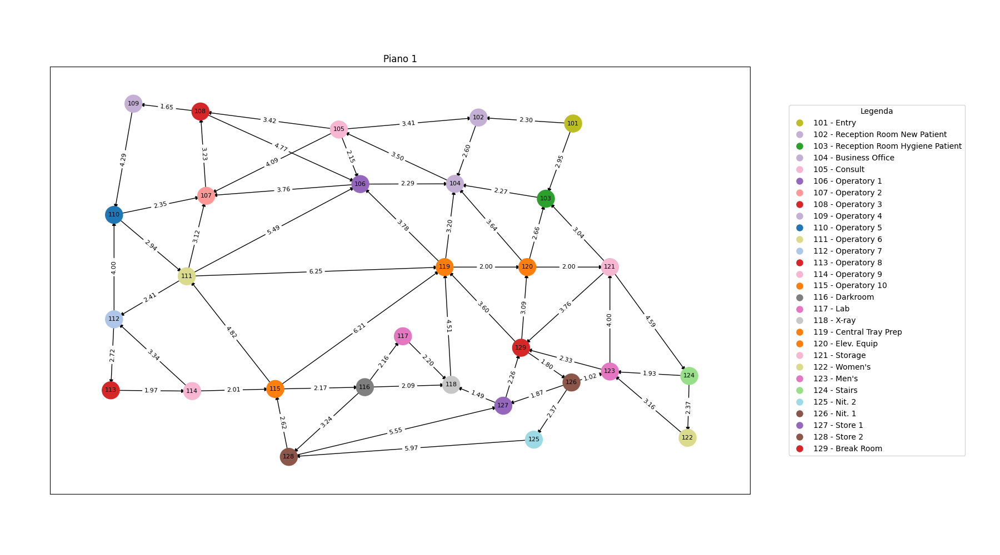

# Grafo Ospedale

## Knowledge Base

Una **Knowledge Base (KB)**, o base di conoscenza, è un insieme strutturato di informazioni, regole e fatti che rappresentano la conoscenza in un determinato dominio. Una KB viene comunemente implementata sfruttando liguaggi di programmazione logica come **Prolog**, che permette di definire **fatti** e **regole**, e formulare **query**. 

Nel nostro contesto, il file `src/graph/data/hospital.pl` rappresenta la KB contenente le informazioni, che descrivono l'architettura dell'ospedale e le relazioni spaziali al suo interno. Queste informazioni verranno sfruttate per fornire una rappresentazione dell'ospedale con un **grafo**, dove i nodi sono le stanze e gli archi sono pesati dalla distanza fra ciascuna stanza in cui è definita una connessione.

Vediamo nel dettaglio le informazioni incluse all'interno della KB.

### Fatti

I fatti sono informazioni atomiche o proposizioni che descrivono il mondo o il dominio. Nel nostro contesto vengono utilizzati per definire le **proprietà** di una classe **Stanza**, e la **relazione** che definisce la connessione fra due stanze.

- **Stanza -`room/1`**:
  
  Definisce una stanza dell'ospedale. Ogni stanza è rappresentata da un numero identificativo.
  
  Esempio: `room(101).` 
  
  Questo significa che esiste una stanza che identificheremo con 101.

- **Nome della Stanza  - `name/2`**:
  
  Associa un nome descrittivo a ciascuna stanza, in maniera tale da definirne la sua funzione.
  
  Esempio: `name(101, 'Entry').` 
  
  Alla stanza 101 è associato il nome "Entry".

- **Coordinate X - (`x/2`) e Y - (`y/2`)**:
  
  Definisce la posizione di una stanza in termini di coordinate $x$ e $y$ su una mappa bidimensionale.
  
  Esempio: `x(101, 13.11).` e `y(101, 17.50).` 
  
  La stanza 101 si trova in coordinata $(13.11, 17.50)$.

- **Piano - `floor/2`**:
  
  Specifica il piano su cui si trova una stanza.
  
  Esempio: `floor(101, 1).`
  
  La stanza 101 è al primo piano.

- **Connessioni Definite - `defined_connection/2`**:
  
  Indica quali stanze sono direttamente collegate tra loro.
  
  Esempio: `defined_connection(101, 102).`
  
  Esiste una connessione fra la stanza 101 e la stanza 102.

- **Inserimento Dinamico di Connessioni** con `assertz/1`:
  
  Aggiunge dinamicamente connessioni tra stanze durante l'esecuzione del programma.
  
  Esempio: `:- assertz(defined_connection(229, 237)).`

Un altro fatto è presente nei file Prolog `src/graph/data/diGraph/heuristics.pl` e in `src/graph/data/biGraph/heuristics.pl`. Ciascun file ritornerà utile nelle **strategie di ricerca informata**, in un caso per il grafo diretto, nell'altro per il grafo bidirezionale.

Quindi avremo come fatto:

- **Costo per Raggiungere l'Obiettivo -`cost_to_goal/3`**:
  
  Definisce il costo minimo (calcolato con la programmazione dinamica) per raggiungere una stanza specifica da un'altra stanza. (Questo valore verrà utilizzato per l'euristica degli algoritmi A* e DFBB).
  
  Esempio: `cost_to_goal(101, 106, 11.0).`

### Regole

Possiamo vedere le regole come insiemi di condizioni e conclusioni che definiscono come i fatti possono essere combinati o interpretati. Le regole permettono di derivare nuova conoscenza dai fatti esistenti. Nel nostro caso le regole sono servite nel stabilire fra due nodi una connessione unidirezionale pesata con la loro distanza euclidea. 

- **Calcolo della Distanza Euclidea -`euclidean_distance/3`**:
  
  Questa regola è usata per calcolare la distanza euclidea tra due stanze, basandosi sulle loro coordinate. La distanza euclidea è definita come la lunghezza del segmento di retta che unisce due punti in uno spazio euclideo. Dove la distanza euclidea $d$ è data dalla seguente formula:
  
  $$
  d = \sqrt{(x_2-x_1)^2 +(y_2 - y_1)^2}
  $$
  
  ```prolog
  euclidean_distance(Room1, Room2, Distance) :-
      room(Room1),
      room(Room2),
      x(Room1, X1),
      y(Room1, Y1),
      x(Room2, X2),
      y(Room2, Y2),
      DiffX is X2 - X1,
      DiffY is Y2 - Y1,
      Distance is sqrt(DiffX*DiffX + DiffY*DiffY).
  ```

- **Connessione con Peso Basato sulla Distanza Euclidea - `connection_with_weight/3`**:
  
  Definisce una connessione tra due stanze, con un peso che corrisponde alla distanza euclidea calcolata tra di esse.
  
  ```prolog
  connection_with_weight(Room1, Room2, Weight) :-
      euclidean_distance(Room1, Room2, Weight).
  ```

- **Connessione Unidirezionale - `connection/3`**:
  
  Definisce una connessione unidirezionale tra due stanze, utilizzando la connessione con peso basato sulla distanza euclidea e verificando che la connessione sia definita tra le stanze.
  
  ```prolog
  connection(Room1, Room2, Weight) :-
      connection_with_weight(Room1, Room2, Weight),
      defined_connection(Room1, Room2).
  ```

### Query

Le query sono richieste di informazione che possono essere poste alla KB per ottenere risposte basate sulle informazioni presenti nella base di conoscenza.

Le query principalmente formulate sono presenti all'interno del file `src/graph/hospital.py`, dove la KB viene utilizzata in combinazione con il codice Python tramite la libreria `pyswip`, che consente di eseguire query Prolog direttamente dal codice Python. Questo tipo di approccio permette di costruire dinamicamente il grafo che rappresenta l'ospedale.

Vediamo in maniera dettagliata come queste query vengono formulate, considerando il metodo `__build_graph_from_prolog` all'interno della classe `Hospital`:

- **Estrazione delle Stanze**
  
  Si esegue una query in Prolog per ottenere tutte le stanze definite all'interno della KB. La query `room(X)` restituisce un elenco di stanze, dove `X` rappresenta il numero identificativo di ciascuna stanza.
  
  ```python
  rooms = list(prolog.query("room(X)"))
  ```

- **Recupero degli attributi delle Stanze**
  
  Per ciascuna stanza identificata nella query precedente, il codice esegue una query aggiuntiva per ottenere gli attributi della stanza: nome (`name`), coordinate spaziali (`x`, `y`), e piano (`floor`). Questi dettagli vengono usati per creare un'istanza della classe `Room`, che incapsula tutte le informazioni rilevanti per la stanza. La stanza viene poi aggiunta al grafo come un nodo, con `number` come identificatore del nodo e `room_obj` come attributo associato.
  
  ```python
  for room in rooms:
      number = room['X']
      details = next(prolog.query(f"name({number}, T), x({number}, X), y({number}, Y), floor({number}, P)"))
      room_obj = self.Room(number, details['T'], float(details['X']), float(details['Y']), int(details['P']))
      G.add_node(number, room=room_obj)
  ```

- **Estrazione delle connessioni**
  
  Si esegue un'altra query in Prolog per ottenere tutte le connessioni tra le stanze, dove `A` e `B` sono i numeri identificativi delle stanze connesse e `Weight` rappresenta il peso dell'arco (che potrebbe indicare distanza, tempo di percorrenza, ecc.).
  
  ```python
  connections = list(prolog.query("connection(A, B, Weight)"))
  for conn in connections:
      G.add_edge(conn['A'], conn['B'], weight=float(conn['Weight']))
  ```
  
  Per ciascuna connessione trovata, viene aggiunto un arco diretto nel grafo dal nodo `A` al nodo `B` con un attributo `weight` che rappresenta il peso dell'arco. Quest'ultimo passaggio permette di fornire una struttura completa del grafo.

L'ultima query formulata è presente in `src/graph/pathFinder.py`, dove con il metodo `__get_heuristic` si ottiene il valore dell'euristica per un nodo specifico rispetto a un  nodo obiettivo, attraverso la seguente query:

```python
list(prolog.query(f"cost_to_goal({node}, {goal}, Cost)"))
```

## Grafo dell'ospedale

### Grafo diretto

Di seguito mostriamo il plot del grafo diretto progettato per l'ospedale.

**Note**:

- La suddivisione in piani (per ora) è per comodità grafica.

- Ciascun nodo che rappresenta le scale di un piano è collegato direttamente al nodo di entrata del piano successivo e viceversa.

**Primo piano**



**Secondo piano**


**Terzo piano**


### Grafo bidirezionale

Abbiamo voluto sperimentare anche con un grafo bidirezionale, per diversi motivi come la valutazione degli algoritmi di **path finding**, che verranno discussi nella sezione successiva, l'applicazione di strategie di ricerca sofisticate come la **ricerca basata su isole**, in cui la direzione di ricerca può andare dall'alto in basso e viceversa, o l'uso della **programmazione dinamica**, che, nel caso di un grafo **NON** **fortemente connesso**, come quello fornito precedentemente, produrrebbe molti costi pari a **inf** (cioè nodo non raggiungibile), comportando uno spreco di memoria.

Un **grafo fortemente connesso** e **bidirezionale**, ottenuto unendo il grafo che abbiamo fornito prima e il suo inverso, ci permette di poter applicare gli algoritmi di **path finding** in un contesto d'uso reale, dove vogliamo che ciascun nodo possa essere raggiungibile da qualsiasi altro.

# Algoritmi

Riferimento: `src/graph/pathFinder.py` 

## Problema di ricerca generico

Per risolvere un problema di ricerca, è necessario prima definire lo spazio di ricerca e poi applicare un algoritmo di ricerca appropriato. Esistono problemi che possono essere visti come la ricerca di un percorso all'interno di un grafo, come ad esempio nel nostro caso trovare un percorso da una stanza di partenza ad una stanza obiettivo all'interno dell'ospedale. Dato un grafo, l'algoritmo di ricerca generico funziona esplorando in maniera incrementale i percorsi, che vanno dai nodi di partenza ai nodi obiettivo, memorizzandoli all'interno di una **frontiera**. Inizialmente la frontiera contiene il solo nodo di partenza, poi l'algoritmo procede espandendo i percorsi verso nodi inesploarati, fino a trovare il nodo obiettivo. Il processo di ricerca generico si articola in 3 fasi:

1. Si seleziona un percorso dalla frontiera e lo si rimuove.

2. Si estende quel percorso utilizzando ogni connessione uscente dall'ultimo nodo.

3. Si aggiungono alla frontiera i nuovi percorsi ottenuti.

Questo processo avviene in maniera iterativa fintantoché non si raggiunge il nodo obiettivo oppure si esauriscono i percorsi da esplorare.

## Strategie di ricerca non informata

Quando abbiamo a che fare con un algoritmo in cui la strategia di ricerca non è informata, è come se dovessimo effettuare una ricerca senza sapere dove si trovi l'obiettivo.

Un paziente mai entrato in ospedale ha una conoscenza diversa da quella del suo dottore, che sa come orientarsi; ad esempio se il paziente deve effettuare degli esami, non sa che la sua stanza obiettivo si trova al terzo piano, mentre il medico ne è a conoscenza: quindi il paziente andrebbe in giro per l'ospedale fintantoché non trova la sua stanza obiettivo, esplorando percorsi e stanze diverse all'interno dell'edificio, mentre il medico seguirebbe percorsi più promettenti, che gli consentono di arrivare senza fatica.

Quando gli archi di un grafo hanno costo unitario si applicano algoritmi di ricerca come DFS, BFS e Iterative Deepening; in senso figurato, potremmo pensare che l'agente in questo caso non prenda in considerazione quanto distino tra di loro le stanze all'interno dell'ospedale.

Alternativamente, disponendo e sfruttando come conoscenza quella della distanza (che non è a costo unitario) fra ciascuna stanza, si applica come algoritmo la LCFS.

### DFS - Depth First Search

Tenendo conto dell'algoritmo di ricerca generico presentato in precedenza, l'algoritmo **DFS** utilizza una **pila** (**LIFO**) come frontiera, `frontier`, per gestire l'esplorazione dei percorsi. Questo implica che l'algoritmo esplora il grafo andando in profondità lungo ciascun percorso possibile, tornando indietro solo quando raggiunge un vicolo cieco, cioè quando il nodo corrente non ha ulteriori nodi adiacenti non visitati: questo metodo è conosciuto come **backtracking**. 

Tuttavia l'algoritmo allo stato dell'arte risulta essere sensibile ai cicli quando presenti, perciò può divergere. Inoltre può capitare che un nodo possa essere esplorato più volte attraverso percorsi diversi. Queste due problematiche inficiano sull'efficienza e sull'uso reale dell'algoritmo, infatti vedere un agente che "gira in tondo" non sembra essere un comportamento così tanto "intelligente". Pertanto sono state implementate due tecniche di **pruning**:

- **Cycle Pruning**: sfruttiamo un *set* di nodi visitati, `visited`, in maniera tale che, quando incontriamo un nodo già visitato, evitiamo di esplorarlo nuovamente così da prevenerire i cicli e migliorare l'efficienza. 

- **Multiple Path Pruning**: prima di esplorare un nodo adiacente, verifichiamo che non sia già presente nel percorso corrente. In questo modo, oltre a prevenire di esplorare un nodo più volte mediante percorsi diversi, riusciamo a ridurre il numero totale di percorsi esplorati.

```python
def dfs(graph, start, goal):
        start_time = time.time()
        frontier = [(start, [start])]
        visited = set()  # Per il cycle pruning
        paths_explored = 0  # Numero di percorsi esplorati
        nodes_visited = 0  # Numero di nodi visitati

        while frontier:
            current, path = frontier.pop()
            nodes_visited += 1

            if current == goal:
                t = time.time() - start_time
                return path, paths_explored, nodes_visited, t

            if current not in visited:
                visited.add(current)

                for adj in graph.neighbors(current):
                    if adj not in path:  # Multiple path pruning
                        new_path = path + [adj]
                        paths_explored += 1
                        frontier.append((adj, new_path))

        return None
```

### BFS - Breadth First Search

Nell'algoritmo **BFS** la frontiera viene implementata mediante una **coda** (**FIFO**), così il grafo viene esplorato per **livelli**, garantendo che tutti i nodi a una certa distanza dal punto di partenza vengano visitati prima di passare al livello successivo. 

A differenza della DFS, la BFS permette di trovare il percorso più corto in termini di numero di archi verso il nodo obiettivo, tuttavia può risultare lento se la soluzione è lontana dal punto di partenza. Come per la DFS, abbiamo implementato meccanismi per evitare cicli e percorsi ripetuti, non per le problematiche discusse per la DFS ma per ridurre il numero di nodi visitati e percorsi esplorati.

```python
def bfs(graph, start, goal):
        start_time = time.time()
        frontier = Queue()
        visited = set()
        frontier.put((start, [start]))

        paths_explored = 0  # Numero di percorsi esplorati
        nodes_visited = 0  # Numero di nodi visitati

        while not frontier.empty():
            current, path = frontier.get()
            nodes_visited += 1

            if current == goal:
                t = time.time() - start_time
                return path, paths_explored, nodes_visited, t

            if current not in visited: #cp
                visited.add(current)

                for adj in graph.neighbors(current):
                    if adj not in path: #mpp
                        paths_explored += 1
                        frontier.put((adj, path + [adj]))

        return None
```

### ID - Iterative Deepening

Questo algoritmo combina i vantaggi di DFS e BFS. Funziona come una serie di DFS con **profondità limitata**, aumentando gradualmente il **limite**. Inizia con una ricerca poco profonda e, se non trova la soluzione, incrementa la profondità e ricomincia fintantoché non si raggiunge la profondità massima. Questo approccio garantisce di trovare la soluzione più vicina al punto di partenza (come BFS) ma con un consumo di memoria simile a DFS. Inoltre, abbiamo scelto di impostare di default come limite di profondità massimo raggiungibile il numero di nodi presenti nel grafo che l'algoritmo prende in input, anche perché aspettare che l'algoritmo fallisca naturalmente potrebbe richiedere molto tempo. Anche in questo caso applichiamo cycle pruning e multiple path pruning per gli stessi motivi discussi per la DFS.

```python
def IterativeDeepening(graph, start, goal, max_bound = None):
        start_time = time.time()

        def DepthLimitedSearch(graph, node, goal, bound, path, paths_explored, nodes_visited, visited):
            nodes_visited += 1

            if node == goal:
                return path, paths_explored, nodes_visited

            if bound > 0:
                visited.add(node)

                for adj in graph.neighbors(node):
                    if adj not in path and adj not in visited:  # Multiple path pruning e cycle pruning
                        new_path = path + [adj]
                        paths_explored += 1
                        result, pe, nv = DepthLimitedSearch(graph, adj, goal, bound - 1, new_path, paths_explored, nodes_visited, visited)
                        if result is not None:
                            return result, pe, nv

                visited.remove(node)  

            return None, paths_explored, nodes_visited

        paths_explored = 0
        nodes_visited = 0
        bound = 0

        if max_bound is None:
# Limite massimo della profondità basato sul numero di nodi del grafo
            max_bound = len(graph.nodes())  

        while bound <= max_bound:
            visited = set()
            result, pe, nv = DepthLimitedSearch(graph, start, goal, bound, [start], paths_explored, nodes_visited, visited)
            paths_explored = pe
            nodes_visited = nv

            if result is not None:
                t = time.time() - start_time
                return result, paths_explored, nodes_visited, t

            bound += 1

        print(f"Nessun percorso trovato fino a una profondità di {max_bound}.")
        return None
```

### LCFS - Lowest Cost First Search

LCFS è un algoritmo che cerca di trovare il percorso a costo minimo in termini di somma dei pesi degli archi verso il nodo obiettivo. Nell'esplorazione del grafo, per dare priorità ai percorsi meno costosi, utilizza come frontiera una coda con priorità, in maniera tale da selezionare sempre il nodo con il costo cumulativo più basso. Quindi tiene traccia del miglior costo per raggiungere ogni nodo, aggiornandolo se trova un percorso migliore. 

Questo approccio è ottimo quando i costi dei percorsi sono variabili e importanti come nel nostro contesto: se, ad esempio, un paziente in ricovero dovesse essere operato d'urgenza, sarebbe il massimo conoscere il percorso a costo minimo dalla stanza in cui viene ricoverato alla sala operatoria.

Inoltre, dati due nodi, abbiamo deciso come scelta progettuale che il peso di ciascun arco sia pari alla distanza euclidea fra i due.

Anche in questo caso abbiamo implementato meccanismi di cycle pruning e multiple path pruning per gli stessi motivi discussi per la BFS: attraverso una mappa `best_costs` teniamo traccia del miglior costo trovato finora per ogni nodo, evitando di esplorare percorsi sub-ottimali e sfruttandola nel meccanismo di multiple path pruning. 

```python
def lowestCostSearch(graph, start, goal):
        start_time = time.time()
        frontier = PriorityQueue()
        visited = set()
        best_costs = {}  # Aggiunta di una struttura per tenere traccia del miglior costo per ogni nodo
        paths_explored = 0
        nodes_visited = 0

        frontier.put((0, (start, [start])))
        best_costs[start] = 0  # Inizializzo il miglior costo per il nodo di partenza

        while not frontier.empty():
            priority, (current, path) = frontier.get()
            nodes_visited += 1

            if current == goal:
                t = time.time() - start_time
                return path, paths_explored, nodes_visited, t

            if current not in visited:
                visited.add(current)
                if current in graph:
                    for adj in graph.neighbors(current):
                        weight = graph.get_edge_data(current, adj)['weight']
                        new_cost = priority + weight
                        if adj not in best_costs or new_cost < best_costs[adj]:  # Multiple path pruning
                            best_costs[adj] = new_cost
                            frontier.put((new_cost, (adj, path + [adj])))
                            paths_explored += 1
                else:
                    print(f"Il nodo {current} non è presente nel grafo.")

        t = time.time() - start_time
        return None
```

## Strategie di ricerca informata

Nella strategia di ricerca informata ricade l'approccio euristico, che, a differenza dell'approccio considerato precedentemente, si basa su intuizioni e conoscenze empiriche per generare nuove soluzioni. Gli algoritmi euristici sfruttano le **funzioni euristiche** per stimare il costo per raggiungere l'obiettivo, e se queste stime sono **ammissibili**, cioè non sovrastimano mai il costo effettivo, possono guidare la ricerca verso una soluzione valida, ma non necessariamente ottimale. 

Ritornando all'esempio descritto precedentemente, in questo caso è come se il paziente dovesse orientarsi tenendo conto di quanto le stanze siano distanti tra loro e chiedendo informazioni al personale per raggiungere la stanza dove svolgere le analisi, e, infatti, la differenza rispetto alla strategia non informata è sostanziale: in un caso il paziente girovaga per l'ospedale con un certo criterio fintantoché non trova la stanza desiderata, nell'altro, invece, essendosi rivolto a qualcuno del personale, sa che la stanza si trova al terzo piano, perciò adotterà un'altra strategia più "intelligente" per raggiungerla, senza dover necessariamente esplorare tutto il piano terra, ma seguendo le indicazioni che gli consentiranno di arrivare fino al terzo piano.

Perciò, nell'implementare questa tipologia di algoritmi, abbiamo l'intento di realizzare il comportamento discusso nell'esempio appena descritto e per farlo presentiamo due algoritmi: A* e DFBB.

### A* Search

L'A* è un algoritmo di ricerca informata che combina il costo del percorso (come LCFS) con una stima euristica della distanza rimanente dall'obiettivo. Usa una funzione $f(n) = g(n) + h(n)$, dove $g(n)$ è il costo effettivo da un punto di partenza $s$ al nodo $n$, e $h(n)$ è la stima euristica da $n$ all'obiettivo $x$. Anche in questa implementazione seguiamo lo schema dell'algoritmo di ricerca generico, implementando la frontiera come coda con priorità, in cui la priorità viene ordinata da $f(n)$. Per quanto riguarda il calcolo di $g(n)$, questo avviene nello stesso modo della LCFS, mentre $h(n)$ si ottiene da una tabella, precalcolata attraverso la **programmazione dinamica**, `cost_to_goal`, che viene memorizzata sia nel file Prolog `src/graph/data/diGraph/heuristics.pl` sia in `src/graph/data/biGraph/heuristics.pl` a seconda del grafo con cui abbiamo a che fare. 

```python
def AStarSearch(graph, start, goal, filename=FILENAME):
        start_time = time.time()
        prolog = Prolog()
        prolog.consult(filename=filename)
        frontier = PriorityQueue()
        best_costs = {}
        start_priority = PathFinder.__get_f(prolog, graph, [start], goal)
        paths_explored = 0
        nodes_visited = 0

        if start_priority == float('inf'):
            print(f"Il nodo di partenza {start} non è raggiungibile dal goal {goal}")
            return None

        frontier.put((start_priority, (start, [start])))
        best_costs[start] = start_priority

        while not frontier.empty():
            priority, (current, path) = frontier.get()
            current = path[-1]
            nodes_visited += 1

            if current == goal:
                t = time.time() - start_time
                return path, paths_explored, nodes_visited, t

            if current in graph:
                for adj in graph.neighbors(current):
                    new_path = path + [adj]
                    new_priority = PathFinder.__get_f(prolog, graph, new_path, goal)
                    if new_priority is not None and new_priority != float('inf'):
                        if adj not in best_costs or new_priority < best_costs[adj]:  # Multiple path pruning
                            best_costs[adj] = new_priority
                            frontier.put((new_priority, (adj, new_path)))
                            paths_explored += 1
            else:
                print(f"Il nodo {current} non è presente nel grafo.")

        print(f"Nessun percorso trovato da {start} a {goal}")
        return None
```

### DFBB - Depth-First Branch and Bound

Questo algoritmo combina l'approccio in profondità di DFS con la tecnica di branch and bound: esplora il grafo in profondità ma mantiene un limite superiore, `bound`, sul costo della soluzione; il bound ci permette di limitare l'esplorazione, infatti, quando il costo stimato di un percorso supera questo limite, quest'ultimo viene scartato.

Quando l'algoritmo trova una soluzione, aggiorna questo limite e usa l'euristica di A* per decidere se continuare l'esplorazione di un ramo. Questo permette di tagliare rapidamente rami non promettenti del grafo, riducendo lo spazio di ricerca.

Questo algoritmo risulta particolarmente efficace in problemi di ottimizzazione dove si vuole trovare la soluzione migliore esplorando selettivamente lo spazio delle soluzioni.

```python
def DF_branch_and_bound(graph, start, goal, filename=FILENAME):
        start_time = time.time()
        prolog = Prolog()
        prolog.consult(filename=filename)
        paths_explored = 0
        nodes_visited = 0

        def cbsearch(graph, path, goal, bound, frontier, visited, paths_explored, nodes_visited):
            current = path[-1]
            nodes_visited += 1
            f_value = PathFinder.__get_f(prolog, graph, path, goal)

            if f_value < bound:
                if current == goal:
                    return PathFinder.__get_cost(graph, path), paths_explored, nodes_visited
                else:
                    for adj in graph.neighbors(current):
                        if adj not in path:
                            new_path = path + [adj]
                            new_f = PathFinder.__get_f(prolog, graph, new_path, goal)
                            paths_explored += 1
                            if adj not in visited or new_f < visited[adj]:
                                visited[adj] = new_f
                                frontier.append((new_f, (adj, new_path)))
            return bound, paths_explored, nodes_visited

        frontier = []
        visited = defaultdict(lambda: sys.float_info.max)
        initial_cost = PathFinder.__get_f(prolog, graph, [start], goal)
        frontier.append((initial_cost, (start, [start])))
        visited[start] = initial_cost
        bound = sys.float_info.max

        best_path = None
        while frontier:
            cost, (current, path) = min(frontier, key=lambda x: x[0])
            frontier.remove((cost, (current, path)))

            if current == goal:
                if cost < bound:
                    bound = cost
                    best_path = path
            elif cost < bound:
                new_bound, pe, nv = cbsearch(graph, path, goal, bound, frontier, visited, paths_explored, nodes_visited)
                paths_explored = pe
                nodes_visited = nv
                if new_bound < bound:
                    bound = new_bound

        t = time.time() - start_time
        if best_path is None:
            return None
        return best_path, paths_explored, nodes_visited, t
```

## Strategie di ricerca avanzate

### Programmazione dinamica

La programmazione dinamica è un metodo di ottimizzazione che memorizza soluzioni parziali per evitare ricalcoli. In questo contesto viene utilizzata principalmente per precomputare le euristiche di cui si serviranno gli algoritmi A* e DFBB.

L'algoritmo implementato opera eseguendo una ricerca inversa a partire da un nodo obiettivo verso tutti gli altri nodi del grafo. Durante questa ricerca, viene costruita una tabella `cost_to_goal`, che memorizza il costo minimo necessario per raggiungere l'obiettivo da ogni nodo. Questa tabella viene costruita **offline** utilizzando la LCFS con multiple path pruning, partendo dal nodo obiettivo nel grafo inverso: in sostanza, il metodo lavora a ritroso rispetto all'obiettivo, memorizzando i valori di `cost_to_goal` per ogni nodo trovato. Questo meccanismo permette di determinare una policy ottimale, ossia una regola che specifica quale arco seguire da ogni nodo, garantendo che l'agente raggiunga l'obiettivo seguendo il percorso a costo minimo. Inoltre, questo tipo di approccio permette anche di ridurre in maniera significativa il tempo di calcolo di A* e DFBB, dato che l'euristica è già disponibile e non deve essere ricalcolata durante la ricerca.

```python
def __dpSearch(graph, goal):
        frontier = PriorityQueue()
        visited = set()
        cost_to_goal = {}

# Il costo per il nodo goal è 0
# Per gli altri è infinito in inizializzazione
        for node in graph.nodes:
            cost_to_goal[node] = {goal: float('inf')}
        cost_to_goal[goal][goal] = 0

        frontier.put((0, (goal, [goal])))
        while not frontier.empty():
            priority, (current, path) = frontier.get()
            if current not in visited:
                visited.add(current)
                for adj in graph.neighbors(current):
                    peso = graph.get_edge_data(current, adj)['weight']
                    new_cost = cost_to_goal[current][goal] + peso
                    if new_cost < cost_to_goal[adj][goal]: 
# in questo caso aggiorno cost_to_goal per il nodo visitato
                        cost_to_goal[adj][goal] = new_cost
                        frontier.put((new_cost, (adj, path + [adj])))
        return cost_to_goal
```

La tabella `cost_to_goal`, che viene costruita per ciascun nodo obiettivo all'interno del grafo, viene memorizzata all'interno di un file Prolog, da cui sia l'A* sia DFBB possono leggere i valori euristici precalcolati, in maniera da servirsene per il calcolo della funzione euristica. Quest'ultimo passaggio appena descritto viene implementato nei metodi `make_graph_heuristics` e `__add_cost_to_goal_to_prolog`.

I due file in cui sono memorizzati i valori di `cost_to_goal`, a seconda del grafo sono:

- `src/graph/data/diGraph/heuristics.pl` per il **grafo diretto**

- `src/graph/data/biGraph/heuristics.pl` per il **grafo bidirezionale**

Possiamo usare i valori di `cost_to_goal` come euristica `h(n)`?

Il metodo `__dpSearch` calcola proprio il costo minimo effettivo da un nodo corrente al nodo obiettivo nel grafo invertito, che equivale al costo minimo per raggiungere il nodo obiettivo, partendo da ogni nodo nel grafo originale. Ciò implica che l'euristica basata sui valori di `cost_to_goal` è **ammissibile** e **consistente**.

---

**Ammissibilità dell'euristica**

L'euristica basata sui valori di `cost_to_goal` è **ammissibile**, ovvero non sovrastima mai il costo effettivo da un nodo $n$ al nodo obiettivo. 

In termini più formali, un'euristica $h(n)$ è **ammissibile** se:

$$
h(n) \leq h^*(n)
$$

dove:

- $h(n)$ è il valore stimato dall'euristica per raggiungere il goal dal nodo $n$

- $h^*(n)$ è il costo reale minimo per raggiungere il goal dal nodo n

L'**ammissibilità** è garantita perché i valori di `cost_to_goal` rappresentano il costo minimo per raggiungere il nodo obiettivo a partire da ciascun nodo. Essendo ciascun arco pesato con la distanza euclidea fra i due nodi, questi valori non possono mai essere inferiori al costo effettivo, anzi forniscono in realtà proprio il costo minimo esatto e non una stima. 

Ricordiamo che un'euristica ammissibile garantisce che l'algoritmo A* trovi il percorso ottimale.

---

**Consistenza dell'euristica**

L'euristica basata sui valori di `cost_to_goal` è anche **consistente**, ovvero rispetta la disuguaglianza triangolare: $h(n) <= cost(n, m) + h(m)$, dove $cost(n, m)$ è il costo dell'arco tra $n$ e $m$. Anche questa relazione è soddisfatta perché i valori di `cost_to_goal` rappresentano il costo minimo effettivo.

---

L'utilizzo di valori di `cost_to_goal` pre-calcolati come euristica $h(n)$, presenta quindi diversi vantaggi come assicurare il raggiungimento di una soluzione ottimale, permettere un accesso rapido all'euristica, senza doverla necessariamente ricalcolarla ogni volta, e sfruttare informazioni esatte sui costi minimi, anziché stime approssimative.

### Ricerca basata su isole

Riferimento: `src/graph/islandSearch.py`

Graficamente abbiamo mostrato il grafo dell'ospedale per piani, sia perché era difficile da visualizzare per intero, sia perché siamo abituati a ragionare sulla struttura di un edificio in termini di piani. In genere siamo fedeli a questo tipo di rappresentazione anche perché non ci sogneremmo mai di ripercorrere più volte le stesse scale. Un paziente dell'ospedale, ad esempio, se è a conoscenza del piano in cui si trova la sua stanza obiettivo, indirizzerebbe la sua ricerca verso quel piano. Se lui si trova al piano terra e la sua stanza obiettivo al terzo piano, la cosa più intelligente che può venirgli in mente, sapendolo, è proprio quella di prendere le scale o l'ascensore per arrivarci, e, una volta arrivato al terzo piano, cercare lì la stanza obiettivo, senza dover tornare indietro al primo piano per riesplorare di nuovo l'ospedale, rivedendosi stanze già visitate e percorsi già esplorati sia per il primo che per il secondo piano.

Sembra un ragionamento scontato, ma non lo è affatto: invece di affrontare un problema di ricerca complesso in un unico passaggio, sono stati risolti più problemi più semplici, riducendo in questa maniera la complessità del problema.

Perché questo comportamento sia replicato da un agente dobbiamo identificare un numero limitato di **isole**, ossia delle posizioni intermedie strategiche che devono essere attraversate lungo il cammino da un punto di partenza $s$ ad un punto di arrivo $g$. Le isole sono scelte perché si trovano necessariamente su un percorso di soluzione, e quindi suddividere la ricerca in più sotto-problemi che coinvolgono il raggiungimento di ciascuna isola rende la soluzione complessiva più semplice da trovare.

Quindi, ritornando all'esempio precedente, potremmo identificare come isole le scale o  gli ascensori dell'ospedale. Tuttavia, per comodità a livello implementativo, ci riferiamo alle isole del nostro dominio applicativo con `stairs_nodes` e ai sottografi generati dall'identificazione di queste isole con `islands`. Questo tipo di associazione è risultato conveniente nel gestire la direzione di ricerca, quindi in questo caso possiamo pensare alle isole come corrispondenti ai diversi piani del grafo, ciascuno dei quali è a sua volta un sottografo in cui la ricerca procede in una certa direzione: se il nodo di partenza si trova ad un piano inferiore rispetto al nodo obiettivo, la ricerca procede verso su, altrimenti verso giù. Questo modo di ragionare si è rivelato utile nel settare i nodi start e goal man mano che la ricerca procedeva di isola in isola. Quando il piano è lo stesso per entrambi i nodi l'ultima fase della ricerca si conclude in quella stessa isola. 

Riferendoci al grafo bidirezionale dell'ospedale e supponendo che il nodo *start* sia il 304 e il nodo *goal* 104, l'agente si rende conto che la direzione di ricerca è verso il basso e che dovrà trovare tre percorsi per passare fra ciascun piano:

- da 304 a 301 (ossia il goal di questa isola, `local_goal`), passando poi per 202

- da 202 (che diventa il nodo start di questa isola) a 201 passando per 124

- da 124 a 104 (che era il goal iniziale)

Questa strategia di ricerca ha avuto maggior senso per il grafo bidirezionale, che, rispetto al grafo diretto progettato inizialmente, ha permesso di procedere verso il basso nella ricerca.

La classe `IDGS` (Island-Driven Graph Search) in `src/graph/islandSearch.py` implementa questa strategia, vediamo ora nel dettaglio come funziona:

- Il costruttore `__init__` prende in input un grafo che rappresenta l'ospedale (`Hospital.get_hospital()`) e un dizionario `stairs_nodes` che contiene i nodi delle scale per passare da un piano all'altro.
  
  ```python
  def __init__(self, graph=Hospital.get_hospital(), stairs_nodes={1:{'up': 124, 'down': None}, 2:{'up': 202, 'down': 201}, 3:{'up': None, 'down': 301}}):
          self.graph = graph
          self.islands = self.partition_graph(self.graph)
          self.stairs_nodes = stairs_nodes
  ```

- Il metodo `partition_graph` divide il grafo in isole, ossia sottografi che rappresentano i singoli piani dell'ospedale. Questo viene fatto utilizzando una funzione di *criterio* (`__floor_criterion`) che verifica se due nodi appartengono allo stesso piano.

- Il metodo `island_driven_graph_search` è il cuore dell'algoritmo. Prende in input il nodo di partenza (`start`) e il nodo di destinazione (`goal`), nonché l'algoritmo di ricerca da utilizzare (`search_algorithm`).
  
  ```python
  def island_driven_graph_search(self, start, goal, search_algorithm='bfs', filename_heuristic=None):
          start_time = time.time()
          local_paths = []
          paths_explored = 0
          nodes_visited = 0
          current_floor = util.get_room_from_graph(self.graph, start).floor
          goal_floor = util.get_room_from_graph(self.graph, goal).floor
  
          while current_floor != goal_floor:
              island = self.islands[current_floor - 1]  
              if current_floor < goal_floor:
                  local_goal = self.stairs_nodes[current_floor]['up']
                  direction = 'up'
              else:
                  local_goal = self.stairs_nodes[current_floor]['down']
                  direction = 'down'
  
              result = self.search(island, start, local_goal, search_algorithm, filename_heuristic=filename_heuristic)
              if result is None:
                  return None
  
              local_path, _, _, local_paths_explored, local_nodes_visited = result
              local_paths.append(local_path)
              paths_explored += local_paths_explored
              nodes_visited += local_nodes_visited
  
              next_start = self.get_next_floor_start(local_goal, direction)
              if next_start is None:
                  print(f"Impossibile trovare un percorso verso il piano successivo da {local_goal}")
                  return None
  
              start = next_start
              current_floor += 1 if direction == 'up' else -1
  
          # Ricerca finale sul piano del goal
          result = self.search(self.islands[goal_floor - 1], start, goal, search_algorithm, filename_heuristic=filename_heuristic)
          if result is None:
              return None
  
          final_local_path, _, _, local_paths_explored, local_nodes_visited = result
          local_paths.append(final_local_path)
          paths_explored += local_paths_explored
          nodes_visited += local_nodes_visited
  
          final_path = self.__integrate_local_paths(local_paths)
          return final_path, paths_explored, nodes_visited, time.time() - start_time
  ```
  
  - Fintantoché il piano corrente è diverso da quello di destinazione, viene effettuata una ricerca locale nell'isola corrispondente al piano corrente, utilizzando il metodo `search`. A seconda del piano corrente e di quello di destinazione, viene scelto come obiettivo locale il nodo della scala che porta al piano successivo (`up`) o precedente (`down`).
  
  - Il risultato della ricerca locale (`local_path`) viene aggiunto a una lista di percorsi parziali (`local_paths`) e viene determinato il prossimo nodo di partenza per il piano successivo (`next_start`) utilizzando il metodo `get_next_floor_start`.
  
  - Il piano corrente viene aggiornato in base alla direzione (`up` o `down`).
  
  - Una volta raggiunto il piano di destinazione, viene effettuata la ricerca finale all'interno di quella isola, e il percorso finale (`final_path`) viene costruito integrando tutti i percorsi parziali.

- Il metodo `search` effettua la ricerca all'interno di una singola isola, utilizzando l'algoritmo di ricerca specificato (`search_algorithm`).

- Il metodo `__integrate_local_paths` combina tutti i percorsi parziali in un unico percorso finale, che verrà restituito come soluzione.

## Valutazioni

In questa sezione ci occupiamo di valutare le prestazioni dei diversi algoritmi prima in termini di nodi visitati e percorsi esplorati, e infine confrontando i diversi tempi di esecuzione.

### Grafo diretto

#### Approccio normale


Facciamo le seguenti **osservazioni**:

- BFS e DFS hanno andamenti simili inizialmente, con una crescita quasi costante nel numero di percorsi esplorati all'aumentare di nodi incontrati. Tuttavia, BFS esplora molti più percorsi con l'aumentare del numero di nodi, mentre la DFS ha un andamento leggermente inferiore verso la fine, limitandosi ad un numero minore di nodi visitati. 

- L'ID mostra una crescita più moderata rispetto a BFS e DFS, infatti notiamo che la sua curva è significativamente più bassa, indicando che esplora meno percorsi per lo stesso numero di nodi incontrati.

- Rispetto agli algoritmi precedentemente discussi la LCFS termina la sua ricerca per un numero più limitato di nodi, tuttavia a parità di numero di nodi visitati per percorso esplora molti più percorsi rispetto agli altri algoritmi.

- Le strategie di ricerca informata sono ovviamente più performanti in questi termini rispetto agli altri algoritmi. Inoltre notiamo che DFBB esplora il minor numero di percorsi rispetto agli altri algoritmi a parità di nodi visitati.

**Tempi di esecuzione**

Generalmente gli algoritmi con strategia di ricerca informata mostrano i tempi di esecuzione più lunghi. Per quanto riguarda gli altri quello che ha mostrato i tempi di esecuzione peggiori è l'ID. La DFS si è rivelato il più efficiente.


#### Approccio basato su isole


**Osservazioni**

- Rispetto agli altri algoritmi la BFS esplora un numero significativamente maggiore di percorsi man mano che incontra più nodi. Per quanto riguarda la DFS, questa mostra una mostra un comportamento simile alla BFS inizialmente, tuttavia la sua curva si interrompe decisamente prima, indicando che visita meno nodi nel complesso rispetto alla BFS. Potremmo considerare un miglioramento in termini di nodi visitati per la DFS.

- Anche in questo caso l'ID tende ad esplorare meno percorsi a parità di nodi incontrati rispetto a DFS e BFS. Anche in questo caso sembra esserci un miglioramento in termini di nodi visitati per la DFS.

- Sembra che sia un leggero peggioramento rispetto all'approccio precedente in termini di percorsi esplorati per quanto riguarda l'A*.

**Tempi di esecuzione**

In questo caso l'A* si è mostrato leggermente ineficiente rispetto a DFBB.

L'ID non mostra più lo stesso divario di prima rispetto agli algoritmi con strategia di ricerca non informata, infatti in questa categoria di algoritmi quello posizionato peggio è la BFS. 


#### Conclusioni

In generale l'approccio basato su isole è riuscito a ridurre il numero di nodi visitati per ciascun algoritmo, senza mostrare significativi miglioramenti per quanto riguarda il numero di percorsi esplorati. Inoltre ci sono chiari peggioramenti in termini di tempi di esecuzione per tutti gli algoritmi tranne per l'ID, che è riuscito a posizionarsi decisamente bene. Questo comportamento per l'ID può essere giustificato con il fatto che lo spazio di ricerca sia ridotto, dato che le isole, prese singolarmente, si prestano ad essere di dimensioni inferiori rispetto all'intero grafo. 

Nella cartella `src/graph/data/diGraph/cmp` è possibile vedere in maniera approfondita le differenze sottolineate fra i due approcci in questo grafo per ciascun algoritmo.

Come abbiamo già discusso, l'approccio basato su isole non era adatto per questo tipo di grafo, sia per la relativa semplicità del problema che per il motivo per cui è stato pensato, ossia quello di poter procedere in due direzioni nella ricerca.

### Grafo bidirezionale

In questo caso mostriamo le differenze che abbiamo nei risultati prodotti da entrambi gli approcci, considerando ciascun algoritmo singolarmente. 

#### Strategie di ricerca non informata

#### BFS


BFS mostra una crescita leggermente più rapida nei percorsi esplorati rispetto alla versione con l'approccio basato su isole, che sembra essere più efficiente. Infatti ISL-BFS esplora meno percorsi per lo stesso numero di nodi incontrati, e questo è molto più evidente nella parte finale del grafico. Possiamo già contare un miglioramento.

#### DFS


ISL-DFS mostra una migliore efficienza, esplorando generalmente meno percorsi per lo stesso numero di nodi incontrati. La differenza diventa più evidente dopo circa 125 nodi incontrati, dove ISL-DFS mantiene un numero inferiore di percorsi esplorati. Anche in questo caso possiamo vedere un miglioramento. 

#### ID


ISL-ID mostra una crescita più rapida inizialmente, esplorando più percorsi per un minor numero di nodi incontrati. Tuttavia, ISL-ID termina prima, suggerendo che potrebbe trovare soluzioni più rapidamente. Sebbene non ci sia un evidente miglioramento, l'approccio basato su isole sembra modificare in maniera significativa il comportamento dell'ID, rendendolo più aggressivo nell'esplorazione iniziale ma potenzialmente più efficiente nel trovare soluzioni. Abbiamo una maggiore conferma andando a considerare le statistiche dei tempi di esecuzione:


Possiamo appunto notare che il tempo medio di esecuzione dell'ISL-ID è di due ordini di grandezza inferiore rispetto ad ID. 

#### LCFS


L'andamento fra entrambe le curve è molto simile, le differenze sono minime ma chiare: ISL-LCFS sembra essere più efficiente nelle fasi intermedie, esplorando meno percorsi per lo stesso numero di nodi. La convergenza verso la fine di entrambe le curve suggerisce che l'approccio basato su isole, a parità di nodi incontrati, abbia un impatto limitato su LCFS.

#### Strategie di ricerca informata

L'approccio basato su isole ha mostrato benefici significativi per gli algoritmi con strategia di ricerca non informata. Tuttavia ciò non vale per gli algoritmi A* e DFBB che, essendo algoritmi basati su una strategia di ricerca informata, sono già di per sé progettati per essere efficienti nell'indirizzare la ricerca verso soluzioni ottimali. Quando l'A* utilizza un'euristica ammissibile, trova un percorso ottimale, e chiaramente utilizzare l'approccio basato su isole non può migliorare ulteriormente questa caratteristica. Dall'altra parte il DFBB utilizza tecniche di branch and bound per potare efficacemente parti dell'albero di ricerca che non porterebbero a soluzioni migliori: questa capacità di pruning combinata con l'uso dell'euristica limita già l'esplorazione non necessaria, suggerendoci che una suddivisione per isole sia un ulteriore costo computazionale che per questi algoritmi non è richiesto.

#### A*


Dopo i primi 10 nodi, ISL-A* inizia a esplorare leggermente più percorsi rispetto ad A* per lo stesso numero di nodi incontrati. Questa divergenza aumenta gradualmente man mano che il numero di nodi cresce.

#### DFBB


Entrambi gli algoritmi mostrano un comportamento molto simile fino a 30-40 nodi incontrati. Dopo questo intervallo, ISL-DFBB mostra una leggera riduzione nei percorsi esplorati rispetto a DFBB. Tuttavia la differenza è minima, suggerendo che l'approccio basato su isole ha un impatto limitato su DFBB.

#### Tempi di esecuzione

**Approccio normale**

ID risulta essere il peggiore fra tutti gli algoritmi in termini di tempo di esecuzione, questo ce lo potevamo aspettare tenendo in considerazione la natura del grafo. 


**Approccio basato su isole**

A* e DFBB ritornano a mostrare le peggiori prestazioni. ID risulta decisamente migliorato con questo tipo di approccio.


In generale, l'approccio basato su isole comporta un maggiore overhead, andando ad inficiare sui tempi di esecuzione degli algoritmi: questa osservazione è stata valida per tutti gli algoritmi tranne che per l'ID per le ragioni già discusse in precedenza.


