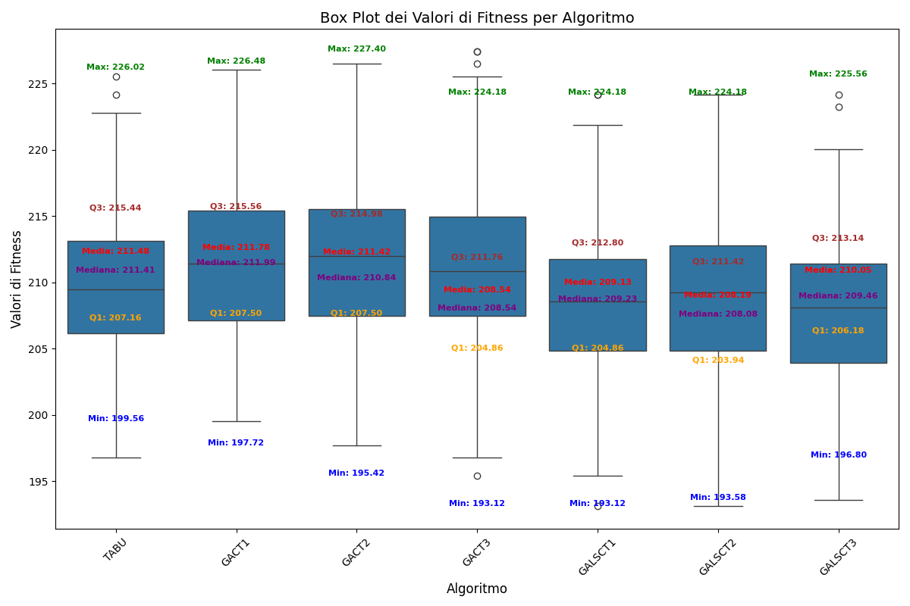

# Nurse Scheduling Problem

## Introduzione

Il problema della pianificazione degli infermieri è un problema di ottimizzazione combinatoria che si presenta negli ospedali e in altri contesti sanitari. L'obiettivo è quello di creare un programma di turni per gli infermieri che soddisfi le esigenze dell'ospedale, come la copertura minima del personale, e che, allo stesso tempo, tenga conto delle preferenze degli infermieri, come i giorni liberi richiesti o il limite di ore lavorative consecutive. Trovare una soluzione ottimale a questo problema può essere molto complesso, in quanto coinvolge un gran numero di variabili e vincoli interdipendenti. Questo problema rientra nella categoria dei problemi NP-hard, il che significa che la sua complessità aumenta esponenzialmente con la dimensione dell'istanza, quindi il numero di soluzioni cresce esponenzialmente rispetto al numero di infermieri, ai giorni e al numero di turni disponibili per ogni giorno.

Il documento da cui traiamo spunto per la soluzione proposta al problema di schedulazione degli infermieri (**NSP**) è "ORProject_Final_Copy.pdf".

Come discusso nella fonte, anche un ospedale relativamente piccolo come il *UPMC Shadyside* ha incontrato difficoltà nell'affrontare questo problema, scegliendo di demandare la pianificazione ai singoli infermieri piuttosto che cercare una soluzione centralizzata. 

Le fonti si concentrano in particolare sull'utilizzo di **algoritmi genetici**, che sfruttano la **programmazione lineare intera** per risolvere il problema della pianificazione degli infermieri. Gli algoritmi genetici sono ispirati al processo di evoluzione naturale e funzionano generando una popolazione di soluzioni candidate, valutandone l'idoneità in base a una funzione obiettivo e utilizzando operatori genetici come la selezione, il crossover e la mutazione per creare nuove soluzioni.

Analizziamo lo pseudocodice proposto:

```pseudo
Genetic Algorithm (NSP)
Initialize a Population of Individuals
While Stop Criterion not met
   Selection of Individuals to Combine
   Application of Crossover Operator
   Application of Mutation Operator
   Application of Local Search Heuristics
   Evaluation of Fitness of the Newly Created Individuals
   Update Population
Endwhile
```

Notiamo che, oltre agli operatori genetici sopracitati, dopo la fase di mutazione è presente una fase in cui viene applicata la **ricerca locale** nel tentativo di minimizzare ulteriormente la funzione obiettivo, proponendo una configurazione migliore che si ottiene attraverso la modifica casuale dei turni assegnati.

A questo punto possiamo chiederci:

- "Cosa accadrebbe se non ci fosse un meccanismo di ricerca locale dopo la fase di mutazione?"

- "Possiamo considerare di applicare, in alternativa all'algoritmo genetico proposto, una variante di ricerca locale per trovare una soluzione?"

Consci del fatto che la ricerca locale sia direttamente applicabile a problemi di ottimizzazione come questo e che quest'ultima di per sé non ha memoria, cioè non ricorda nulla su come procede la ricerca, abbiamo pensato di proporre come soluzione alternativa la **Tabu Search** da confrontare sia con l'algoritmo genetico proposto dal paper sia con l'algoritmo genetico in cui vi è assenza di ricerca locale dopo la fase di mutazione. 

Infatti un algoritmo di ricerca locale tradizionale, senza memoria, esplora lo spazio delle soluzioni modificando iterativamente una soluzione esistente per cercare miglioramenti. Tuttavia, questo algoritmo può facilmente rimanere intrappolato in un minimo locale o ciclare tra le stesse soluzioni senza fare progressi significativi.

La ricerca tabù introduce un elemento di memoria nella ricerca locale per superare questi ostacoli. Questa memoria, conosciuta come "lista tabù", tiene traccia delle modifiche recenti apportate alle variabili della soluzione. L'idea chiave è quella di prevenire la ripetizione immediata di certe mosse, dando alla ricerca la possibilità di esplorare altre aree dello spazio delle soluzioni senza ritornare subito a configurazioni precedentemente esaminate.

Per poter comprendere al meglio come viene formulato questo problema di ottimizzazione e come interviene la programmazione lineare intera, sarà necessario introdurre qualche notazione e qualche convenzione per semplificare l'enunciato del problema.

## Notazione

Faremo riferimento, almeno per questa parte, al file `HDM/src/csp/NSP/src/main/java/com/mycompany/nsp/NSP.java`

Siano:

- $I$: numero di infermieri (*numNurses* in Java)

- $K$: numero di giorni nel periodo di programmazione (*numDays* in Java)

- $S$: insieme dei turni $\{s_1, s_2, s_3, s_4\}$ (*numShifts* in Java)

- $D_{i, k, s}\in\{0, 1\}$: variabile decisionale binaria per l'infermiere $i$, giorno $k$, turno $s$. (*schedule[i][k][s]* in Java).

### Vincoli rigidi

I **vincoli rigidi** sono condizioni essenziali che devono essere soddisfatte per garantire la fattibilità di un programma di turni per gli infermieri. In altre parole, un programma di schedulazione che viola anche solo uno di questi vincoli è considerato inaccettabile.

Definiamo i **vincoli rigidi** implementati nel metodo `protected boolean isFeasible(int[][][] schedule)`:

- **Vincolo di copertura minima ospedaliera**:
  
  Per tutti i giorni $k$ e turni $s$ dove $k=1, \dots, K$ e $s\in S$:
  
  $$
  \sum_{i=1}^I D_{i,k,s} \geq H_{k,s}
  $$
  
  dove $H_{k,s}$ rappresenta il requisito di copertura minima dell'ospedale per il giorno $k$, turno $s$. ($H_{k,s}$ è *this.getHospitalCoverage()[k][s]* in Java).
  
  In altre parole, per ogni giorno $k$ e per ogni turno $s$, il numero di infermieri assegnati a quel turno deve essere maggiore o uguale al fabbisogno minimo dell'ospedale per quel giorno e turno (indicato con $H_{k,s}$).
  
  ---
  
  **Implementazione**
  
  ```java
  for(int k = 0; k < this.getNumDays(); k++){
      for(int s = 0; s < this.getNumShifts(); s++){
          int sum = 0;
          for(int i = 0; i < this.getNumNurses(); i++)
          {sum += schedule[i][k][s];}
          if(sum < this.getHospitalCoverage()[k][s]){
              return false;
  }}}
  ```
  
  ---

- **Nessun turno notturno deve essere seguito da un turno mattutino**:
  
  Per tutti gli $i=1, \dots, I$ e $k=1, \dots, K-1$:
  
  $$
  D_{i,k,s_3} + D_{i, k+1, s_1} \leq 1
  $$
  
  Quindi nessun infermiere può essere assegnato a un turno di notte (indicato con $s_3$) seguito immediatamente da un turno di mattina (indicato con $s_1$) nel giorno successivo.
  
  ---
  
  **Implementazione**
  
  ```java
  for(int i = 0; i < this.getNumNurses(); i++){
      for(int k = 0; k < this.getNumDays() - 1; k++){
          if(schedule[i][k][2] == 1 && schedule[i][k + 1][0] == 1)
                  {return false;}}}
  ```
  
  ---

- **Esattamente un turno al giorno**:
  
  Per tutti gli infermieri $i$ e giorni $k$:
  
  $$
  \sum_{s\in S} D_{i,k,s}=1
  $$
  
  Ogni infermiere può essere assegnato a un solo turno per ogni giorno. Questo significa che la somma degli assegnamenti di turno per un infermiere in un giorno deve essere uguale a 1.
  
  ---
  
  **Implementazione**
  
  ```java
  for(int i = 0; i < this.getNumNurses(); i++){
      for(int k = 0; k < this.getNumDays(); k++){
          int sum = 0;
          for(int s = 0; s < this.getNumShifts(); s++)
              {sum += schedule[i][k][s];}
          if (sum != 1) {return false;}}}
  ```
  
  ---

### Funzione obiettivo

La funzione obiettivo nel problema di pianificazione degli infermieri, ha lo scopo di **quantificare la "bontà" di un determinato programma di turni**. Poiché questo problema coinvolge obiettivi spesso in conflitto tra loro (esigenze dell'ospedale vs. preferenze degli infermieri), la funzione obiettivo deve combinare questi aspetti in un'unica metrica da **minimizzare**.

La funzione obiettivo svolge un ruolo di guida nella ricerca della soluzione negli algoritmi che andremo a definire, in quanto questi la utilizzeranno per valutare e confrontare le diverse soluzioni durante il processo di ottimizzazione.

A livello implementativo facciamo riferimento alla funzione obiettivo nel metodo `protected double fitness(int[][][] schedule)`.

**Componenti della Funzione Obiettivo:**

Denotiamo le due componenti principali che contribuiscono alla funzione obiettivo:

1. **Avversione Complessiva degli Infermieri ($F$):** Misura quanto il programma di turni sia sgradito agli infermieri in base alle loro preferenze individuali. Questa funzione ($F$) prende in input la matrice del programma e restituisce un valore di fitness. Un valore più basso indica una maggiore soddisfazione degli infermieri.
2. **Costo per l'Ospedale ($G$):** Rappresenta il costo sostenuto dall'ospedale a causa di sovraffollamento o carenza di personale in determinati turni. Anche questa funzione ($G$) prende in input la matrice del programma e restituisce un valore, che quando è inferiore indica un costo minore per l'ospedale.

**Bilanciamento degli Obiettivi con Lambda ($\lambda$):**

Per combinare le due componenti in un'unica funzione obiettivo, si introduce un peso **lambda ($\lambda$)**, un valore compreso tra 0 e 1 che determina l'importanza relativa data a ciascun obiettivo:

- $\lambda > 0.5$: Priorità alle preferenze degli infermieri.
- $λ < 0.5$: Priorità alle esigenze dell'ospedale.
- $\lambda = 0.5$: Importanza uguale a entrambi.

Come scelta progettuale si è scelto di impostare $\lambda=0.46$ proprio come nel documento di riferimento. In questa maniera si riflettono le priorità dell'ospedale, in quanto il valore $\lambda$ (*lambdaWeight* in Java) ci permette di specificare l'importanza relativa data alla soddisfazione degli infermieri rispetto al contenimento dei costi.

**Formulazione completa**

La funzione obiettivo completa, da **minimizzare**, è formulata come segue:

$$
\lambda \cdot F(D) + (1-\lambda) \cdot G(D)
$$

Dove:

- **$D$** rappresenta la matrice del programma di turni.
- **$F(D)$** è l'avversione complessiva degli infermieri al programma D (*nurseAversion* in Java).
- **$G(D)$** è il costo per l'ospedale associato al programma D (*hospitalCost* in Java).

Nello specifico:

- $$
  F(D) = \sum_{i=1}^I \sum_{k=1}^K \sum_{s \in S} D_{i,k,s} \cdot P_{i,k,s}
  $$
  
  dove:
  
  - $P_{i,k,s}$ è un valore che rappresenta l'avversione dell'infermiere $i$ per il turno $s$ nel giorno $k$. (Nell'implementazione Java: *this.getNursePreferences()[i][k][s]* è l'elemento corrispondente in una matrice tridimensionale che memorizza queste preferenze); I valori possibili che possono essere assunti da $P_{i,k,s}$ sono scelti da un insieme $A=\{1,2,3,4\}$, dove:
    
    - 1 rappresenta una forte preferenza per il turno;
    
    - 4 indica una forte avversione al turno;
    
    - 2 e 3 sono dei valori intermedi.
  
  ---
  
  **Implementazione**
  
  ```java
  double nurseAversion = 0;
  for(int i = 0; i < this.getNumNurses(); i++){
      for(int k = 0; k < this.getNumDays(); k++){
          for(int s = 0; s < this.getNumShifts(); s++){
              nurseAversion += 
              schedule[i][k][s] * this.getNursePreferences()[i][k][s];
  }}}
  ```
  
  ---

- $$
  G(D) = \sum_{k=1}^K \sum_{s \in S} \sum_{i=1}^I D_{i,k,s} - H_{k,s}
  $$
  
  ---
  
  **Implementazione**
  
  ```java
  double hospitalCost = 0;
  for(int k = 0; k < this.getNumDays(); k++){
      for(int s = 0; s < this.getNumShifts(); s++){
          int coverage = 0;
          for(int i = 0; i < this.getNumNurses(); i++)
          {coverage += schedule[i][k][s];}
          int diff = coverage - this.getHospitalCoverage()[k][s];
          hospitalCost += diff;
  }}
  ```

---

#### Convessità della funzione obiettivo

Nei problemi di **minimizzazione**, avere una funzione obiettivo **convessa** è altamente desiderabile per la garanzia di ottimo globale: in una funzione convessa, ogni minimo locale è anche un minimo globale, ciò significa che se troviamo un punto di minimo, possiamo essere certi che sia la migliore soluzione possibile per l'intero dominio della funzione. Quindi nel nostro contesto ci semplifica notevolmente il processo di ottimizzazione, tuttavia è importante notare che mentre la funzione obiettivo è convessa, il problema complessivo del NSP rimane comunque NP-hard a causa dei vincoli definiti. La convessità della funzione obiettivo nel nostro caso fornisce comunque dei vantaggi, come una maggiore stabilità nelle soluzioni trovate e una maggiore affidabilità nel confronto tra le diverse soluzioni candidate.

---

 **Definizione di funzione convessa**

Una funzione $f(x)$ si dice convessa se, per ogni coppia di punti $x_1$ e $x_2$ nel suo dominio e se per ogni $t$ nell'intervallo $[0,1]$, vale la seguente disuguaglianza:

$$
f(t \cdot x_1 + (1-t)\cdot x_2) \leq t \cdot f(x_1) + (1-t) \cdot f(x_2)  
$$

Geometricamente, questo significa che il segmento che unisce due punti qualsiasi sulla curva della funzione giace sempre sopra o sulla curva stessa.

---

Riprendendo la funzione obiettivo definita in precedenza notiamo che sia $F(D)$ sia $G(D)$ sono due funzioni lineari in $D$, quindi sono entrambe sia convessse che concave. Inoltre, dal momento che la combinazione lineare di funzioni convesse è convessa e sia $\lambda$ che $1-\lambda$ sono entrambi non negativi, la funzione obiettivo complessiva $\lambda \cdot F(D) + (1-\lambda) \cdot G(D)$ è convessa.

In sintesi, la funzione obiettivo nel NSP è una misura che combina l'avversione degli infermieri e il costo per l'ospedale, bilanciandoli tramite un peso lambda. L'obiettivo dell'algoritmo è trovare il programma di turni che minimizza questa funzione, trovando un compromesso ottimale tra le esigenze contrastanti.

### Vincoli soft

L'NSP come presentato nel documento di riferimento include due vincoli soft:

1. Non più di tre giorni liberi consecutivi per ciascun infermiere.

2. Non più di sette giorni lavorativi consecutivi per ciascun infermiere.

Nella nostra implementazione attuale, abbiamo scelto di non includere questi vincoli soft per le seguenti ragioni:

- **Complessità computazionale**: L'aggiunta di questi vincoli aumenterebbe significativamente la complessità computazionale dell'algoritmo, potenzialmente rallentando l'esecuzione su grandi istanze del problema.

- **Flessibilità del modello**: Omettendo questi vincoli, il nostro modello mantiene una maggiore flessibilità, permettendo soluzioni che potrebbero essere necessarie in situazioni eccezionali (ad esempio, durante periodi di alta richiesta o carenza di personale).

- **Focus sui vincoli principali**: La nostra implementazione si concentra sui vincoli hard e sulla funzione obiettivo principale, che riteniamo siano gli elementi più critici per una soluzione di base al NSP.

Riconosciamo l'importanza di questi vincoli soft per molte applicazioni pratiche del NSP, infatti in uno sviluppo futuro prevediamo di implementarli come parte della funzione di fitness, assegnando delle penalità quando vengono violati, e di effettuare degli studi comparativi per valutare l'impatto dell'inclusione di questi vincoli sulla qualità delle soluzioni e sulle prestazioni dell'algoritmo.

## Algoritmi

### Tabu Search

Riferimento: `HDM/src/csp/NSP/src/main/java/com/mycompany/nsp/NSPTabuSearch.java`

La classe NSPTabuSearch implementa l'algoritmo di Ricerca Tabu per risolvere il problema di schedulazione degli infermieri. Questo approccio si basa sull'idea di esplorare lo spazio delle soluzioni in modo intelligente, evitando di rimanere intrappolati in minimi locali. 

Iniziamo con il costruttore della classe. Quando creiamo un'istanza di NSPTabuSearch, forniamo tre parametri: il nome del file contenente i dati del problema, il numero di iterazioni che l'algoritmo eseguirà, e la *tabuTenure* (durata tabu). Quest'ultimo parametro determina per quanto tempo una soluzione rimarrà nella lista tabu, impedendo all'algoritmo di rivisitarla. Il costruttore inizializza anche una lista tabu vuota, che sarà fondamentale per il funzionamento dell'algoritmo.

Il cuore dell'algoritmo è il metodo `run()`. Questo metodo inizia generando una soluzione iniziale casuale utilizzando il metodo `randomSchedule()` ereditato dalla classe genitore `NSP`. Assicura che questa soluzione iniziale sia fattibile, cioè che rispetti tutti i vincoli del problema, utilizzando il metodo `isFeasible()`. Se la soluzione non è fattibile, ne genera una nuova finché non ne trova una valida. 

Una volta ottenuta una soluzione iniziale valida, l'algoritmo entra nel suo ciclo principale. In ogni iterazione, esplora il "**vicinato**" della soluzione corrente. Qui entra in gioco il metodo `getNeighbors()`. Questo metodo genera tutte le possibili modifiche alla soluzione corrente, cambiando un turno alla volta per ogni infermiere e ogni giorno. Ogni nuova soluzione generata viene controllata per assicurarsi che sia fattibile e che non sia già nella lista tabu. Solo le soluzioni che passano questi controlli vengono aggiunte alla lista dei vicini.

Il metodo `getNeighbors()` fa uso di altri due metodi di supporto: `copySchedule()` e `isTabu()`. Il primo crea una copia profonda dello schedule, necessaria per generare nuove soluzioni senza modificare quella originale. Il secondo controlla se una soluzione è già presente nella lista tabu, confrontandola con tutte le soluzioni nella lista.

Tornando al ciclo principale in `run()`, una volta generati tutti i vicini validi, l'algoritmo li ordina in base alla loro **fitness**. Sceglie quindi il miglior vicino come nuova soluzione corrente.

Qui c'è un passaggio interessante: anche se la nuova soluzione non è migliore della migliore trovata finora, l'algoritmo la accetta comunque. Questo è un aspetto chiave della Tabu Search, che permette all'algoritmo di uscire da minimi locali. Tuttavia, l'algoritmo tiene sempre traccia della migliore soluzione globale trovata finora.

L'algoritmo continua questo processo per il numero specificato di iterazioni, o fino a quando non può più generare nuovi vicini validi. 

Infine, il metodo `main()` fornisce un esempio di come utilizzare la classe. Crea un'istanza di `NSPTabuSearch`, la esegue, e misura il tempo di esecuzione. Questo è utile per valutare le prestazioni dell'algoritmo su diverse istanze del problema.

In sintesi, `NSPTabuSearch` implementa una strategia sofisticata per esplorare lo spazio delle soluzioni del problema di schedulazione degli infermieri. Combina l'esplorazione di nuove soluzioni con un meccanismo di memoria per evitare cicli, permettendo all'algoritmo di trovare soluzioni di alta qualità anche in problemi complessi e con molti minimi locali.

### Algoritmo Genetico

Riferimento: `HDM/src/csp/NSP/src/main/java/com/mycompany/nsp/NSPGeneticAlgorithm.java`

La classe NSPGeneticAlgorithm implementa un algoritmo genetico per risolvere il problema di schedulazione degli infermieri. Questo approccio si ispira al processo di evoluzione naturale per trovare soluzioni ottimali o quasi ottimali.

Il costruttore della classe prende diversi parametri: il nome del file contenente i dati del problema, la dimensione della popolazione (`populationSize`), il numero di generazioni (`generations`), il tasso di mutazione (`mutationRate`) e il tipo di crossover (`crossoverType`). Questi parametri definiscono come l'algoritmo genetico opererà.

Il metodo `initializePopulation()` è responsabile della creazione della popolazione iniziale. Genera schedule casuali usando il metodo `randomSchedule()` ereditato dalla classe genitore `NSP`, assicurandosi che ogni schedule sia fattibile (cioè rispetti tutti i vincoli del problema) tramite il metodo `isFeasible()`. Questo processo continua fino a quando non viene creata una popolazione completa di soluzioni fattibili. (La popolazione è completa quando raggiunge la dimensione di `populationSize`).

Il metodo `run()` esegue l'algoritmo genetico per il numero specificato di generazioni (`generations`). Per ogni generazione, l'algoritmo crea una nuova popolazione attraverso i seguenti passaggi:

1. **Selezione dei genitori**: Il metodo `selectParents()` implementa la selezione tramite torneo. Seleziona casualmente coppie di individui e sceglie il migliore di ogni coppia come genitore. Questo processo favorisce gli individui più adatti ma mantiene anche una certa diversità nella popolazione.

2. **Crossover**: Il metodo `crossover()` combina le informazioni genetiche di due genitori per creare un nuovo "**figlio**". L'implementazione supporta diversi tipi di crossover (`crossoverType`), come lo scambio di metà delle colonne tra i genitori o lo scambio di informazioni a partire da un punto casuale.
   
   **Tipologie di crossover**
   
   1. Questo metodo di crossover è il più semplice dei tre implementati: divide le soluzioni dei due genitori, $P_1$ e $P_2$, a metà, prendendo la prima metà da $P_1$ e la seconda metà da $P_2$. Questo metodo crea un figlio $C_{p_1\_p_2}$ che eredita metà del programma di $P_1$ e metà del programma di $P_2$.
   
   2. Questo metodo introduce un punto di crossover casuale, $x$, all'interno dell'orizzonte di pianificazione ($K$ giorni). Il figlio, $C_{P_1\_P_2}$, eredita i primi $x$ giorni del programma da $P_1$ e i restanti $(K-x)$ giorni da $P_2$. Questo metodo permette una maggiore flessibilità rispetto al tipo di Crossover 1, consentendo al figlio di ereditare blocchi di giorni consecutivi da entrambi i genitori.
   
   3. Questo metodo, simile al Crossover 2, utilizza un punto di crossover casuale, $i$, ma questa volta considera gli infermieri. Il figlio, $C_{P_1\_P_2}$, eredita il programma dei primi i infermieri da $P_1$ e il programma dei restanti $(I-i)$ infermieri da $P_2$. Questo metodo permette di combinare le assegnazioni di interi gruppi di infermieri dai due genitori.

3. **Mutazione**: Il metodo `mutate()`, con una probabilità pari a `mutationRate`, sceglie casualmente un infermiere, un giorno e un turno, e assegna quel turno all'infermiere per quel giorno; in sintesi introduce piccole modifiche casuali negli schedule. Questo aiuta a mantenere la diversità nella popolazione e a esplorare nuove aree dello spazio delle soluzioni. 

Dopo aver creato un nuovo individuo attraverso questi processi, l'algoritmo verifica che sia fattibile prima di aggiungerlo alla nuova popolazione. Questo assicura che tutte le soluzioni nella popolazione rispettino i vincoli del problema.

Alla fine di ogni generazione, la nuova popolazione viene ordinata in base alla **fitness** (calcolata dal metodo `fitness()` ereditato da NSP) e viene mantenuta solo la parte migliore, pari alla dimensione della popolazione originale.

La classe include anche una classe interna `Individual` che rappresenta un singolo schedule con il suo valore di fitness. Questa classe implementa l'interfaccia `Comparable`, permettendo di ordinare facilmente gli individui in base alla loro fitness.

### Algoritmo Genetico con Local Search

Riferimento:

`HDM/src/csp/NSP/src/main/java/com/mycompany/nsp/NSPGeneticAlgorithmLocalSearch.java`

La classe `NSPGeneticAlgorithmLocalSearch` estende `NSPGeneticAlgorithm`, aggiungendo una fase di ricerca locale dopo la mutazione. Questo approccio ibrido combina la capacità dell'algoritmo genetico di esplorare ampiamente lo spazio delle soluzioni con l'abilità della ricerca locale di ottimizzare soluzioni promettenti.

Il costruttore di questa classe aggiunge un nuovo parametro: il numero di iterazioni per la ricerca locale (`localSearchIterations`). Questo determina quanto intensivamente verrà applicata la ricerca locale a ciascun individuo dopo la mutazione.

Il metodo `mutate()` sovrascrive il metodo della classe genitore. Dopo aver applicato la mutazione già descritta precedentemente, questo metodo chiama `localSearch()` per cercare di migliorare ulteriormente la soluzione.

Il metodo `localSearch()` permette di realizzare l'approccio ibrido proposto dalla fonte di riferimento. Per un numero specificato di iterazioni, tenta di migliorare lo schedule corrente facendo piccole modifiche. 

Per ogni iterazione:

1. Sceglie casualmente un infermiere e un giorno.
2. Cambia il turno dell'infermiere in quel giorno a un turno diverso, casuale.
3. Se il nuovo schedule è fattibile e migliore di quello corrente, lo adotta come nuovo migliore schedule.

Questo processo di ricerca locale permette all'algoritmo di "scalare" i picchi locali di fitness, potenzialmente trovando soluzioni migliori che la sola mutazione potrebbe non raggiungere.

Il metodo `run()` di questa classe è simile a quello della classe genitore, ma applica la versione sovrascritta di `mutate()` che include la ricerca locale.

In sintesi, `NSPGeneticAlgorithm` implementa un approccio evolutivo al problema di schedulazione degli infermieri, mentre `NSPGeneticAlgorithmLocalSearch` potenzia questo approccio con una fase di ottimizzazione locale. Queste strategie permettono di esplorare efficacemente lo spazio delle soluzioni, combinando l'esplorazione globale dell'algoritmo genetico con l'ottimizzazione locale per trovare soluzioni di alta qualità.

### Scelta degli iperparametri

Il tuning degli iperparametri è un passaggio fondamentale nel migliorare le performance dei modelli che andremo a definire, e farlo in modo efficiente può fare la differenza.

Per affrontare questa sfida, esiste un metodo avanzato chiamato **ottimizzazione bayesiana**, che può essere implementato in Python usando la libreria  [Optuna](https://optuna.org).

Il processo inizia con la **definizione dello spazio di ricerca**, dove si scelgono gli iperparametri che si desidera ottimizzare. Per ciascuno di questi iperparametri, si specificano i valori possibili o gli intervalli entro cui devono essere esplorati. Questo passaggio stabilisce i limiti entro cui Optuna cercherà la configurazione ottimale. Vediamo ad esempio  nel caso della Tabu Search come i parametri vengono definiti: 

```python
iterations = trial.suggest_int('iterations', 50, 200)
tabu_tenure = trial.suggest_int('tabu_tenure', 3, 10)
```

Successivamente, si passa alla **definizione della funzione obiettivo**: prende in input un set di iperparametri e restituisce una metrica di performance che desideriamo ottimizzare (nel nostro caso la fitness definita in precedenza). In pratica, ogni volta che la funzione viene eseguita, addestra un modello con gli iperparametri specificati e valuta la sua performance. L’obiettivo è ottimizzare questa metrica, cercando di minimizzare il valore della fitness nel nostro contesto. 

Vediamo un esempio nel caso della Tabu Search facendo riferimento a `src/csp/nsp.py`:

```python
def objective_tabu(trial):
        iterations = trial.suggest_int('iterations', 50, 200)
        tabu_tenure = trial.suggest_int('tabu_tenure', 3, 10)
        _, best_fitness = NSP.tabu_search(iterations, tabu_tenure)
        return best_fitness
```

A questo punto inizia il **processo di ottimizzazione**: Optuna inizia con un campionamento iniziale, selezionando casualmente alcuni set di iperparametri da esplorare. Successivamente, utilizza i risultati ottenuti per costruire un modello surrogato, ossia una rappresentazione probabilistica che stima come gli iperparametri influenzano le performance.

Il processo di ottimizzazione è iterativo, quindi Optuna testa nuovi set di iperparametri, aggiorna il modello surrogato e continua la ricerca fino a raggiungere il numero predefinito di iterazioni o una condizione di arresto.

```python
study = optuna.create_study(direction='minimize')
study.optimize(NSP.objective_tabu, n_trials=100)
```

**Note implementative**: 

- `src/csp/nsp.py` è stato pensato per consentire il bridging da Java a Python, pertanto è in questo file che vengono definite le funzioni obiettivo per il tuning, tuttavia il tuning viene fatto in `src/csp/optimizeParams.py`.

- Il numero di trials per ciascun algoritmo è di 100.

- È stato considerato un solo file .nsp per effettuare il tuning.

|             | iterations | tabu tenure | population size | generations | mutation rate | local search iterations |
| ----------- | ---------- | ----------- | --------------- | ----------- | ------------- | ----------------------- |
| **Tabu**    | 121        | 6           | /               | /           | /             | /                       |
| **GACT1**   | /          | /           | 44              | 485         | 0.837         | /                       |
| **GACT2**   | /          | /           | 39              | 487         | 0.826         | /                       |
| **GACT3**   | /          | /           | 41              | 500         | 0.899         | /                       |
| **GALSCT1** | /          | /           | 11              | 351         | 0.291         | 143                     |
| **GALSCT2** | /          | /           | 48              | 144         | 0.554         | 54                      |
| **GALSCT3** | /          | /           | 29              | 457         | 0.762         | 17                      |

## Statistiche

Una volta ottenuti i parametri ottimizzati per i nostri modelli, ciascuno di questi è stato testato su un insieme di 100 esempi che rappresentano istanze del problema NSP con 25 infermieri ([NSPLib](https://www.projectmanagement.ugent.be/research/personnel_scheduling/nsp)).

### Boxplot dei valori di Fitness per Algoritmo

**da modificare l'introduzione** - **Introduzione**: 

### ricorda i 100 esempi da dove hai preso i file nsp

**da aggiungere**: Le fonti riportano un'analisi comparativa dei tre tipi di crossover, eseguita su due dataset di dimensioni diverse. I risultati mostrano che, in media, i tre tipi di crossover producono soluzioni con fitness simili. Tuttavia, si osserva che la scelta del crossover può influenzare la variabilità delle soluzioni generate, con alcuni crossover che tendono a produrre soluzioni più simili tra loro.

**da aggiungere**: La scelta del tipo di crossover può influenzare le prestazioni dell'algoritmo genetico, ma non esiste un metodo universalmente migliore. La scelta ottimale dipende dalle caratteristiche specifiche del problema e dai dati a disposizione.

In questo studio, abbiamo condotto un'analisi comparativa approfondita di sette algoritmi di ottimizzazione applicati a un problema di minimizzazione della fitness. Gli algoritmi esaminati comprendono la Tabu Search, tre varianti di Algoritmi Genetici con diversi tipi di Crossover (GACT1, GACT2, GACT3), e tre varianti di Algoritmi Genetici con Local Search e diversi tipi di Crossover (GALSCT1, GALSCT2, GALSCT3). L'obiettivo è valutare l'efficacia di ciascun algoritmo in termini di qualità della soluzione, consistenza e capacità di esplorazione dello spazio delle soluzioni.

**Metodologia**

Per ogni algoritmo, abbiamo analizzato le seguenti metriche statistiche: minimo, massimo, mediana, media, primo quartile (Q1), terzo quartile (Q3) e range interquartile (IQR). Queste metriche ci permettono di valutare non solo la performance in termini di miglior soluzione trovata, ma anche la distribuzione complessiva dei risultati e la consistenza dell'algoritmo.

---

**DA TOGLIERE LE DEFINIZIONI**

**Definizione di Media**

Data una serie di $n$ valori $x_1, x_2, \dots,x_n$, la media $\mu$ è definita come segue:

$$
\mu = \frac{1}{n}\sum_{i=1}^n x_i
$$

**Definizione di Mediana**

Data una serie di $n$ valori ordinati $x_1​,x_2​,…,x_n​$:

- Se $n$ è dispari, la mediana è il valore al centro della serie ordinata
  
  $$
  Me = x_{\frac{n+1}{2}}
  $$

- Se $n$ è pari, la mediana è la media dei due valori centrali
  
  $$
  Me = \frac{
x_{n/2} + x_{\frac{n}{2} + 1}
}{2}
  $$

**Definizione di Intervallo Interquantile (IQR)**

L'**intervallo interquantile (IQR)** è una misura di dispersione che descrive l'ampiezza del range tra il primo quartile (Q1) e il terzo quartile (Q3) di un insieme di dati. Formalmente:

$$
IQR = Q_3 - Q_1
$$

dove:

- $Q_1$​ è il primo quartile, cioè il valore sotto il quale cade il 25% dei dati ordinati.

- $Q_3$ ​è il terzo quartile, cioè il valore sotto il quale cade il 75% dei dati ordinati.

In quanto indice di dispersione, è appunto una misura di quanto i valori si allontanino da un valore centrale.

---



**Analisi**

|             | **MIN** | **MAX** | **MEDIANA** | **MEDIA** | Q1     | Q3     | IQR  |
| ----------- | ------- | ------- | ----------- | --------- | ------ | ------ | ---- |
| **TABU**    | 199.56  | 226.02  | 211.41      | 211.48    | 207.16 | 215.44 | 8.28 |
| **GACT1**   | 197.72  | 226.48  | 211.99      | 211.78    | 207.50 | 215.56 | 8.06 |
| **GACT2**   | 195.42  | 227.40  | 210.84      | 211.42    | 207.50 | 214.98 | 7.48 |
| **GACT3**   | 193.12  | 224.18  | 208.54      | 208.54    | 204.86 | 211.76 | 6.90 |
| **GALSCT1** | 193.12  | 224.18  | 209.23      | 209.13    | 204.86 | 212.80 | 7.94 |
| **GALSCT2** | 193.58  | 224.18  | 208.08      | 208.19    | 203.94 | 211.42 | 7.48 |
| **GALSCT3** | 196.80  | 225.56  | 209.46      | 210.05    | 206.18 | 213.14 | 6.96 |

**Tabu Search**:

La Tabu Search mostra la performance peggiore in termini di valore minimo, che è il più alto fra tutti gli algoritmi, indicando una limitata capacità di trovare soluzioni ottimali globali.

L'IQR è il più alto (8.28), questo indica una maggiore variabilità nei risultati tra tutti gli algoritmi testati, suggerendo una minore consistenza nelle soluzioni generate.

La mediana (211.41) e la media (211.48) sono molto vicine, indicando una distribuzione quasi simmetrica dei risultati. Questo suggerisce che, nonostante l'alta variabilità, la Tabu Search tende a produrre soluzioni distribuite uniformemente intorno al valore centrale.

Il valore massimo (226.02), pur non essendo il più alto tra gli algoritmi, è significativamente distante dal minimo, confermando l'ampia dispersione dei risultati.


**GACT1 (Algoritmo Genetico con Crossover di Tipo 1)**:

GACT1 presenta le performance peggiori tra gli algoritmi genetici, con la mediana e la media più alte.

Il valore minimo (197.72), sebbene migliore della Tabu Search, è ancora significativamente più alto rispetto agli altri algoritmi genetici, indicando una limitata capacità di trovare soluzioni di alta qualità.

L'IQR di 8.06, il secondo più alto dopo la Tabu Search, suggerisce una variabilità relativamente alta nelle soluzioni generate.

La differenza tra media (211.78) e mediana (211.99) è minima, suggerendo una distribuzione quasi simmetrica, ma leggermente sbilanciata verso valori più bassi, il che è  desiderabile in un problema di minimizzazione. 

Il valore massimo (226.48) è il secondo più alto, indicando che GACT1 può occasionalmente produrre soluzioni di qualità molto bassa.


**GACT2 (Algoritmo Genetico con Crossover di Tipo 2)**:

GACT2 mostra un miglioramento rispetto a GACT1 in termini di valore minimo (195.42) e mediana (210.84). Tuttavia, GACT2 presenta il valore massimo più alto (227.40) tra tutti gli algoritmi, questo potrebbe suggerire una certa instabilità nelle soluzioni prodotte. L'IQR di 7.48 è significativamente più basso rispetto a GACT1 e la Tabu Search, indicando una maggiore consistenza nelle soluzioni centrali. La differenza tra media (211.42) e mediana (210.84) è più evidente rispetto a GACT1, con la mediana più bassa della media. Questo indica una distribuzione leggermente asimmetrica, tendente a valori più alti, che è meno desiderabile in un problema di minimizzazione.


**GACT3 (Algoritmo Genetico con Crossover di Tipo 3)**

GACT3 rappresenta un significativo miglioramento rispetto agli altri algoritmi genetici e mostra performance paragonabili agli algoritmi genetici con local search. 

Il valore minimo di 193.12, il più basso tra tutti gli algoritmi (pari a GALSCT1), indica un'eccellente capacità di trovare soluzioni di alta qualità. L'IQR più basso (6.90) tra tutti gli algoritmi suggerisce la massima consistenza nelle soluzioni generate. La perfetta coincidenza tra mediana e media (208.54) suggerisce una distribuzione simmetrica dei risultati, indicando un comportamento molto stabile dell'algoritmo. 

Il valore massimo (224.18) è significativamente più basso rispetto a GACT1 e GACT2, confermando la maggiore robustezza di questo approccio nel prevenire soluzioni di bassa qualità. La combinazione di minimo basso, IQR basso e simmetria nella distribuzione fa di GACT3 un algoritmo molto promettente, suggerendo un ottimo bilanciamento tra esplorazione e sfruttamento dello spazio delle soluzioni.

**GALSCT1 (Algoritmo Genetico con Local Search e Crossover di Tipo 1)** 

GALSCT1 condivide il valore minimo più basso (193.12) con GACT3, dimostrando un'eccellente capacità di trovare soluzioni ottimali. L'IQR di 7.94, più alto rispetto a GACT3 ma più basso della Tabu Search e GACT1, indica una buona consistenza nelle soluzioni, anche se non al livello di GACT3. Questo potrebbe suggerire che la ricerca locale, mentre migliora la qualità delle soluzioni, potrebbe introdurre una certa variabilità nei risultati. La leggera differenza tra media (209.13) e mediana (209.23) indica una distribuzione leggermente asimmetrica, con una tendenza verso valori più bassi, il che è desiderabile in un problema di minimizzazione. Il valore massimo (224.18), identico a GACT3, suggerisce che GALSCT1 è ugualmente efficace nel prevenire soluzioni di bassa qualità. La performance complessiva di GALSCT1 suggerisce che la combinazione di crossover di tipo 1 con ricerca locale è particolarmente efficace nel migliorare la qualità delle soluzioni rispetto al solo GACT1.

**GALSCT2 (Algoritmo Genetico con Local Search e Crossover di Tipo 2)**

GALSCT2 emerge come l'algoritmo più performante in termini di mediana e media, suggerendo la migliore performance complessiva tra tutti gli algoritmi testati. La mediana più bassa (208.08) indica che almeno il 50% delle soluzioni generate da GALSCT2 sono migliori rispetto agli altri algoritmi. Il Q1 più basso (203.94) tra tutti gli algoritmi indica che il 25% delle soluzioni di GALSCT2 sono di qualità superiore rispetto a tutti gli altri metodi, evidenziando una consistente capacità di generare soluzioni di alta qualità. Il valore minimo (193.58), sebbene leggermente superiore a GACT3 e GALSCT1, rimane molto competitivo, suggerendo che GALSCT2 potrebbe privilegiare una performance più consistente rispetto alla ricerca di soluzioni estreme. L'IQR di 7.48, identico a GACT2, indica una buona consistenza nelle soluzioni centrali, bilanciando efficacemente l'esplorazione di nuove soluzioni con lo sfruttamento di quelle promettenti. La piccola differenza tra media (208.19) e mediana (208.08) suggerisce una distribuzione quasi simmetrica, con una leggera tendenza verso valori più alti. Questo potrebbe indicare che GALSCT2 è meno soggetto a produrre outlier estremi rispetto ad altri algoritmi. Il valore massimo (224.18), in linea con GACT3 e GALSCT1, conferma la robustezza dell'algoritmo nel prevenire soluzioni di bassa qualità.

**Osservazioni**

- Mediana: 208.08 (la più bassa)

- Media: 208.19 (la più bassa)

- Q1: 203.94 (il più basso)

**GALSCT3 (Algoritmo Genetico con Local Search e Crossover di Tipo 3)**

GALSCT3 mostra performance solide ma leggermente inferiori rispetto a GALSCT1 e GALSCT2 in termini di valore minimo e mediana/media. Il valore minimo di 196.80, sebbene competitivo, è il più alto tra i GALSCT, suggerendo una minore capacità di trovare soluzioni estremamente ottimali. L'IQR di 6.96, il secondo più basso dopo GACT3, indica un'alta consistenza nelle soluzioni generate. Questo suggerisce che GALSCT3 potrebbe privilegiare la stabilità e la prevedibilità dei risultati rispetto all'esplorazione di soluzioni estreme. La differenza relativamente piccola tra mediana (209.46) e media (210.05) indica una distribuzione leggermente asimmetrica, con una tendenza verso valori più alti (meno desiderabile in un problema di minimizzazione). Il valore massimo (225.56), leggermente superiore agli altri GALSCT, suggerisce che questo algoritmo potrebbe occasionalmente produrre soluzioni di qualità inferiore rispetto ai suoi omologhi. Complessivamente, GALSCT3 sembra offrire un buon compromesso tra consistenza e qualità delle soluzioni, anche se non raggiunge i picchi di performance di GALSCT1 o GALSCT2.

**Conclusioni**

Per quanto riguarda gli algoritmi genetici senza ricerca locale, abbiamo notato un chiaro miglioramento nelle performance passando da GACT1 a GACT3, che raggiunge prestazioni paragonabili agli algoritmi genetici con ricerca locale. Ciò evidenza l'importanza nella scelta del tipo di crossover. 

Gli algoritmi genetici con ricerca locale dimostrano complessivamente le migliori performance, in particolare quello con il secondo tipo di crossover emerge come il più efficace in termini di mediana e media. Aver intergrato la ricerca locale negli algoritmi genetici sembra aver migliorato significativamente la qualità delle soluzioni prodotte e la consistenza dei risultati. 

Inoltre, GACT3 e GALSCT1 mostrano la migliore capacità di trovare soluzioni ottimali (minimo più basso), suggerendo un'efficace esplorazione dello spazio delle soluzioni. GALSCT2, d'altra parte, offre il miglior equilibrio tra qualità della soluzione e consistenza, indicando un ottimo compromesso tra esplorazione e sfruttamento. GACT3 mostra la maggiore consistenza (IQR più basso), seguito da vicino da GALSCT3.

Quindi l'introduzione della ricerca locale negli algoritmi genetici generalmente migliora le performance, specialmente in termini di qualità media delle soluzioni. Tuttavia, l'effetto varia tra i diversi tipi di crossover, suggerendo un'interazione complessa tra ricerca locale e operatori genetici.

Sebbene la Tabu Search non abbia mostrato performance in termini di fitness degne di nota, un'analisi dei tempi di esecuzione di ciascun algoritmo la fa emergere come la più prestante. Fra gli algoritmi genetici quello con le migliori performance è GALSCT1.


